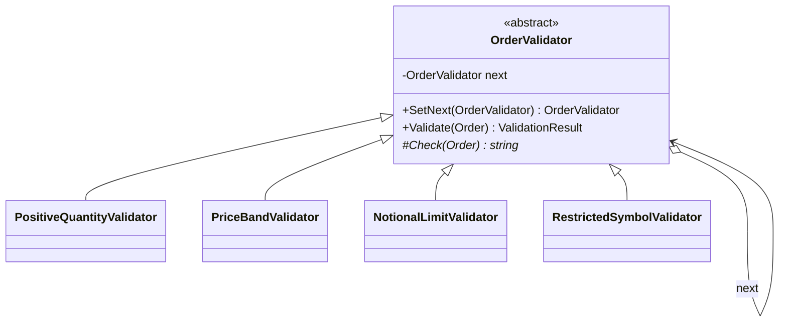
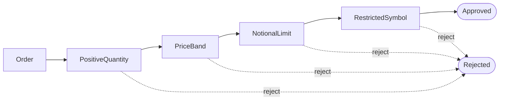

# Chain of Responsibility — Order Validation Chain

> **Week 3 · Day 1a · Behavioral**
> Run just this kata: `dotnet test --filter "FullyQualifiedName~ChainOfResponsibility"`

## The scenario

An incoming order must clear several checks before it can be worked: positive quantity, sane price,
notional under the desk's limit, symbol not on a restricted list — and more over time. Different
desks want different checks, in different orders.

## The challenge

Open [`Legacy/LegacyOrderValidator.cs`](./Legacy/LegacyOrderValidator.cs). Every rule is an `if` in
one method, and every rule's configuration is a parameter:

```csharp
public string? Validate(Order order, decimal notionalLimit, ISet<string> restrictedSymbols) { ... }
```

| Smell | What it costs you |
|-------|-------------------|
| **Rigid pipeline** | You can't reorder, skip, or swap a single rule without editing the method. |
| **No reuse / no isolation** | A rule can't be reused elsewhere or unit-tested on its own. |
| **Growing signature** | Each new rule adds a parameter and an `if`; every caller feels it. |
| **One size fits all** | Every desk shares the same hard-coded sequence. |

We want each rule to be a **standalone, composable step**.

## The pattern: Chain of Responsibility

> **Intent:** Avoid coupling the sender of a request to its receiver by giving more than one object a
> chance to handle it. Chain the receivers and pass the request along until one handles it. — *GoF*

- The **Handler** (`OrderValidator`) does its own check and holds a link to the **next** handler.
- Each **Concrete Handler** (`PositiveQuantityValidator`, …) implements one rule.
- A request travels down the chain; a handler either **handles it** (here: rejects) or **passes it
  on**. Reaching the end with no rejection means approved.

### UML





## Your task

Implement `Check` in each of the four handlers in
[`OrderValidation.cs`](./OrderValidation.cs). Return **`null`** to pass, or a **reason string** to
reject:

1. `PositiveQuantityValidator` — reject `"Quantity must be positive."` when `Quantity <= 0`.
2. `PriceBandValidator` — reject `"Price must be positive."` when `Price <= 0`.
3. `NotionalLimitValidator` — reject `"Notional exceeds limit."` when `order.Notional > _limit`.
4. `RestrictedSymbolValidator` — reject `$"Symbol {order.Symbol} is restricted."` when it's in `_restricted`.

```bash
dotnet test --filter "FullyQualifiedName~ChainOfResponsibility"
```

The provided `Validate` already does the chaining and short-circuiting — notice
`The_first_failing_handler_short_circuits_the_chain` proves the first failure wins and the rest are
skipped.

### Stretch goals

- **Reconfigure the pipeline.** Build a *second* chain in a different order (or omitting a rule) and
  show the same handlers produce a different policy — no handler code changes.
- **Collect-all variant.** Change the base so the chain gathers *every* failure instead of stopping
  at the first. When would a desk want each behaviour?
- **Add a rule** (e.g. a market-hours check) by writing one new handler and slotting it into the
  chain.

## When to use it

- **Use it** when several handlers might process a request and you want to decouple sender from
  receiver, or configure the processing pipeline at runtime.
- **Real-world finance:** order/risk validation pipelines, approval workflows (limits → compliance →
  desk head), middleware pipelines, event/alert routing, support-ticket escalation.
- **Avoid it** when exactly one handler always applies (just call it), or when "did anything handle
  it?" being unclear would be a bug — an unhandled request silently falling off the end.

## Done when

- [ ] All four `Check` methods are implemented.
- [ ] `dotnet test --filter "FullyQualifiedName~ChainOfResponsibility"` is fully green.
- [ ] You can rebuild the chain in a new order without touching any handler.
