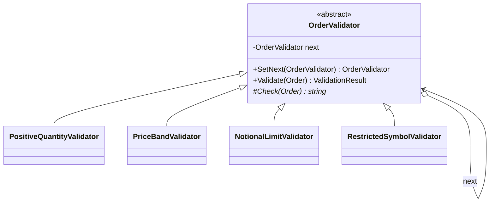

# Chain of Responsibility — Order Validation Chain

> **Week 3 · Day 1a · Behavioral**
> Run just this kata: `dotnet test --filter "FullyQualifiedName~ChainOfResponsibility"`
> **This is a build-from-scratch kata:** you create every type yourself. Nothing is stubbed.

## The scenario

An incoming order must clear several checks before it can be worked: positive quantity, sane price,
notional under the desk's limit, symbol not on a restricted list — and more over time. Different
desks want different checks, in different orders.

## The challenge

Open [`Legacy/LegacyOrderValidator.cs`](./Legacy/LegacyOrderValidator.cs). Every rule is an `if` in
one method, and every rule's configuration is a parameter:

```csharp
public string? Validate(Order order, decimal notionalLimit, ISet<string> restrictedSymbols) { ... }
```

| Smell | What it costs you |
|-------|-------------------|
| **Rigid pipeline** | You can't reorder, skip, or swap a single rule without editing the method. |
| **No reuse / no isolation** | A rule can't be reused elsewhere or unit-tested on its own. |
| **Growing signature** | Each new rule adds a parameter and an `if`; every caller feels it. |
| **One size fits all** | Every desk shares the same hard-coded sequence. |

We want each rule to be a **standalone, composable step**.

## The pattern: Chain of Responsibility

> **Intent:** Avoid coupling the sender of a request to its receiver by giving more than one object a
> chance to handle it. Chain the receivers and pass the request along until one handles it. — *GoF*

- The **Handler** (`OrderValidator`) does its own check and holds a link to the **next** handler.
- Each **Concrete Handler** (`PositiveQuantityValidator`, …) implements one rule.
- A request travels down the chain; a handler either **handles it** (here: rejects) or **passes it
  on**. Reaching the end with no rejection means approved.

### UML




## Target API — what the (commented-out) tests expect

You must create these types so the tests compile and pass. **Names and constructor signatures are
fixed by the tests; everything inside is your design.**

| Type | Shape | Behaviour the tests pin down |
|------|-------|------------------------------|
| `OrderValidator` | abstract handler: `OrderValidator SetNext(OrderValidator next)`, `ValidationResult Validate(Order order)`, protected abstract `Check(Order)` | links the next handler and returns it so `SetNext(…).SetNext(…)` chains; `Validate` runs *this* rule then passes the order down the chain — the first failure wins and stops the walk, reaching the end means approved |
| `PositiveQuantityValidator` | `PositiveQuantityValidator()` | rejects `"Quantity must be positive."` when the quantity isn't positive |
| `PriceBandValidator` | `PriceBandValidator()` | rejects `"Price must be positive."` when the price isn't positive |
| `NotionalLimitValidator` | `NotionalLimitValidator(decimal limit)` | rejects `"Notional exceeds limit."` when the order's notional is over `limit` |
| `RestrictedSymbolValidator` | `RestrictedSymbolValidator(string symbol)` | rejects `$"Symbol {symbol} is restricted."` when the order is that symbol |

**Provided (do not create):** `Order` and `ValidationResult` in
[`ValidationModels.cs`](./ValidationModels.cs) — the value types your handlers read and return
(`ValidationResult.Pass()` / `ValidationResult.Reject(reason)`) — plus `LegacyOrderValidator` under
[`Legacy/`](./Legacy/). Derive the exact reasons and numbers from the tests.

## Your task (from scratch)

1. **Uncomment the tests.** In [`ChainOfResponsibilityTests.cs`](../../../DesignPatternsBootcamp.Tests/Behavioral/ChainOfResponsibilityTests.cs)
   delete the `/*` and `*/`. Now `dotnet test --filter "FullyQualifiedName~ChainOfResponsibility"`
   **won't compile** — that's step one done. Each "type or namespace could not be found" error is a
   type on your to-do list.
2. **Create the handler base.** Add a new `.cs` file in this folder; define the abstract
   `OrderValidator` with `SetNext`, `Validate`, and the protected `Check` each rule overrides. Put
   the chaining and first-failure short-circuit here once so no concrete handler repeats it.
3. **Create the four concrete validators.** `PositiveQuantityValidator`, `PriceBandValidator`,
   `NotionalLimitValidator`, `RestrictedSymbolValidator` — each overrides `Check` to pass (return
   `null`/`Pass()`) or reject with its reason. `The_first_failing_handler_short_circuits_the_chain`
   pins the behaviour your `Validate` must have: the first failure wins and the rest are skipped.
4. **Green.** `dotnet test --filter "FullyQualifiedName~ChainOfResponsibility"`.

### Stretch goals

- **Reconfigure the pipeline.** Build a *second* chain in a different order (or omitting a rule) and
  show the same handlers produce a different policy — no handler code changes.
- **Collect-all variant.** Change the base so the chain gathers *every* failure instead of stopping
  at the first. When would a desk want each behaviour?
- **Add a rule** (e.g. a market-hours check) by writing one new handler and slotting it into the
  chain.

## When to use it

- **Use it** when several handlers might process a request and you want to decouple sender from
  receiver, or configure the processing pipeline at runtime.
- **Real-world finance:** order/risk validation pipelines, approval workflows (limits → compliance →
  desk head), middleware pipelines, event/alert routing, support-ticket escalation.
- **Avoid it** when exactly one handler always applies (just call it), or when "did anything handle
  it?" being unclear would be a bug — an unhandled request silently falling off the end.

## Done when

- [ ] You created the `OrderValidator` base and the four concrete validators from scratch.
- [ ] `dotnet test --filter "FullyQualifiedName~ChainOfResponsibility"` is fully green.
- [ ] You can rebuild the chain in a new order without touching any handler.
