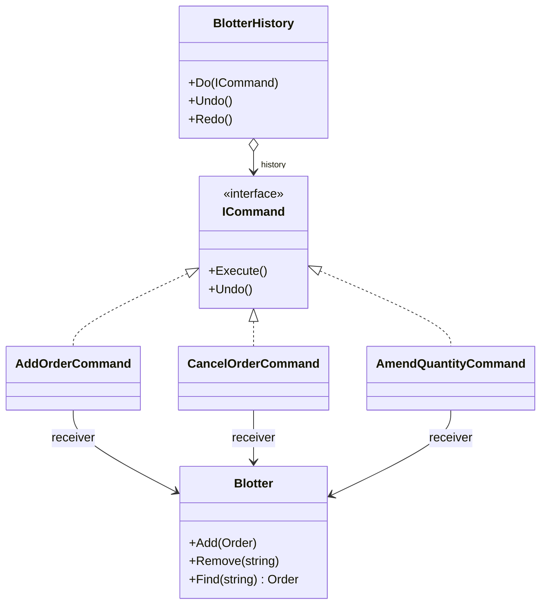

# Command — Undo/Redo for the Order Blotter

> **Week 3 · Day 1b · Behavioral**
> Run just this kata: `dotnet test --filter "FullyQualifiedName~Command"`

## The scenario

Traders edit a blotter all day: add an order, cancel one, amend a quantity. They fat-finger things.
The blotter needs **undo** and **redo** — ideally many levels deep.

## The challenge

Open [`Legacy/LegacyBlotter.cs`](./Legacy/LegacyBlotter.cs). Each action mutates state directly:

```csharp
public void CancelOrder(string id) => _orders.RemoveAll(o => o.Id == id);
```

It works, but the *actions themselves aren't objects* — so there's nothing to reverse, replay, queue,
or log.

| Smell | What it costs you |
|-------|-------------------|
| **Actions aren't first-class** | You can't hold "the cancel that just happened" to undo it. |
| **Undo is bespoke** | Multi-level undo means hand-stashing prior state in every method + a hand-rolled history. |
| **No decoupling** | Whatever triggers an action is welded to how the blotter performs it. |

We want each action to be a **thing** that knows how to do *and* undo itself.

## The pattern: Command

> **Intent:** Encapsulate a request as an object, thereby letting you parameterize clients with
> different requests, queue or log requests, and support undoable operations. — *Gang of Four*

- The **Command** (`ICommand`) declares `Execute` and `Undo`.
- Each **Concrete Command** (`AddOrderCommand`, …) bundles a **Receiver** (the `Blotter`) with the
  arguments for one action, and knows how to perform and reverse it.
- The **Invoker** (`BlotterHistory`) runs commands and keeps the undo/redo stacks — without knowing
  what any command does.

The key move for undo: a command **captures whatever it needs to reverse itself before it changes
anything** (the cancelled order; the previous quantity).

### Participants

| Role | In this kata |
|------|--------------|
| Command | `ICommand` |
| Concrete Command | `AddOrderCommand`, `CancelOrderCommand`, `AmendQuantityCommand` |
| Receiver | `Blotter` |
| Invoker | `BlotterHistory` |

### UML



## Your task

Implement `Execute` and `Undo` for the three commands in [`Commands.cs`](./Commands.cs). The receiver
(`Blotter`) and the invoker (`BlotterHistory`) are provided.

1. **`AddOrderCommand`** — Execute adds `_order`; Undo removes it by `Id`.
2. **`CancelOrderCommand`** — Execute stashes the found order in `_removed`, then removes it; Undo
   adds `_removed` back.
3. **`AmendQuantityCommand`** — Execute saves the current quantity in `_previousQuantity`, then sets
   the new one; Undo restores `_previousQuantity`.

```bash
dotnet test --filter "FullyQualifiedName~Command"
```

`Undo_walks_multiple_actions_back_in_order` shows the payoff: because every action is a command on a
stack, multi-level undo/redo comes from the (provided) invoker for free.

### Stretch goals

- **Build your own invoker.** Re-implement `BlotterHistory` from scratch — the two stacks and why a
  fresh `Do` must clear the redo stack.
- **Macro command.** A `CompositeCommand` that holds a list of commands and Executes/Undoes them as
  one unit (undo in reverse order). Basis for "cancel this whole basket".
- **Command vs. Memento (Day 3b).** Command remembers *how to reverse an action*; Memento snapshots
  *state to roll back to*. When is each cheaper?

## When to use it

- **Use it** for undo/redo, queuing/scheduling work, logging/replaying actions, macro recording, or
  decoupling "what triggers an action" from "who performs it".
- **Real-world finance:** order-blotter edits, trade-amendment audit trails, batch/scheduled jobs,
  transactional "apply then maybe roll back" operations, wizard back/next.
- **Avoid it** when an action never needs to be reversed, queued, or logged — wrapping a one-off call
  in a command object is just ceremony.

## Done when

- [ ] All three commands implement `Execute` and `Undo`.
- [ ] `dotnet test --filter "FullyQualifiedName~Command"` is fully green.
- [ ] You can explain why each command captures reversal state *before* mutating.
