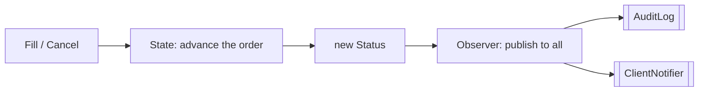

# Final Project — The Full Trading Platform

> **Week 4 · Day 5 · Behavioral · 🏁 Course finale**
> Run just this kata: `dotnet test --filter "FullyQualifiedName~FinalProject"`
> **This is a build-from-scratch kata:** the finale's whole source was deleted — you build the
> composing `TradingSession` yourself. Nothing here is stubbed.
> **Prerequisites:** finish **Day 1a (Observer)** and **Day 1b (State)** first — this finale composes
> both, so it won't compile until their types exist.

## Goal

Bring the order to life. A `TradingSession` runs a single order through its lifecycle and keeps the
whole desk informed — by composing two patterns:

- **State** advances the order (New → PartiallyFilled → Filled / Cancelled) and enforces legal moves.
- **Observer** broadcasts each new status to every subscriber (audit, client notifier, …).

## Target API — what the (commented-out) tests expect

This is the finale: you create the one composing type below, and it *composes* types you already built
in the prerequisite katas. **Name and signatures are fixed by the tests; the wiring inside is your
design.**

| Type (you create) | Shape | Behaviour the tests pin down |
|-------------------|-------|------------------------------|
| `TradingSession` | `TradingSession(string orderId, int quantity, OrderStatusPublisher publisher)`; `void Fill(int quantity)`; `void Cancel()`; `string Status { get; }` | `Fill`/`Cancel` advance the internal State machine, then publish the new status through the Observer publisher; `Status` reflects the state machine (`"PartiallyFilled"` → `"Filled"`, or `"Cancelled"`) |

**Provided:** only this README — the `TradingSession` is yours to write. The **dependency types come
from the prerequisite katas**: `OrderStatusPublisher` / `AuditLog` / `ClientNotifier` / `OrderStatus`
(Observer, Day 1a) and the order **state machine** with its `Fill`/`Cancel`/`Status` (State, Day 1b).
If either isn't done, this won't compile.

## Your task (from scratch)

1. **Uncomment the tests.** In [`FinalProjectTests.cs`](../../../DesignPatternsBootcamp.Tests/Behavioral/FinalProjectTests.cs)
   delete the `/*` and `*/`. Now `dotnet test --filter "FullyQualifiedName~FinalProject"` **won't
   compile** — that's step one done. Missing-type errors point at this finale's `TradingSession` *and*
   any prerequisite (Observer/State) type you haven't built yet.
2. **Create `TradingSession`.** Add a new `.cs` file: the constructor holds the order id, a State
   machine seeded with the quantity, and the injected `OrderStatusPublisher`; expose `Status` from the
   state machine. Then make `Fill`/`Cancel` each do two steps:
   - **Advance the state machine** — `Fill(quantity)` / `Cancel()` on the internal order.
   - **Announce the result** — publish the new status through the publisher, so every subscribed
     observer hears it.
3. **Green.** `dotnet test --filter "FullyQualifiedName~FinalProject"`.

The tests watch an order go New → PartiallyFilled → Filled while every subscribed observer records the
journey — the State machine deciding *what happens*, the Observer deciding *who hears about it*.

## 🎓 The whole course — all 23 patterns

You built a fintech platform, one pattern at a time. Here's the complete map.

### Creational — *how objects come into existence*
| Pattern | Kata |
|---------|------|
| Factory Method | payment-rail processors |
| Abstract Factory | regional market suites |
| Builder | trade-order construction |
| Prototype | model-basket cloning |
| Singleton | shared market-data connection |

### Structural — *how objects compose into larger structures*
| Pattern | Kata |
|---------|------|
| Adapter | third-party payment gateways |
| Bridge | indicators × feeds |
| Composite | portfolio tree |
| Decorator | fee & tax pricing |
| Facade | trade settlement |
| Flyweight | instrument reference data |
| Proxy | caching market-data service |

### Behavioral — *how objects communicate and divide responsibility*
| Pattern | Kata |
|---------|------|
| Chain of Responsibility | order validation |
| Command | undo/redo blotter |
| Interpreter | fee-rule language |
| Iterator | position-book traversal |
| Mediator | order-processing hub |
| Memento | order-ticket snapshots |
| Observer | status notifications |
| State | order state machine |
| Strategy | fee calculation |
| Template Method | regulatory reports |
| Visitor | instrument analytics |

## Day 4 — combinations & anti-patterns (reflect)

- **Patterns combine.** This finale is State + Observer. The week capstones paired Builder + Abstract
  Factory, Composite + Proxy, and Chain + Command. Real designs are patterns *interacting*.
- **Twins to keep straight:** Strategy vs. State (who swaps the object, and why), Strategy vs.
  Template Method (composition vs. inheritance), Adapter vs. Bridge (reactive vs. planned), Decorator
  vs. Proxy vs. Facade (add behavior vs. control access vs. simplify), Composite vs. Visitor vs.
  Interpreter (traverse vs. operate-over vs. evaluate).
- **Anti-patterns:** don't reach for a pattern where a plain method, `enum`, `record`, `Func<>`, or DI
  registration is clearer. A pattern applied to a problem you don't have is just ceremony (and a
  Singleton is a global variable in a nicer coat — see the Week 1 caveat).

## Stretch goals — grow the platform

- **Price it.** Attach a **Strategy** (Day 2a) fee to each fill and a **Decorator** (Week 2) tax on
  top.
- **Report it.** Feed the session's fills into a **Template Method** (Day 2b) regulatory report.
- **Analyze it.** Run **Visitor** (Day 3) analytics over the resulting positions.
- **Guard it.** Put a **Chain of Responsibility** (Week 3) validation in front of every fill.

## Done when

- [ ] You built `TradingSession` from scratch; `Fill` and `Cancel` advance the state and publish the
      new status (both prerequisite katas done first).
- [ ] `dotnet test --filter "FullyQualifiedName~FinalProject"` is green.
- [ ] You can name the pattern behind each part of this one method.

---

🎉🎉 **That's the whole bootcamp — all 23 Gang of Four patterns, in C#, through a fintech platform.**
Mark the last items in [STATUS.md](../../../STATUS.md), run the full suite one more time
(`dotnet test`), and take a well-earned bow. 👏
