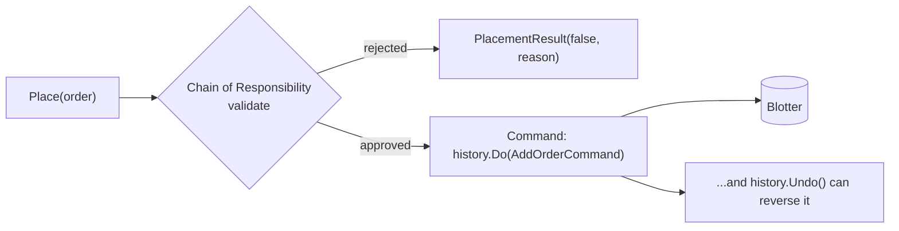

# Review & Mini-Project — The Order Processing Workflow

> **Week 3 · Day 5 · Behavioral**
> Run just this kata: `dotnet test --filter "FullyQualifiedName~BehavioralIntegration"`
> **This is a build-from-scratch kata:** the capstone's whole source was deleted — you build the
> composing `OrderProcessingWorkflow` yourself. Nothing here is stubbed.
> **Prerequisites:** finish **Day 1a (Chain of Responsibility)** and **Day 1b (Command)** first — this
> capstone drives both, so it won't compile until their types exist.

## Goal

Take an order from "submitted" to "on the blotter, and reversible" by composing two of the week's
patterns:

- **Chain of Responsibility** runs the order through the validation pipeline.
- **Command** places an approved order as an **undoable** action.

## Target API — what the (commented-out) tests expect

This is a capstone: you create the composing types below, and they *drive* types you already built in
the prerequisite katas. **Names and signatures are fixed by the tests; the wiring inside is your
design.**

| Type (you create) | Shape | Behaviour the tests pin down |
|-------------------|-------|------------------------------|
| `OrderProcessingWorkflow` | `OrderProcessingWorkflow(head, Blotter blotter, BlotterHistory history)` where `head` is the front of the validation chain; `PlacementResult Place(string id, string symbol, int quantity, decimal price)` | validates the order through the chain; if rejected, returns `PlacementResult(false, reason)` and places nothing; if approved, runs an undoable `AddOrderCommand` through the history and returns `PlacementResult(true, null)` |
| `PlacementResult` | `PlacementResult(bool Placed, string? Reason)` | `.Placed` says whether it reached the blotter; `.Reason` carries the chain's rejection message (else `null`) |

**Provided:** only this README — both capstone types are yours to write. The **dependency types come
from the prerequisite katas**: the validator handlers `PositiveQuantityValidator` /
`NotionalLimitValidator` / `RestrictedSymbolValidator` and `Order` (Chain of Responsibility, Day 1a);
`Blotter` / `BlotterHistory` / `AddOrderCommand` / `Order` (Command, Day 1b). If either isn't done,
this won't compile.

## Your task (from scratch)

1. **Uncomment the tests.** In [`BehavioralIntegrationTests.cs`](../../../DesignPatternsBootcamp.Tests/Behavioral/BehavioralIntegrationTests.cs)
   delete the `/*` and `*/`. Now `dotnet test --filter "FullyQualifiedName~BehavioralIntegration"`
   **won't compile** — that's step one done. Missing-type errors point at both this capstone's types
   *and* any prerequisite (Chain/Command) type you haven't built yet.
2. **Create `PlacementResult`.** A small type holding `Placed` and an optional `Reason`.
3. **Create `OrderProcessingWorkflow` and `Place`.** Compose the two patterns:
   - **Validate** — run the order through the chain (`Validate(new Cor.Order(symbol, quantity, price))`).
     If it isn't approved, return `PlacementResult(false, reason)` and place nothing.
   - **Place (undoably)** — push an `AddOrderCommand(blotter, new Cmd.Order(id, symbol, quantity))`
     through the `BlotterHistory`, then return `PlacementResult(true, null)`.
4. **Green.** `dotnet test --filter "FullyQualifiedName~BehavioralIntegration"`.

The three tests show the whole story: a clean order lands on the blotter; a restricted order is
stopped by the chain and never becomes a command; and a placed order can be rolled back through the
command history.

### How the flow composes

## The Week 3 map — what each behavioral pattern does

| Pattern | Day | Behavioral job | One-liner |
|---------|-----|----------------|-----------|
| **Chain of Responsibility** | 1a | Pass a request along handlers until one deals with it | "A pipeline of maybe-handlers." |
| **Command** | 1b | Turn a request into an object (execute/undo/queue/log) | "An action you can hold." |
| **Interpreter** | 2a | Represent a grammar as objects and evaluate it | "Rules as a tree." |
| **Iterator** | 2b | Traverse a collection without exposing its guts | "Walk without peeking." |
| **Mediator** | 3a | Centralize how a set of objects interact | "Talk through a hub." |
| **Memento** | 3b | Capture/restore state without breaking encapsulation | "An opaque snapshot." |

Behavioral patterns are about **how objects communicate and divide responsibility** — via chains,
commands, grammars, iterators, hubs, and snapshots.

## Stretch goals — grow the mini-project

- **Mediator front door.** Replace the direct call sites with a `TradingDeskMediator` (Day 3a) that
  drives validation → placement → notification.
- **Interpreter-driven rules.** Swap the hard-coded chain for a `RestrictedSymbolValidator` whose
  predicate is an Interpreter (Day 2a) rule loaded from config.
- **Memento checkpoints.** Snapshot the blotter (or a ticket) before a risky batch with Memento
  (Day 3b), independent of the per-action Command undo.
- **Iterate the blotter.** Expose the blotter as an `IEnumerable<Order>` (Day 2b) so callers can walk
  working orders without touching its list.

## Done when

- [ ] You built `PlacementResult` and `OrderProcessingWorkflow.Place` from scratch; `Place` validates
      via the chain, then places via an undoable command (both prerequisite katas done first).
- [ ] `dotnet test --filter "FullyQualifiedName~BehavioralIntegration"` is green.
- [ ] You can explain why a rejected order results in `blotter.Count == 0`.

---

🎉 **That completes Week 3 — the first six behavioral patterns.** Update your
[STATUS.md](../../../STATUS.md) as each kata goes green, and tell the professor when you're ready for
Week 4 (Observer, State, Strategy, Template Method, Visitor).
