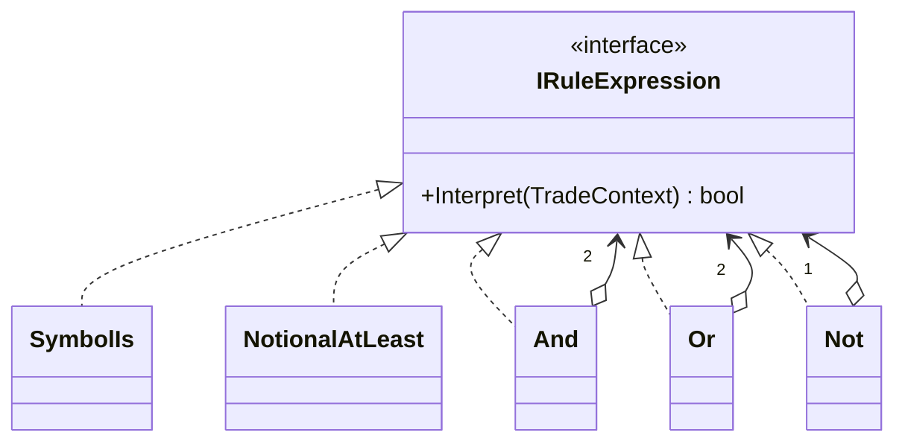
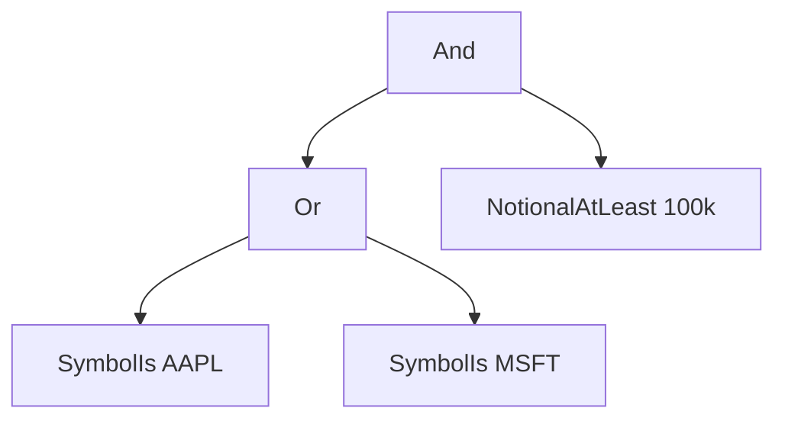

# Interpreter — Fee Rule Language

> **Week 3 · Day 2a · Behavioral**
> Run just this kata: `dotnet test --filter "FullyQualifiedName~Interpreter"`
> **This is a build-from-scratch kata:** you create every type yourself. Nothing is stubbed.

## The scenario

Compliance and desk heads keep inventing fee/eligibility rules: "AAPL over $100k", "AAPL or MSFT",
"anything that's *not* a restricted name". They want to define and change these rules without a code
release — ideally by combining simple building blocks.

## The challenge

Open [`Legacy/LegacyFeeRule.cs`](./Legacy/LegacyFeeRule.cs). The rule lives entirely in a compiled
boolean expression:

```csharp
public bool Applies(TradeContext context) => context.Symbol == "AAPL" && context.Notional >= 100_000m;
```

| Smell | What it costs you |
|-------|-------------------|
| **Rules are code, not data** | You can't store, load, edit, or combine a rule at runtime. |
| **Every rule is a new method** | Each variation needs a code change and a release. |
| **No composition** | There's no way to say "this rule OR that one" from existing pieces. |

We want a rule to be a **value we can build from parts** and evaluate.

## The pattern: Interpreter

> **Intent:** Given a language, define a representation for its grammar along with an interpreter
> that uses the representation to interpret sentences in the language. — *Gang of Four*

Each grammar rule becomes a class; a "sentence" becomes a **tree of these objects** (an AST):

- The **Abstract Expression** (`IRuleExpression`) declares `Interpret(context)`.
- **Terminal Expressions** (`SymbolIs`, `NotionalAtLeast`) are the leaves — they read the context.
- **Nonterminal Expressions** (`And`, `Or`, `Not`) combine sub-expressions, delegating to them.

Interpreting the tree is a recursive walk: each node interprets its children and combines the results.

### UML



`(AAPL OR MSFT) AND notional≥100k` as a tree:



## Target API — what the (commented-out) tests expect

You must create these types so the tests compile and pass. **Names and constructor signatures are
fixed by the tests; everything inside is your design.**

| Type | Shape | Behaviour the tests pin down |
|------|-------|------------------------------|
| `IRuleExpression` | interface: `bool Interpret(TradeContext context)` | the common expression type every node implements |
| `SymbolIs` | `SymbolIs(string symbol)` — terminal | true when the context's symbol equals `symbol` |
| `NotionalAtLeast` | `NotionalAtLeast(decimal threshold)` — terminal | true when the context's notional is at or above `threshold` |
| `And` | `And(IRuleExpression left, IRuleExpression right)` — nonterminal | true only when both sides interpret true |
| `Or` | `Or(IRuleExpression left, IRuleExpression right)` — nonterminal | true when either side interprets true |
| `Not` | `Not(IRuleExpression inner)` — nonterminal | inverts its inner expression |

**Provided (do not create):** `TradeContext` (the trade facts a rule reads) in
[`RuleContext.cs`](./RuleContext.cs), plus `LegacyFeeRule` under [`Legacy/`](./Legacy/).

## Your task (from scratch)

1. **Uncomment the tests.** In [`InterpreterTests.cs`](../../../DesignPatternsBootcamp.Tests/Behavioral/InterpreterTests.cs)
   delete the `/*` and `*/`. Now `dotnet test --filter "FullyQualifiedName~Interpreter"` **won't
   compile** — that's step one done. Each "type or namespace could not be found" error is a type on
   your to-do list.
2. **Create the abstract expression.** Add a new `.cs` file; define `IRuleExpression` with its
   `Interpret(TradeContext)` method — the one operation every node shares.
3. **Create the terminals.** `SymbolIs` and `NotionalAtLeast` — the leaves that read the context
   directly.
4. **Create the nonterminals.** `And`, `Or`, `Not` — each holds sub-expression(s) and combines their
   results by delegating `Interpret` down. `Expressions_compose_into_an_arbitrary_tree` proves the
   pieces nest into any rule you assemble from objects — the same rule the legacy hard-coded, plus an
   `OR` it couldn't express, with no new "rule code".
5. **Green.** `dotnet test --filter "FullyQualifiedName~Interpreter"`.

### Stretch goals

- **Add operators.** `NotionalBelow`, `SymbolIn(params string[])`. Each is one small class; existing
  rules keep working.
- **Parsing is a separate job.** Interpreter defines the *tree + evaluation*; turning
  `"AAPL AND notional>=100000"` text into that tree is a *parser*. Write a tiny parser as a stretch
  and note how the two concerns divide.
- **Interpreter vs. Composite (Week 2).** Both are trees of a common interface. What makes this
  Interpreter (a grammar you *evaluate*) rather than plain Composite (a structure you *traverse*)?

## When to use it

- **Use it** for small, stable grammars/DSLs you evaluate often: business-rule engines, search/filter
  expressions, feature-flag conditions, simple query languages.
- **Real-world finance:** eligibility/fee rules, alert and surveillance conditions, screening filters,
  routing rules.
- **Avoid it** for large or fast-changing grammars — the class-per-rule explosion gets heavy; reach
  for a real parser generator or an existing expression library instead.

## Done when

- [ ] You created `IRuleExpression`, the two terminals, and the three nonterminals from scratch.
- [ ] `dotnet test --filter "FullyQualifiedName~Interpreter"` is fully green.
- [ ] You can build a brand-new rule at runtime without adding any code.
