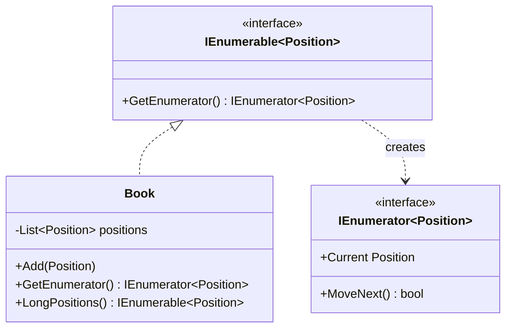

# Iterator — Position Collection Traversal

> **Week 3 · Day 2b · Behavioral**
> Run just this kata: `dotnet test --filter "FullyQualifiedName~Iterator"`

## The scenario

A trading book holds positions. Callers need to walk it — sometimes all positions, sometimes just
the longs — without caring (or knowing) whether it's backed by a list, an array, or a live feed.

## The challenge

Open [`Legacy/LegacyBook.cs`](./Legacy/LegacyBook.cs). The book just exposes its internal list:

```csharp
public List<Position> Positions { get; } = new();
```

| Smell | What it costs you |
|-------|-------------------|
| **Representation leaks** | Every caller now depends on it being a `List`. Change it and they all break. |
| **Duplicated traversal** | "Long positions only" gets re-written at every call site. |
| **No encapsulated strategies** | The collection can't offer its own meaningful ways to walk it. |

We want to hand callers a **way to traverse**, not the container itself.

## The pattern: Iterator

> **Intent:** Provide a way to access the elements of an aggregate object sequentially without
> exposing its underlying representation. — *Gang of Four*

- The **Aggregate** (`Book`) exposes iterators instead of its storage.
- The **Iterator** walks the elements one at a time.

**C# builds this pattern into the language.** `IEnumerable<T>`/`IEnumerator<T>` *are* the Aggregate
and Iterator roles, and the **`yield`** keyword generates the concrete iterator (a state machine) for
you. Implementing `IEnumerable<Position>` gives you `foreach` and all of LINQ for free — and the
internal list stays private.

### UML



## Your task

Implement the two traversals in [`Book.cs`](./Book.cs) using `yield return`:

1. **`GetEnumerator()`** — `foreach` over `_positions`, `yield return` each. This alone unlocks
   `foreach (var p in book)` and LINQ (`book.Count()`, `book.Where(...)`, …).
2. **`LongPositions()`** — `yield return` only the positions with `Quantity > 0`.

```bash
dotnet test --filter "FullyQualifiedName~Iterator"
```

Notice the tests never touch a list — there isn't a public one. They can only *traverse*, which is
exactly the encapsulation we wanted.

### Stretch goals

- **Write the iterator by hand.** Implement a `class BookEnumerator : IEnumerator<Position>` (with
  `MoveNext`, `Current`, `Reset`) *without* `yield`, to see the state machine the compiler was
  generating for you.
- **More strategies.** Add `ByLargestNotional()` or `Shorts()`. Each is a few lines and hides the
  traversal from callers.
- **External vs. internal iterators.** `foreach` is an *external* iterator (caller pulls). A method
  like `ForEach(Action<Position>)` is *internal* (collection pushes). When is each nicer?

## When to use it

- **Use it** to expose sequential access to a collection while hiding its structure, or to offer
  several meaningful ways to traverse it.
- **Real-world finance:** position/order books, paged result sets, streaming market data, tree/graph
  walks over portfolios. In C#, reach for `IEnumerable<T>` + `yield` by default.
- **Avoid it** (as a hand-rolled pattern) in C# when a plain `IEnumerable<T>`/LINQ already does the
  job — don't build a bespoke iterator class where `yield` suffices.

## Done when

- [ ] `GetEnumerator()` and `LongPositions()` are implemented with `yield`.
- [ ] `dotnet test --filter "FullyQualifiedName~Iterator"` is fully green.
- [ ] You can explain how `foreach` and LINQ started working from just `GetEnumerator`.
