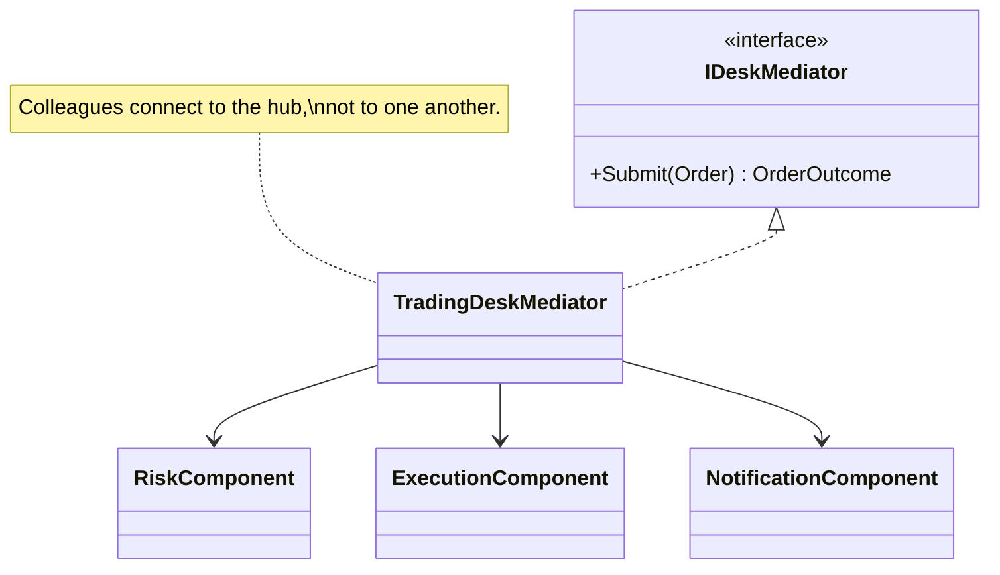

# Mediator — Order Processing Desk

> **Week 3 · Day 3a · Behavioral**
> Run just this kata: `dotnet test --filter "FullyQualifiedName~Mediator"`
> **This is a build-from-scratch kata:** you create every type yourself. Nothing is stubbed.

## The scenario

Processing an order touches several desk components: risk, execution, notification (and later
settlement, compliance, P&L). Each has its own job. The question is how they **collaborate** without
turning into a tangle where every part calls every other part.

## The challenge

Open [`Legacy/LegacyOrderEntry.cs`](./Legacy/LegacyOrderEntry.cs). One class hard-wires the whole
flow and drives every component directly:

```csharp
if (order.Notional > riskLimit) return "REJECTED: Exceeds risk limit.";
string executionRef = $"EXE-{order.Id}";
// ...then wired straight into notification, settlement, ledger, ...
```

| Smell | What it costs you |
|-------|-------------------|
| **N×N coupling** | As parts multiply, everything ends up referencing everything. |
| **Scattered flow** | The interaction logic is smeared across components instead of living in one place. |
| **Ripple changes** | Reordering or inserting a step means editing several components. |

We want each component to talk to **one hub**, not to each other.

## The pattern: Mediator

> **Intent:** Define an object that encapsulates how a set of objects interact. Mediator promotes
> loose coupling by keeping objects from referring to each other explicitly. — *Gang of Four*

- The **Mediator** (`IDeskMediator` / `TradingDeskMediator`) owns the interaction logic.
- The **Colleagues** (`RiskComponent`, `ExecutionComponent`, `NotificationComponent`) each do one
  job and know **only the mediator** — never each other.

Coupling goes from a **web** to a **hub-and-spoke**.

> **Mediator vs. Facade (Week 2):** a Facade is a one-way convenience door *in front of* a subsystem
> (client → subsystem), adding no coordination of its own. A Mediator sits *among peers* and owns how
> they interact — colleagues can notify it and it routes work back out. Facade simplifies access;
> Mediator centralizes collaboration.

### UML



## Target API — what the (commented-out) tests expect

You must create these types so the tests compile and pass. **Names and constructor signatures are
fixed by the tests; everything inside is your design.**

| Type | Shape | Behaviour the tests pin down |
|------|-------|------------------------------|
| `IDeskMediator` | interface: `OrderOutcome Submit(Order order)` | the hub clients (and colleagues) depend on |
| `TradingDeskMediator` | `TradingDeskMediator(RiskComponent risk, ExecutionComponent execution, NotificationComponent notifications)` : `IDeskMediator` | `Submit` runs risk → (execution) → notification and returns the outcome |

**Provided (don't recreate):** the `Order` and `OrderOutcome` records and the three colleagues
`RiskComponent`, `ExecutionComponent`, `NotificationComponent` in
[`DeskComponents.cs`](./DeskComponents.cs), plus the `Legacy/` baseline. The colleagues are complete —
you only wire them together in the mediator.

## Your task (from scratch)

1. **Uncomment the tests.** In [`MediatorTests.cs`](../../../DesignPatternsBootcamp.Tests/Behavioral/MediatorTests.cs)
   delete the `/*` and `*/`. Now `dotnet test --filter "FullyQualifiedName~Mediator"` **won't
   compile** — `TradingDeskMediator` and its `Submit` don't exist yet. Each build error is the next
   type to create.
2. **Declare the hub.** Add a new `.cs` file in this folder; define `IDeskMediator` with a `Submit(Order)`
   that returns an `OrderOutcome`, and a `TradingDeskMediator` that takes the three colleagues in its
   constructor and holds them.
3. **Coordinate the approved path.** In `Submit`, ask the risk colleague to approve the order. When it
   approves, have execution run it (that hands back a reference), tell notification the order
   *executed*, and return an executed `OrderOutcome` carrying the reference. The tests pin the reference
   to `"EXE-O1"` and expect exactly one execution and one notification.
4. **Short-circuit the rejected path.** When risk refuses, notify that the order was *rejected*, return
   an un-executed outcome whose `Message` is the risk reason (`"Exceeds risk limit."`) and whose
   `ExecutionRef` is null — and **never call execution**. The rejected-order test checks
   `execution.Executions == 0`: colleagues act only when the mediator tells them to.
5. **Green.** `dotnet test --filter "FullyQualifiedName~Mediator"`.

### Stretch goals

- **Event-style colleagues.** Give each colleague a reference to the mediator and a `Notify(sender,
  event)` method on the mediator, so a colleague *raises* events ("filled!") and the mediator reacts
  — the fuller GoF form.
- **Add a colleague.** Insert a `SettlementComponent` step. You should touch only the mediator.
- **Watch for the god-object.** A mediator that accretes all logic becomes its own problem. Note
  where you'd draw the line.

## When to use it

- **Use it** when a set of objects communicate in complex, many-to-many ways and you want to
  decouple them, centralize the interaction, and make the collaboration reconfigurable.
- **Real-world finance:** order-processing desks, trade lifecycle coordination, UI dialogs where
  controls affect each other, chat/room hubs, workflow engines.
- **Avoid it** when interactions are simple or naturally one-directional (a Facade or plain calls are
  lighter), or when the mediator would balloon into a god-object hoarding every rule.

## Done when

- [ ] You created `IDeskMediator` and `TradingDeskMediator` from scratch, and `Submit` coordinates
      risk → execution → notification with correct short-circuiting.
- [ ] `dotnet test --filter "FullyQualifiedName~Mediator"` is fully green.
- [ ] You can explain how adding a settlement step touches only the mediator.
