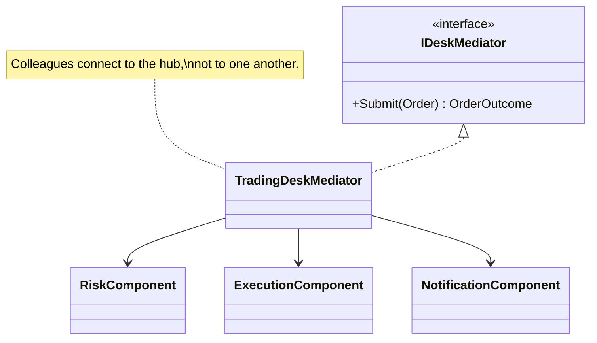

# Mediator — Order Processing Desk

> **Week 3 · Day 3a · Behavioral**
> Run just this kata: `dotnet test --filter "FullyQualifiedName~Mediator"`

## The scenario

Processing an order touches several desk components: risk, execution, notification (and later
settlement, compliance, P&L). Each has its own job. The question is how they **collaborate** without
turning into a tangle where every part calls every other part.

## The challenge

Open [`Legacy/LegacyOrderEntry.cs`](./Legacy/LegacyOrderEntry.cs). One class hard-wires the whole
flow and drives every component directly:

```csharp
if (order.Notional > riskLimit) return "REJECTED: Exceeds risk limit.";
string executionRef = $"EXE-{order.Id}";
// ...then wired straight into notification, settlement, ledger, ...
```

| Smell | What it costs you |
|-------|-------------------|
| **N×N coupling** | As parts multiply, everything ends up referencing everything. |
| **Scattered flow** | The interaction logic is smeared across components instead of living in one place. |
| **Ripple changes** | Reordering or inserting a step means editing several components. |

We want each component to talk to **one hub**, not to each other.

## The pattern: Mediator

> **Intent:** Define an object that encapsulates how a set of objects interact. Mediator promotes
> loose coupling by keeping objects from referring to each other explicitly. — *Gang of Four*

- The **Mediator** (`IDeskMediator` / `TradingDeskMediator`) owns the interaction logic.
- The **Colleagues** (`RiskComponent`, `ExecutionComponent`, `NotificationComponent`) each do one
  job and know **only the mediator** — never each other.

Coupling goes from a **web** to a **hub-and-spoke**.

> **Mediator vs. Facade (Week 2):** a Facade is a one-way convenience door *in front of* a subsystem
> (client → subsystem), adding no coordination of its own. A Mediator sits *among peers* and owns how
> they interact — colleagues can notify it and it routes work back out. Facade simplifies access;
> Mediator centralizes collaboration.

### UML



## Your task

Implement `Submit` in [`TradingDeskMediator.cs`](./TradingDeskMediator.cs):

1. Ask `_risk.Approve(order, out var reason)`. If it fails → notify `$"Order {order.Id} rejected:
   {reason}"` and return an un-executed `OrderOutcome` carrying the reason. **Don't** call execution.
2. Otherwise execute (`_execution.Execute` returns a reference), notify `$"Order {order.Id} executed:
   {executionRef}"`, and return an executed outcome with that reference.

```bash
dotnet test --filter "FullyQualifiedName~Mediator"
```

The rejected-order test checks `execution.Executions == 0` — the colleagues only act when the
mediator tells them to.

### Stretch goals

- **Event-style colleagues.** Give each colleague a reference to the mediator and a `Notify(sender,
  event)` method on the mediator, so a colleague *raises* events ("filled!") and the mediator reacts
  — the fuller GoF form.
- **Add a colleague.** Insert a `SettlementComponent` step. You should touch only the mediator.
- **Watch for the god-object.** A mediator that accretes all logic becomes its own problem. Note
  where you'd draw the line.

## When to use it

- **Use it** when a set of objects communicate in complex, many-to-many ways and you want to
  decouple them, centralize the interaction, and make the collaboration reconfigurable.
- **Real-world finance:** order-processing desks, trade lifecycle coordination, UI dialogs where
  controls affect each other, chat/room hubs, workflow engines.
- **Avoid it** when interactions are simple or naturally one-directional (a Facade or plain calls are
  lighter), or when the mediator would balloon into a god-object hoarding every rule.

## Done when

- [ ] `Submit` coordinates risk → execution → notification with correct short-circuiting.
- [ ] `dotnet test --filter "FullyQualifiedName~Mediator"` is fully green.
- [ ] You can explain how adding a settlement step touches only the mediator.
