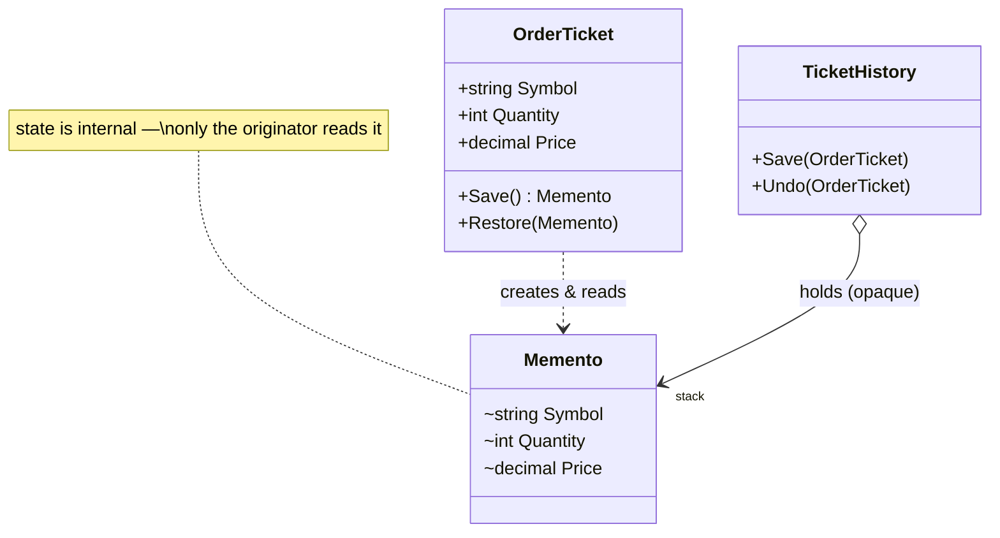

# Memento — Order Ticket Snapshots

> **Week 3 · Day 3b · Behavioral**
> Run just this kata: `dotnet test --filter "FullyQualifiedName~Memento"`

## The scenario

A trader edits an order ticket, then wants to roll back to how it was — a "revert changes" or
multi-level undo. We need to snapshot and restore the ticket's state **without exposing its guts** to
whatever holds the snapshots.

## The challenge

Open [`Legacy/LegacyTicket.cs`](./Legacy/LegacyTicket.cs) and its test. Every field is public, and
snapshots are taken by external code copying fields out and back:

```csharp
var savedSymbol = ticket.Symbol; var savedQty = ticket.Quantity; var savedPrice = ticket.Price;
// ...mutate...
ticket.Symbol = savedSymbol; ticket.Quantity = savedQty; ticket.Price = savedPrice;
```

| Smell | What it costs you |
|-------|-------------------|
| **Broken encapsulation** | The ticket's entire state is public *just* to enable undo. |
| **Snapshot logic lives outside** | Copied at every save site, easy to get wrong. |
| **Silent drift** | Add a `Side` field and every snapshot site forgets it — no compiler help. |

We want the ticket to **snapshot itself into an opaque token** that callers can hold but not read.

## The pattern: Memento

> **Intent:** Without violating encapsulation, capture and externalize an object's internal state so
> that the object can be restored to this state later. — *Gang of Four*

- The **Originator** (`OrderTicket`) creates a memento of its state (`Save`) and restores from one
  (`Restore`).
- The **Memento** (`OrderTicket.Memento`) holds the state, but exposes it **only to the originator**.
- The **Caretaker** (`TicketHistory`) keeps mementos (e.g., an undo stack) but **never looks inside**
  them.

Here the memento's state is `internal`, so anything outside the originator's assembly — the caretaker
and the tests — can pass a memento around but cannot read or forge it. (In a single project you'd get
the same effect with a private nested class.)

### UML



## Your task

Implement the two methods in [`OrderTicket.cs`](./OrderTicket.cs):

1. **`Save()`** — `return new Memento(Symbol, Quantity, Price);`
2. **`Restore(memento)`** — copy `memento.Symbol/Quantity/Price` back into this ticket.

(Both live inside `OrderTicket`, so they're allowed to touch the memento's `internal` state — no one
else is.)

```bash
dotnet test --filter "FullyQualifiedName~Memento"
```

The provided `TicketHistory` caretaker gives you multi-level undo the moment `Save`/`Restore` work —
and notice it never reads a memento's fields.

### Stretch goals

- **Add a field.** Give `OrderTicket` a `Side` and thread it through `Save`/`Restore`. One place
  changes — contrast with the legacy, where every external snapshot site would need updating.
- **Memento vs. Command (Day 1b).** Command stores *how to reverse an action*; Memento stores *state
  to roll back to*. For a ticket with ten fields, which is simpler? For a huge document?
- **Memento vs. Prototype (Week 1).** Prototype deep-copies the *whole* object; Memento captures just
  the state needed to restore, kept opaque. When does the distinction matter?

## When to use it

- **Use it** for undo/redo, checkpoints, snapshots, and "revert", especially when you must preserve
  encapsulation of the object being snapshotted.
- **Real-world finance:** order-ticket edits, form/wizard rollback, what-if scenario checkpoints,
  transactional "save point then maybe restore".
- **Avoid it** when snapshots are huge or frequent (memory cost), or when the object is simple enough
  that a public copy/`record with` is clearer than a formal memento.

## Done when

- [ ] `Save` and `Restore` are implemented.
- [ ] `dotnet test --filter "FullyQualifiedName~Memento"` is fully green.
- [ ] You can explain why the caretaker can hold a memento but not read it.
