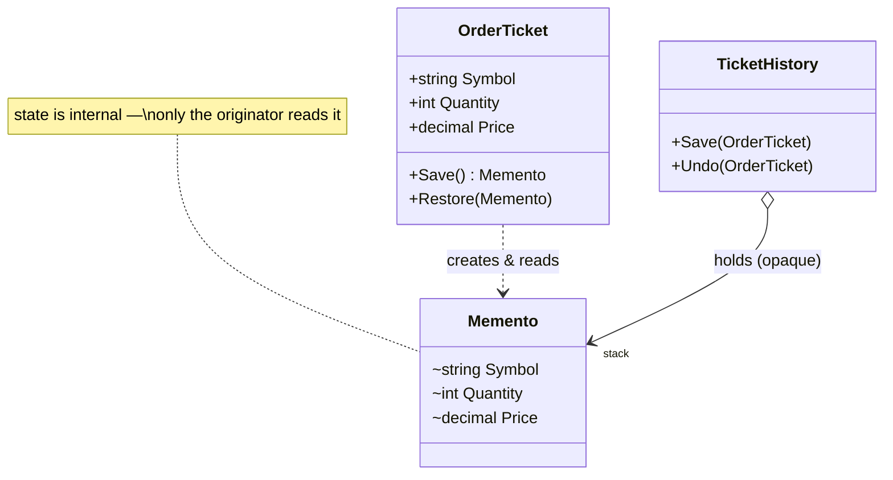

# Memento — Order Ticket Snapshots

> **Week 3 · Day 3b · Behavioral**
> Run just this kata: `dotnet test --filter "FullyQualifiedName~Memento"`
> **This is a build-from-scratch kata:** you create every type yourself. Nothing is stubbed.

## The scenario

A trader edits an order ticket, then wants to roll back to how it was — a "revert changes" or
multi-level undo. We need to snapshot and restore the ticket's state **without exposing its guts** to
whatever holds the snapshots.

## The challenge

Open [`Legacy/LegacyTicket.cs`](./Legacy/LegacyTicket.cs) and its test. Every field is public, and
snapshots are taken by external code copying fields out and back:

```csharp
var savedSymbol = ticket.Symbol; var savedQty = ticket.Quantity; var savedPrice = ticket.Price;
// ...mutate...
ticket.Symbol = savedSymbol; ticket.Quantity = savedQty; ticket.Price = savedPrice;
```

| Smell | What it costs you |
|-------|-------------------|
| **Broken encapsulation** | The ticket's entire state is public *just* to enable undo. |
| **Snapshot logic lives outside** | Copied at every save site, easy to get wrong. |
| **Silent drift** | Add a `Side` field and every snapshot site forgets it — no compiler help. |

We want the ticket to **snapshot itself into an opaque token** that callers can hold but not read.

## The pattern: Memento

> **Intent:** Without violating encapsulation, capture and externalize an object's internal state so
> that the object can be restored to this state later. — *Gang of Four*

- The **Originator** (`OrderTicket`) creates a memento of its state (`Save`) and restores from one
  (`Restore`).
- The **Memento** (`OrderTicket.Memento`) holds the state, but exposes it **only to the originator**.
- The **Caretaker** (`TicketHistory`) keeps mementos (e.g., an undo stack) but **never looks inside**
  them.

Here the memento's state is `internal`, so anything outside the originator's assembly — the caretaker
and the tests — can pass a memento around but cannot read or forge it. (In a single project you'd get
the same effect with a private nested class.)

### UML



## Target API — what the (commented-out) tests expect

You must create these types so the tests compile and pass. **Names and constructor signatures are
fixed by the tests; everything inside is your design.**

| Type | Shape | Behaviour the tests pin down |
|------|-------|------------------------------|
| `OrderTicket` | `OrderTicket(string symbol, int quantity, decimal price)`; settable `Symbol`/`Quantity`/`Price`; `Memento Save()`; `void Restore(Memento)` | the originator — snapshots itself and restores itself |
| `OrderTicket.Memento` | nested type carrying a symbol/quantity/price snapshot; its state is **internal** (readable only inside the originator's assembly) | the opaque token callers hold but cannot read or forge |
| `TicketHistory` | `void Save(OrderTicket)`, `void Undo(OrderTicket)`, `int Count` | the caretaker — an undo stack of mementos it never looks inside |

**Provided (don't recreate):** only the `Legacy/` baseline (`LegacyTicket` + its test). Everything the
new tests touch — `OrderTicket`, its nested `Memento`, and `TicketHistory` — is yours to build.

## Your task (from scratch)

1. **Uncomment the tests.** In [`MementoTests.cs`](../../../DesignPatternsBootcamp.Tests/Behavioral/MementoTests.cs)
   delete the `/*` and `*/`. Now `dotnet test --filter "FullyQualifiedName~Memento"` **won't compile** —
   `OrderTicket`, `OrderTicket.Memento` and `TicketHistory` don't exist yet. Each build error is the
   next type to create.
2. **Build the originator.** Add a new `.cs` file in this folder; define `OrderTicket` with a constructor
   and mutable `Symbol`/`Quantity`/`Price`. Nest a `Memento` type inside it that carries a snapshot of
   those three values, and keep the memento's state `internal` so nothing outside the originator's
   assembly can read it.
3. **Snapshot and restore.** Give `OrderTicket` a `Save()` that returns a new memento of its current
   state, and a `Restore(memento)` that copies a memento's state back in. Both live inside `OrderTicket`,
   so they're the only code allowed to touch the memento's internals. Get
   `Save_then_restore_rolls_the_ticket_back` green.
4. **Build the caretaker.** Add `TicketHistory`: `Save(ticket)` pushes the ticket's memento onto a stack
   (`Count` reflects its size); `Undo(ticket)` pops the last memento and restores the ticket from it —
   without ever reading the memento's fields. Get the multi-level-undo test green.
5. **Green.** `dotnet test --filter "FullyQualifiedName~Memento"`.

### Stretch goals

- **Add a field.** Give `OrderTicket` a `Side` and thread it through `Save`/`Restore`. One place
  changes — contrast with the legacy, where every external snapshot site would need updating.
- **Memento vs. Command (Day 1b).** Command stores *how to reverse an action*; Memento stores *state
  to roll back to*. For a ticket with ten fields, which is simpler? For a huge document?
- **Memento vs. Prototype (Week 1).** Prototype deep-copies the *whole* object; Memento captures just
  the state needed to restore, kept opaque. When does the distinction matter?

## When to use it

- **Use it** for undo/redo, checkpoints, snapshots, and "revert", especially when you must preserve
  encapsulation of the object being snapshotted.
- **Real-world finance:** order-ticket edits, form/wizard rollback, what-if scenario checkpoints,
  transactional "save point then maybe restore".
- **Avoid it** when snapshots are huge or frequent (memory cost), or when the object is simple enough
  that a public copy/`record with` is clearer than a formal memento.

## Done when

- [ ] You built `OrderTicket` (with its nested `Memento`) and `TicketHistory` from scratch.
- [ ] `dotnet test --filter "FullyQualifiedName~Memento"` is fully green.
- [ ] You can explain why the caretaker can hold a memento but not read it.
