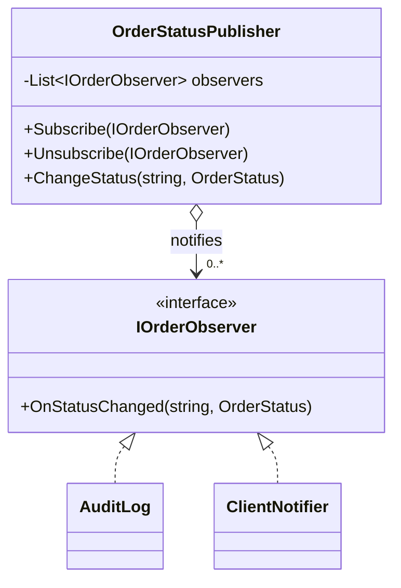

# Observer — Order Status Notifications

> **Week 4 · Day 1a · Behavioral**
> Run just this kata: `dotnet test --filter "FullyQualifiedName~Observer"`

## The scenario

When an order's status changes (New → PartiallyFilled → Filled → Cancelled), lots of things need to
react: an audit trail, a client push notification, a risk monitor, a P&L feed. That list grows and
changes, and the order shouldn't have to know about any of it.

## The challenge

Open [`Legacy/LegacyOrderBook.cs`](./Legacy/LegacyOrderBook.cs). The book hard-codes a call to each
interested party:

```csharp
AuditEntries.Add($"{orderId}:{status}"); // audit
ClientNotifications++;                    // notify client
// want a risk monitor too? edit this method.
```

| Smell | What it costs you |
|-------|-------------------|
| **Tight coupling** | The subject knows every subscriber and its API. |
| **Closed to extension** | A new interested party means editing the subject. |
| **No runtime flexibility** | Subscribers can't be added or removed while running. |

We want the subject to just **announce** "status changed" and let anyone listen.

## The pattern: Observer

> **Intent:** Define a one-to-many dependency between objects so that when one object changes state,
> all its dependents are notified and updated automatically. — *Gang of Four*

- The **Subject** (`OrderStatusPublisher`) keeps a list of observers and broadcasts changes.
- **Observers** (`IOrderObserver` → `AuditLog`, `ClientNotifier`) subscribe and react.
- The subject depends only on the `IOrderObserver` interface — never on concrete observers.

### UML



> **C# note:** The idiomatic Observer in C# is the **`event`** keyword (and `IObservable<T>` for
> streams). This hand-rolled version shows the mechanics behind them — a subscriber list and a
> broadcast loop.

## Your task

Implement the three methods in [`OrderStatusPublisher.cs`](./OrderStatusPublisher.cs):

1. **`Subscribe`** — add the observer to `_observers`.
2. **`Unsubscribe`** — remove it.
3. **`ChangeStatus`** — call `OnStatusChanged(orderId, status)` on **every** subscribed observer.

```bash
dotnet test --filter "FullyQualifiedName~Observer"
```

`A_brand_new_observer_type_just_subscribes…` is the payoff: a new listener plugs in without the
publisher changing at all.

### Stretch goals

- **Rewrite with `event`.** Replace the list + loop with a C# `event Action<string, OrderStatus>`.
  Note what you gain (language support, `+=`/`-=`) and lose (explicit control of the list).
- **Push vs. pull.** We *push* the new status to observers. Alternatively push just "something
  changed" and let observers *pull* details. When is each better?
- **Beware feedback loops & ordering.** What happens if an observer, while handling a change,
  triggers another change? Add a guard.

## When to use it

- **Use it** for event/notification systems, publish–subscribe, and keeping multiple views/consumers
  in sync with a changing subject.
- **Real-world finance:** order/execution status feeds, market-data subscriptions, position and P&L
  updates, alerting, UI data binding.
- **Avoid it** when there's exactly one dependent (just call it), or when hidden update cascades
  would make the flow hard to follow — sometimes an explicit call is clearer than a broadcast.

## Done when

- [ ] `Subscribe`, `Unsubscribe`, and `ChangeStatus` are implemented.
- [ ] `dotnet test --filter "FullyQualifiedName~Observer"` is fully green.
- [ ] You can add a new observer type without touching `OrderStatusPublisher`.
