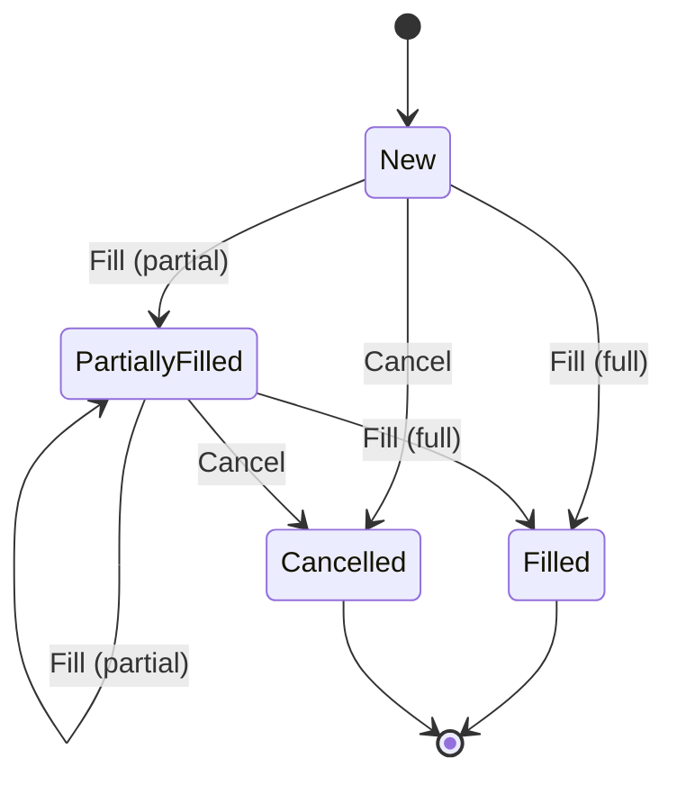
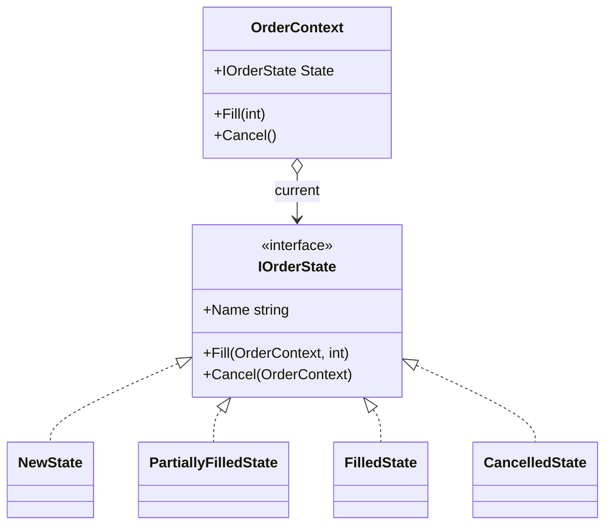

# State — Order State Machine

> **Week 4 · Day 1b · Behavioral**
> Run just this kata: `dotnet test --filter "FullyQualifiedName~State"`
> **This is a build-from-scratch kata:** you create every type yourself. Nothing is stubbed.

## The scenario

An order moves through a lifecycle: **New → PartiallyFilled → Filled**, and **New/PartiallyFilled →
Cancelled**. What you're allowed to do — and where you go next — depends entirely on the current
state. A filled order can't be cancelled; a cancelled order can't be filled.

## The challenge

Open [`Legacy/LegacyOrder.cs`](./Legacy/LegacyOrder.cs). It tracks a `Status` string and every
operation re-checks it:

```csharp
public void Fill(int quantity) {
    if (Status is "Filled" or "Cancelled") throw ...;
    FilledQuantity += quantity;
    Status = FilledQuantity >= Quantity ? "Filled" : "PartiallyFilled";
}
public void Cancel() { if (Status is "Filled" or "Cancelled") throw ...; Status = "Cancelled"; }
```

| Smell | What it costs you |
|-------|-------------------|
| **Duplicated transition rules** | The same status checks are copied into every operation. |
| **Implicit machine** | The state machine exists only smeared across `if`s — nowhere to see it. |
| **Rigid to new states** | Add "PendingCancel" and you edit every method's guards. |

We want each state to be a **thing that owns its own behaviour and transitions**.

## The pattern: State

> **Intent:** Allow an object to alter its behavior when its internal state changes. The object will
> appear to change its class. — *Gang of Four*

- The **Context** (`OrderContext`) holds a reference to a current **State** and delegates operations
  to it.
- Each **Concrete State** (`NewState`, `PartiallyFilledState`, `FilledState`, `CancelledState`)
  implements `Fill`/`Cancel` for that state — including moving the context to the next state, or
  refusing the operation.

### State diagram





> **State vs. Strategy (Day 2a):** structurally twins — a context delegating to a swappable object.
> The difference is *who swaps it and why*: a **Strategy** is chosen by the client and usually stays
> put; a **State** changes itself as part of the object's lifecycle (the transitions live in the
> states).

## Target API — what the (commented-out) tests expect

You must create these types so the tests compile and pass. **Names and constructor signatures are
fixed by the tests; everything inside is your design.**

| Type | Shape | Behaviour the tests pin down |
|------|-------|------------------------------|
| `OrderContext` | `OrderContext(int quantity)`; `string Status`; `int FilledQuantity`; `void Fill(int)`; `void Cancel()` (plus a mutable current `State` and the target `Quantity` the states read/advance) | delegates `Fill`/`Cancel` to its current state; `Status` reads the state's name; starts in `NewState` |
| `IOrderState` | interface: `string Name`, `void Fill(OrderContext, int)`, `void Cancel(OrderContext)` | one state's behaviour + its transitions |
| `NewState` | `IOrderState`, `Name` = `"New"` | `Fill` → PartiallyFilled/Filled; `Cancel` → Cancelled |
| `PartiallyFilledState` | `IOrderState`, `Name` = `"PartiallyFilled"` | same transitions as `NewState` |
| `FilledState` | `IOrderState`, `Name` = `"Filled"` | both operations throw `InvalidOperationException` |
| `CancelledState` | `IOrderState`, `Name` = `"Cancelled"` | both operations throw `InvalidOperationException` |

**Provided (don't recreate):** only the `Legacy/` baseline (`LegacyOrder`). The context, the state
interface, and all four state classes are yours to build.

## Your task (from scratch)

1. **Uncomment the tests.** In [`StateTests.cs`](../../../DesignPatternsBootcamp.Tests/Behavioral/StateTests.cs)
   delete the `/*` and `*/`. Now `dotnet test --filter "FullyQualifiedName~State"` **won't compile** —
   `OrderContext`, `IOrderState` and the four state classes don't exist yet. Each build error is the
   next type to create.
2. **Build the context.** Add a new `.cs` file; define `OrderContext(int quantity)` holding the target
   `Quantity`, the `FilledQuantity` so far, and a mutable current state. `Status` returns the current
   state's `Name`; `Fill`/`Cancel` delegate straight to the current state; a fresh context starts in
   `NewState`.
3. **Define the state interface.** Declare `IOrderState` with a `Name`, a `Fill(context, quantity)`,
   and a `Cancel(context)`.
4. **Implement the working states.** In `NewState` and `PartiallyFilledState`, `Fill` adds to the
   context's `FilledQuantity`, then points the context at `FilledState` when fully filled, otherwise
   `PartiallyFilledState`; `Cancel` points it at `CancelledState`.
5. **Implement the terminal states.** In `FilledState` and `CancelledState`, both `Fill` and `Cancel`
   are illegal — throw `InvalidOperationException`.
6. **Green.** `dotnet test --filter "FullyQualifiedName~State"`.

### Stretch goals

- **Add a state.** Introduce `PendingCancel` (New/PartiallyFilled can request cancel, then it either
  confirms → Cancelled or resumes). Notice you add a class and touch only the states that transition
  into it — never a giant switch.
- **Entry/exit actions.** Give states an `OnEnter(context)` hook (e.g. stamp a timestamp). Where does
  the context call it?
- **Illegal-transition policy.** Compare throwing vs. returning a result vs. ignoring. Which suits an
  order-management system?

## When to use it

- **Use it** when an object's behavior depends on its state and it has many state-dependent
  operations, or when you have a state machine with non-trivial transitions.
- **Real-world finance:** order/trade lifecycles, settlement status, account/KYC status, workflow and
  approval state machines, connection/session state.
- **Avoid it** for two trivial states with one guard (an `enum` + `if` is fine), or when states share
  so much behavior that separate classes add more ceremony than clarity.

## Done when

- [ ] You built `OrderContext`, `IOrderState`, and all four state classes from scratch.
- [ ] `dotnet test --filter "FullyQualifiedName~State"` is fully green.
- [ ] You can explain how adding a new state avoids editing the other states' code.
