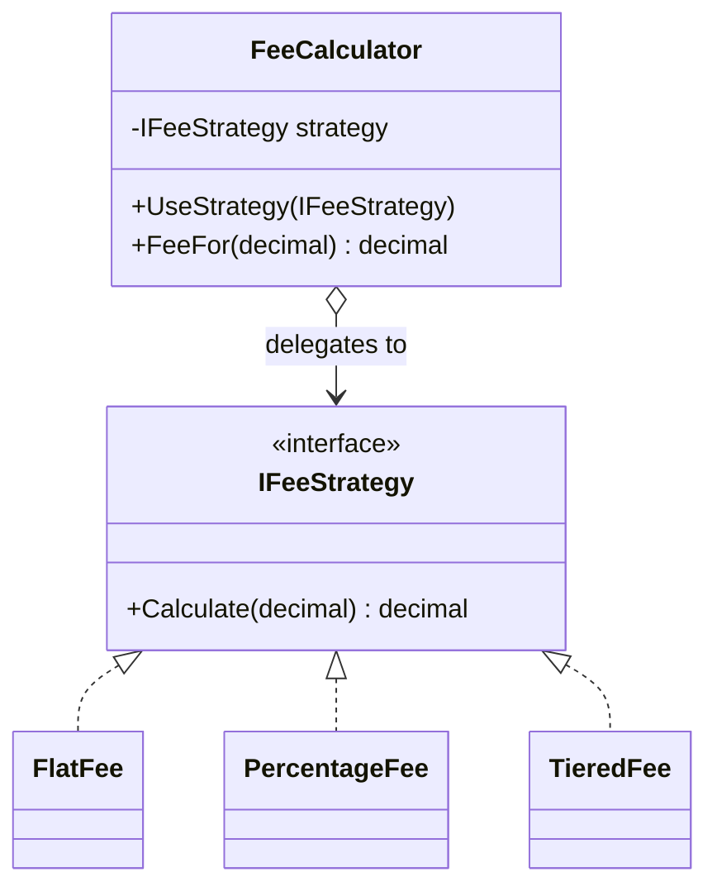

# Strategy — Fee Calculation

> **Week 4 · Day 2a · Behavioral**
> Run just this kata: `dotnet test --filter "FullyQualifiedName~Strategy"`
> **This is a build-from-scratch kata:** you create every type yourself. Nothing is stubbed.

## The scenario

Different accounts and venues charge fees differently: a flat ticket charge, a percentage of
notional, a tiered schedule. The fee policy is chosen per account and can change — the calculator
shouldn't hard-code them all.

## The challenge

Open [`Legacy/LegacyFeeCalculator.cs`](./Legacy/LegacyFeeCalculator.cs). Every algorithm is jammed
into one `switch`, with a `parameter` that means something different in each branch:

```csharp
switch (feeType) {
    case "flat":       return parameter;
    case "percentage": return Math.Round(notional * parameter, 2);
    case "tiered":     return notional < 100_000m ? ... : ...;
}
```

| Smell | What it costs you |
|-------|-------------------|
| **Tangled algorithms** | Unrelated calculations share one method. |
| **Not first-class** | You can't hold "the fee policy" as a value, pass it, or swap it at runtime. |
| **Overloaded parameter** | `parameter` is amount, or rate, or ignored — a trap. |
| **Closed to extension** | A new fee type edits the switch. |

We want each algorithm to be an **interchangeable object**.

## The pattern: Strategy

> **Intent:** Define a family of algorithms, encapsulate each one, and make them interchangeable.
> Strategy lets the algorithm vary independently from clients that use it. — *Gang of Four*

- The **Strategy** (`IFeeStrategy`) is the common interface.
- Each **Concrete Strategy** (`FlatFee`, `PercentageFee`, `TieredFee`) is one algorithm.
- The **Context** (`FeeCalculator`) holds a strategy and delegates to it, swapping it freely.

### UML



> **Strategy vs. State (Day 1b):** the *same shape* — a context delegating to a swappable object. The
> difference is intent: a **Strategy** is picked by the client and usually stays; a **State** swaps
> *itself* as the object's lifecycle advances.
>
> **Strategy vs. Template Method (Day 2b):** both vary an algorithm. Strategy varies the *whole*
> algorithm by composition (swap the object); Template Method varies *steps* of a fixed skeleton by
> inheritance.

## Target API — what the (commented-out) tests expect

You must create these types so the tests compile and pass. **Names and constructor signatures are
fixed by the tests; everything inside is your design.**

| Type | Shape | Behaviour the tests pin down |
|------|-------|------------------------------|
| `IFeeStrategy` | interface: `decimal Calculate(decimal notional)` | the common strategy type |
| `FlatFee` | `FlatFee(decimal amount)` | `Calculate` returns the constant `amount`, ignoring notional |
| `PercentageFee` | `PercentageFee(decimal rate)` | `Calculate` returns `notional × rate`, rounded to cents |
| `TieredFee` | `TieredFee()` (no args) | `0.1%` below `$100k`, `0.05%` at/above, rounded to cents |
| `FeeCalculator` | `FeeCalculator(IFeeStrategy strategy)`; `decimal FeeFor(decimal notional)`; `void UseStrategy(IFeeStrategy strategy)` | delegates `FeeFor` to the current strategy; `UseStrategy` swaps it at runtime |

**Provided:** only `Legacy/LegacyFeeCalculator.cs` (the "before" switch). Every type above you build
yourself — the exact fee numbers are in the tests.

## Your task (from scratch)

1. **Uncomment the tests.** In [`StrategyTests.cs`](../../../DesignPatternsBootcamp.Tests/Behavioral/StrategyTests.cs)
   delete the `/*` and `*/`. Now `dotnet test --filter "FullyQualifiedName~Strategy"` **won't
   compile** — that's step one done. Each "type could not be found" error is one row of the table above.
2. **Create the strategy interface + concrete strategies.** Add a new `.cs` file in this folder;
   define `IFeeStrategy` and the three algorithms:
   - **`FlatFee`** → the constant amount.
   - **`PercentageFee`** → `Math.Round(notional * rate, 2)`.
   - **`TieredFee`** → `0.1%` below `$100k`, `0.05%` at/above, rounded to cents.
   That greens `Flat_fee_is_constant`, `Percentage_fee_scales_with_notional`, and
   `Tiered_fee_picks_the_right_band`.
3. **Create the context.** Add `FeeCalculator`: it holds an `IFeeStrategy`, delegates `FeeFor` to it,
   and `UseStrategy` replaces it. That greens `The_calculator_swaps_strategies_at_runtime`.
4. **Green.** `dotnet test --filter "FullyQualifiedName~Strategy"`.

`The_calculator_swaps_strategies_at_runtime` shows the payoff: the same context produces different
fees just by swapping the strategy object — no branching in sight.

### Stretch goals

- **Strategy as a function.** In C# a strategy can be a `Func<decimal, decimal>`. Add a
  `FeeCalculator` overload that takes one and note when a whole interface is overkill.
- **Inject it.** Register the account's strategy in a DI container and inject `IFeeStrategy` — the
  everyday form of Strategy in modern C#.
- **Compose strategies.** A `CappedFee(inner, max)` that wraps another strategy and caps its result.
  (Notice that's Strategy meeting Decorator from Week 2.)

## When to use it

- **Use it** when you have several interchangeable ways to do one thing and want to choose/swap at
  runtime, or to banish a big conditional that selects behavior.
- **Real-world finance:** fee/commission schedules, pricing and risk models, routing/execution
  algorithms, retry/backoff policies, sort/ranking rules.
- **Avoid it** when there's only one algorithm, or when the "strategies" never actually vary — a
  single method is simpler than a hierarchy built for change that never comes.

## Done when

- [ ] You created `IFeeStrategy`, the three strategies, and the `FeeCalculator` context from scratch.
- [ ] `dotnet test --filter "FullyQualifiedName~Strategy"` is fully green.
- [ ] You can articulate the difference between Strategy and State.
