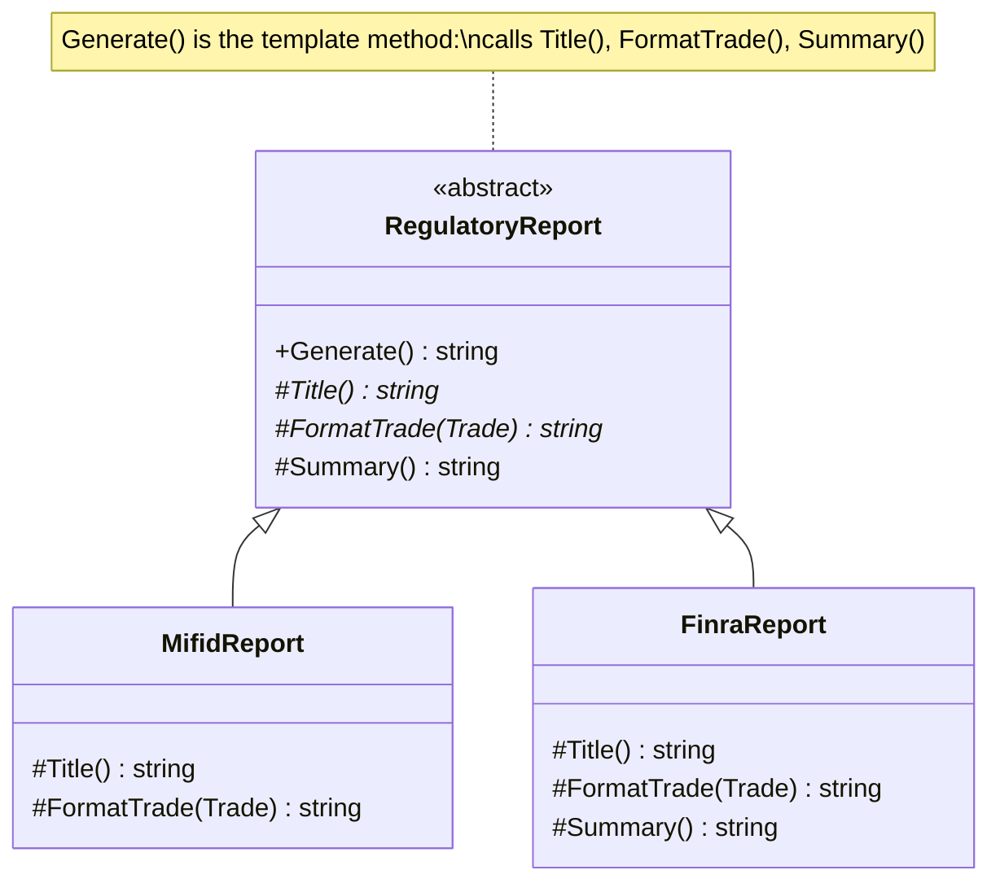

# Template Method — Regulatory Reports

> **Week 4 · Day 2b · Behavioral**
> Run just this kata: `dotnet test --filter "FullyQualifiedName~TemplateMethod"`

## The scenario

We file several regulatory reports — MiFID, FINRA, more to come. They all share the same shape:
a **title**, then a **formatted line per trade**, then a **summary**. Only the details of each step
differ (CSV vs. pipe-delimited, EUR vs. USD, the footer wording).

## The challenge

Open [`Legacy/LegacyReportGenerator.cs`](./Legacy/LegacyReportGenerator.cs). Each report type
re-implements the whole skeleton:

```csharp
public string GenerateMifid(...) { sb.AppendLine("MiFID..."); foreach(...) sb.AppendLine(csvRow); sb.Append(summary); }
public string GenerateFinra(...) { sb.AppendLine("FINRA..."); foreach(...) sb.AppendLine(pipeRow); sb.Append(summary); }
```

| Smell | What it costs you |
|-------|-------------------|
| **Duplicated skeleton** | The title→rows→summary shape is copy-pasted per report. |
| **Drift** | Change the skeleton (add a timestamp, blank-line separators) and every copy must change — and won't. |
| **Buried variation** | What actually differs between reports is hard to see amid the boilerplate. |

We want the **skeleton written once**, with only the varying steps supplied per report.

## The pattern: Template Method

> **Intent:** Define the skeleton of an algorithm in an operation, deferring some steps to
> subclasses. Template Method lets subclasses redefine certain steps of an algorithm without changing
> the algorithm's structure. — *Gang of Four*

- The **Abstract Class** (`RegulatoryReport`) defines the **template method** `Generate()` — the
  fixed skeleton — and declares the steps it calls.
- **Primitive operations** (`Title`, `FormatTrade`) are abstract — subclasses must supply them.
- **Hooks** (`Summary`) have a default — subclasses may override.
- **Concrete Classes** (`MifidReport`, `FinraReport`) fill in the steps.

This is the **Hollywood Principle**: "Don't call us, we'll call you" — the base class calls down into
your steps, not the other way round.

### UML



> **Template Method vs. Strategy (Day 2a):** both let an algorithm vary. Template Method varies
> *steps of a fixed skeleton* via **inheritance** (subclass overrides). Strategy swaps the *whole*
> algorithm via **composition** (inject a different object). Inheritance vs. composition is the crux.

## Your task

Fill in the steps in [`RegulatoryReport.cs`](./RegulatoryReport.cs) — `Generate()` is already written:

1. **`MifidReport`** — `Title()` = `"MiFID II Transaction Report"`; `FormatTrade` =
   `$"{Symbol},{Quantity},{Price:0.00},EUR"`. (Uses the default `Summary`.)
2. **`FinraReport`** — `Title()` = `"FINRA OATS Report"`; `FormatTrade` =
   `$"{Symbol}|{Quantity}|{Price:0.00}|USD"`; override `Summary()` =
   `$"{Trades.Count} trades reported to FINRA"`.

```bash
dotnet test --filter "FullyQualifiedName~TemplateMethod"
```

`Both_reports_follow_the_same_skeleton_order` proves the shape is enforced by the shared template
method — neither subclass can reorder it.

### Stretch goals

- **Add a report** (`EmirReport`) by writing only its steps. The skeleton — and any future change to
  it — is inherited for free.
- **Add a hook.** Give the base a `virtual string Separator() => ""` between rows; override it in one
  report. Hooks are the "optional" extension points.
- **Skeleton change, once.** Add a generation-timestamp line to `Generate()` (pass the time in — the
  bootcamp forbids `DateTime.Now` in library code) and watch every report gain it with no per-report
  edits.

## When to use it

- **Use it** when several variants share an invariant overall algorithm but differ in specific steps,
  and you want to enforce the shape while allowing controlled variation.
- **Real-world finance:** report/statement generation, ETL and batch pipelines (extract→transform→
  load), settlement/reconciliation runs, onboarding flows.
- **Avoid it** when composition fits better (prefer Strategy for swapping whole algorithms), or when
  deep inheritance hierarchies would make the flow hard to follow.

## Done when

- [ ] `MifidReport` and `FinraReport` implement their steps.
- [ ] `dotnet test --filter "FullyQualifiedName~TemplateMethod"` is fully green.
- [ ] You can explain the difference between a primitive operation and a hook.
