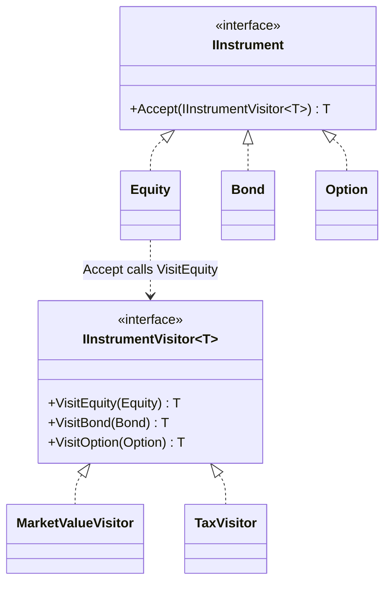

# Visitor — Instrument Analytics

> **Week 4 · Day 3 · Behavioral**
> Run just this kata: `dotnet test --filter "FullyQualifiedName~Visitor"`
> **This is a build-from-scratch kata:** you build the two visitors yourself. The element hierarchy is given; nothing is stubbed.

## The scenario

A portfolio holds different instrument types — equities, bonds, options — and we keep needing new
analytics over them: market value, tax estimate, exposure, risk. We want to add an **operation**
without editing every instrument class.

## The challenge

Open [`Legacy/LegacyAnalytics.cs`](./Legacy/LegacyAnalytics.cs). Each analytic re-switches on the
instrument type:

```csharp
public decimal MarketValue(IInstrument instrument) => instrument switch {
    Equity e => e.Shares * e.Price,
    Bond b   => b.FaceValue,
    Option o => o.Contracts * o.Premium * 100,
    _        => throw ...,     // a default the compiler can't check for completeness
};
// Tax(...) would repeat the exact same switch. And exposure. And risk.
```

| Smell | What it costs you |
|-------|-------------------|
| **Duplicated type switch** | Every operation hand-rolls the same `Equity/Bond/Option` dispatch. |
| **Unchecked completeness** | The `default` hides a missing case — no compile-time help. |
| **Scattered operations** | An operation isn't a first-class thing; it's a switch copied around. |

We want an **operation to be one object** whose per-type logic lives together and dispatches safely.

## The pattern: Visitor

> **Intent:** Represent an operation to be performed on the elements of an object structure. Visitor
> lets you define a new operation without changing the classes of the elements on which it operates.
> — *Gang of Four*

- The **Element** (`IInstrument`) declares `Accept(visitor)`.
- Each **Concrete Element** (`Equity`, `Bond`, `Option`) implements `Accept` to call the visitor's
  method **for its own type** — this is **double dispatch**.
- The **Visitor** (`IInstrumentVisitor<T>`) has one method per element type.
- Each **Concrete Visitor** (`MarketValueVisitor`, `TaxVisitor`) is one operation.

**Double dispatch:** `instrument.Accept(visitor)` first dispatches on the instrument's real type (via
`Accept`), then on the visitor — so the right `Visit…` runs with no casts and no `default`.

### UML



> **The trade-off (the "expression problem"):** Visitor makes adding an **operation** trivial (a new
> visitor, no element changes) but adding an **element type** costly (every visitor gets a new
> method). A `switch`/pattern-match is the opposite — easy to add a type, but each operation repeats
> the dispatch. Choose Visitor when your *types* are stable and your *operations* grow.

## Target API — what the (commented-out) tests expect

You must create these two visitor types so the tests compile and pass. **Names are fixed by the tests;
everything inside is your design.**

| Type | Shape | Behaviour the tests pin down |
|------|-------|------------------------------|
| `MarketValueVisitor` | `MarketValueVisitor()` (no args); implements `IInstrumentVisitor<decimal>` — `VisitEquity`, `VisitBond`, `VisitOption`, each returning `decimal` | Equity → `Shares × Price`; Bond → `FaceValue`; Option → `Contracts × Premium × 100` |
| `TaxVisitor` | `TaxVisitor()` (no args); implements `IInstrumentVisitor<decimal>` | Equity → `Shares × Price × 0.15`; Bond → `FaceValue × CouponRate × 0.25`; Option → `Contracts × Premium × 100 × 0.20` |

**Provided:** `Instruments.cs` gives you the whole **element** side — `IInstrument`, the visitor
interface `IInstrumentVisitor<T>`, and the sealed `Equity`/`Bond`/`Option` with their double-dispatch
`Accept<T>` already written. `Legacy/LegacyAnalytics.cs` is the "before". You write **only** the two
concrete visitors; you do not touch the instruments. The exact numbers are in the tests.

## Your task (from scratch)

1. **Uncomment the tests.** In [`VisitorTests.cs`](../../../DesignPatternsBootcamp.Tests/Behavioral/VisitorTests.cs)
   delete the `/*` and `*/`. Now `dotnet test --filter "FullyQualifiedName~Visitor"` **won't
   compile** — that's step one done. The only missing types are `MarketValueVisitor` and `TaxVisitor`.
2. **Create `MarketValueVisitor`.** Add a new `.cs` file; implement `IInstrumentVisitor<decimal>` with
   the three `Visit…` methods valuing each instrument type. That greens the market-value tests.
3. **Create `TaxVisitor`.** A second `IInstrumentVisitor<decimal>` applying a type-specific rate —
   a brand-new operation over the **same** instruments, none of which change.
4. **Green.** `dotnet test --filter "FullyQualifiedName~Visitor"`.

`Adding_an_operation_is_a_new_visitor…` is the point: `TaxVisitor` is a whole new operation over the
same instruments, and not one instrument class changed.

### Stretch goals

- **Add an operation** (`ExposureVisitor`) — one new class, zero instrument edits. Feel how easy the
  "good" axis is.
- **Add an element** (`Future : IInstrument`) — now feel the "hard" axis: every visitor needs a new
  `VisitFuture`. This is the expression problem made concrete.
- **Visitor over a Composite.** Recall the Week 2 capstone pattern-matched a Composite tree to reprice
  it. Rewrite that as a Visitor and note what you gained (type-safety, grouped operations).

## When to use it

- **Use it** when you must run many distinct operations over a stable set of element types, and want
  each operation grouped in one place with compile-time-checked dispatch.
- **Real-world finance:** portfolio analytics (valuation, tax, risk, exposure) over instrument types,
  AST processing, document/DOM traversal, exporters/serializers over an object model.
- **Avoid it** when element types change often (every change ripples through all visitors), or when a
  single `switch`/pattern-match is clearer — modern C# pattern matching is often enough.

## Done when

- [ ] You created `MarketValueVisitor` and `TaxVisitor` from scratch, each implementing all three
      `Visit` methods (and you left the provided instruments untouched).
- [ ] `dotnet test --filter "FullyQualifiedName~Visitor"` is fully green.
- [ ] You can explain double dispatch, and which axis (types vs. operations) Visitor optimizes.
