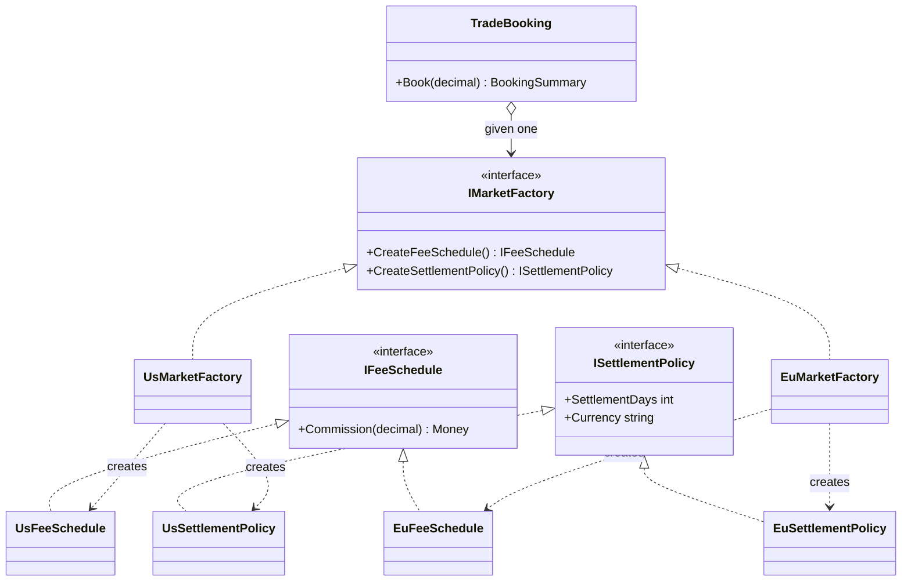

# Abstract Factory — Regional Market Suites

> **Week 1 · Day 1b · Creational**
> Run just this kata: `dotnet test --filter "FullyQualifiedName~AbstractFactory"`

## The scenario

Our brokerage trades in several markets. Each market comes with a **matched set of rules** that
must be used together:

| Market | Commission | Settlement | Currency |
|--------|-----------|------------|----------|
| US | max($1, 0.1% of notional) | T+1 | USD |
| EU | €1.20 + 0.2% of notional | T+2 | EUR |

The fee schedule and the settlement policy for a market are a **family**: US fees only make sense
with US settlement in USD. Pairing US fees with EU settlement is nonsense — but is your code
*structurally* able to prevent it?

## The challenge

Open [`Legacy/LegacyTradeDesk.cs`](./Legacy/LegacyTradeDesk.cs). The market rules are smeared
across **three** independent `switch` statements, all keyed by a loose `"region"` string:

```csharp
Commission(region, notional)   // switch on region
SettlementDays(region)         // switch on region again
SettlementCurrency(region)     // and again
```

The smells:

| Smell | What it costs you |
|-------|-------------------|
| **No enforced consistency** | Three switches that must agree, but nothing makes them. Add a market's fees, forget its settlement → a half-built region ships. |
| **Mix-and-match bugs** | `Commission("US", …)` + `SettlementCurrency("EU")` compiles fine. You just booked US fees settling in euros. |
| **Shotgun surgery** | Adding APAC means editing every switch. |
| **Primitive obsession** | "A market" is a magic string, not a thing you can pass around. |

We want **"a market" to be a single object** that hands out a guaranteed-consistent set of rules.

## The pattern: Abstract Factory

> **Intent:** Provide an interface for creating families of related or dependent objects without
> specifying their concrete classes. — *Gang of Four*

- The **Abstract Factory** (`IMarketFactory`) declares one creator method per product in the family.
- Each **Concrete Factory** (`UsMarketFactory`, `EuMarketFactory`) produces one coherent family.
- The **Client** (`TradeBooking`) is handed *one* factory and pulls the whole family from it, so
  the products it uses are always from the same market — by construction.

> **Factory Method vs. Abstract Factory:** Factory Method (Day 1a) creates **one** product and
> varies it by subclassing a creator. Abstract Factory creates a **family of several** products
> that must be consistent, and varies the whole family by swapping the factory object. Abstract
> Factories are often *implemented* with a Factory Method per product.

### Participants

| Role | In this kata |
|------|--------------|
| Abstract Factory | `IMarketFactory` |
| Concrete Factory | `UsMarketFactory`, `EuMarketFactory` |
| Abstract Products | `IFeeSchedule`, `ISettlementPolicy` |
| Concrete Products | `UsFeeSchedule`/`EuFeeSchedule`, `UsSettlementPolicy`/`EuSettlementPolicy` |
| Client | `TradeBooking` |

### UML



## Your task

The settlement policies and the client are provided. You supply the **fee maths** and **wire up
the two factories** so each produces a coherent family.

1. **Implement the fee schedules** in [`Products.cs`](./Products.cs): port the `"US"` and `"EU"`
   branches of `LegacyTradeDesk.Commission` into `UsFeeSchedule` and `EuFeeSchedule`.
2. **Implement the two concrete factories** in [`IMarketFactory.cs`](./IMarketFactory.cs): each
   `Create…` method returns its market's product.
3. **Run the tests:**
   ```bash
   dotnet test --filter "FullyQualifiedName~AbstractFactory"
   ```
4. **See the guarantee.** `A_booking_is_internally_consistent_…` passes because `TradeBooking`
   pulled *both* products from one factory. There is no code path that mixes markets.

### Stretch goals

- Add an **APAC** market (commission `0.15%`, T+2, `JPY`) by adding **only new classes** —
  `ApacFeeSchedule`, `ApacSettlementPolicy`, `ApacMarketFactory` — plus tests. You should not open
  any existing factory.
- Notice the tension: Abstract Factory makes adding a *market* easy but adding a new *product type*
  (say, a `IMarginPolicy`) hard — every factory must change. That trade-off is the pattern's
  defining limitation; write a sentence in your own words about when it bites.

## When to use it

- **Use it** when your system must work with **families** of related objects that have to stay
  consistent, and you want to swap the whole family at once (per region, per venue, per tenant,
  per environment).
- **Real-world finance:** per-market trading suites (fees + settlement + calendar), per-regulator
  reporting toolkits, per-broker connectivity stacks, sandbox-vs-production service families.
- **Avoid it** when there is only one product in the "family" (use Factory Method), or when the set
  of product types changes more often than the set of families.

## Done when

- [ ] `Products.cs` — both fee schedules implemented.
- [ ] `IMarketFactory.cs` — both concrete factories implemented.
- [ ] `dotnet test --filter "FullyQualifiedName~AbstractFactory"` is fully green.
- [ ] You can explain why `TradeBooking` can never mix a US fee with EU settlement.
