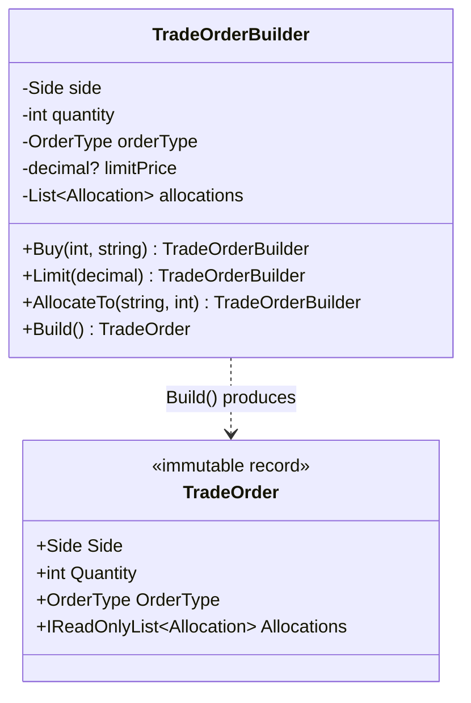
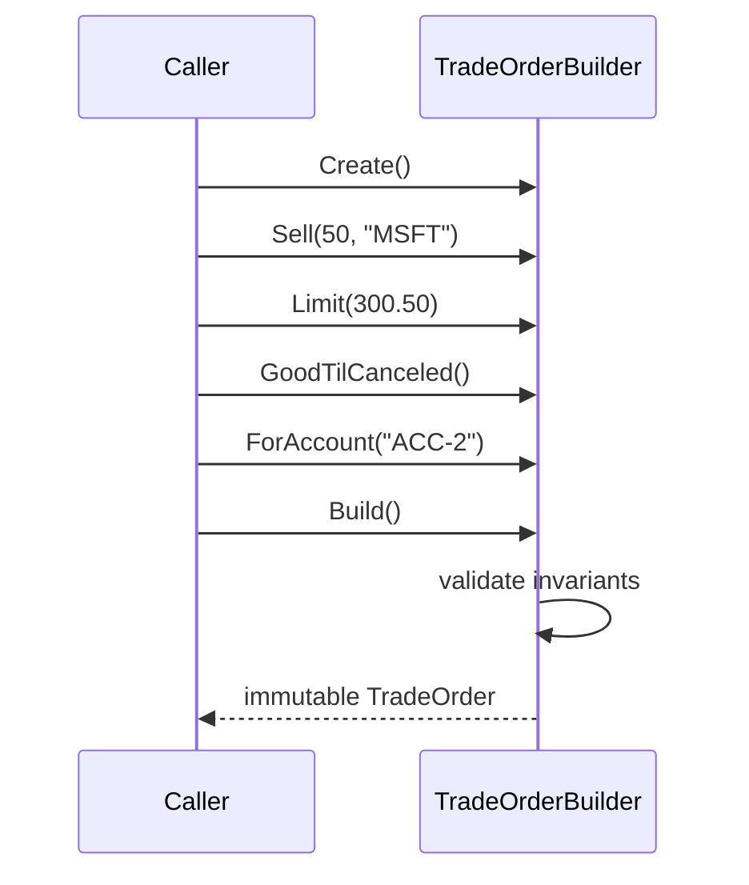

# Builder — Trade Order Construction

> **Week 1 · Day 2 · Creational**
> Run just this kata: `dotnet test --filter "FullyQualifiedName~Builder"`

## The scenario

A trade order has a handful of required fields (side, quantity, symbol, account) and a long tail of
optional ones (order type, limit price, stop price, time-in-force, allocations, a free-text note).
A market order needs almost none of them; a stop-limit order split across sub-accounts needs most.
And some combinations are simply invalid — allocations that don't add up to the order quantity, a
zero quantity, a missing account.

## The challenge

Open [`Legacy/LegacyOrder.cs`](./Legacy/LegacyOrder.cs). Every order is built through one
constructor with **ten positional parameters**:

```csharp
// A plain market order still forces a wall of nulls:
var o = new LegacyOrder("AAPL", "Buy", 100, "Market", null, null, "Day", "ACC-1", null, null);

// limitPrice and stopPrice are adjacent decimal? params. Transpose them → still compiles:
var bug = new LegacyOrder("TSLA", "Buy", 10, "StopLimit", 250m, 255m, "Day", "ACC-1", null, null);
```

The smells:

| Smell | What it costs you |
|-------|-------------------|
| **Unreadable call sites** | Which `null` is the stop price? You have to count commas. |
| **Positional fragility** | Two adjacent `decimal?`/`string` params invite silent transposition bugs. |
| **No single validation gate** | Nothing guarantees the order is *coherent*; nonsense objects sail through. |
| **Telescoping** | Add one more optional field and every call site — and any overloads — must change. |

We want construction to **read like a sentence** and to be **validated exactly once**, at the end.

## The pattern: Builder

> **Intent:** Separate the construction of a complex object from its representation so that the same
> construction process can create different representations. — *Gang of Four*

- The **Builder** (`TradeOrderBuilder`) exposes small, named, fluent steps that *accumulate* state.
- Each step returns `this`, so calls chain fluently.
- **`Build()`** is the single gate: it validates the accumulated state and constructs the immutable
  **Product** (`TradeOrder`).

> **Modern C# note:** The Gang of Four version also has a **Director** that drives a `Builder`
> interface through a fixed recipe (useful when the *same* steps must build several representations).
> In everyday C# the fluent single-builder shown here is the common form; we mention the Director in
> the stretch goals.

### Participants

| Role | In this kata |
|------|--------------|
| Builder | `TradeOrderBuilder` (fluent steps + `Build`) |
| Product | `TradeOrder` (immutable record) |
| Director *(optional)* | see stretch goals |

### UML



The fluent chain in practice:



## Your task

The fluent steps are already written (read them — they simply record intent and `return this`).
**Your job is to implement `Build()`** in [`TradeOrderBuilder.cs`](./TradeOrderBuilder.cs).

1. Validate, throwing `InvalidOperationException` on any violation:
   - Quantity must be `> 0`.
   - Symbol must be non-empty.
   - Account must be set.
   - If any allocations were added, they must **sum to the order quantity**.
2. Construct the `TradeOrder`. **Defensive copy** the allocations into a new read-only list so a
   caller who keeps using the builder can't mutate an order you already returned.
3. Run the tests:
   ```bash
   dotnet test --filter "FullyQualifiedName~Builder"
   ```

Note *why* validation lives in `Build()` and not in the setters: the allocation-sum rule spans
multiple fields, so it simply cannot be checked until every step has run. That is the essence of
"deferred construction."

### Stretch goals

- **Add an iceberg order** step, `.Iceberg(int displayQuantity)`, that must be `< Quantity`
  (validate in `Build`). Add it by writing **only** a new fluent method plus a test.
- **Introduce a Director.** Write a `RebalanceDirector` with a method
  `TradeOrder BuildReduceToHalf(string symbol, int currentQty, string account)` that drives the
  builder through a fixed recipe. This is the GoF "same steps, reusable recipe" idea.
- **Product Configuration Builder** *(the second Day 2 exercise)*: model a structured note
  (`Principal`, `Underlying`, `BarrierLevel?`, `CouponSchedule`, `MaturityMonths`) with its own
  builder and validation (e.g. a barrier note requires a `BarrierLevel`). Same pattern, new domain.

## When to use it

- **Use it** when an object has many optional fields, when several fields must be validated
  *together*, or when you want immutable products assembled step-by-step.
- **Real-world finance:** order/quote construction, report request builders, backtest configuration,
  fluent query/criteria builders for position and risk screens.
- **Avoid it** when the object has two or three fields (a constructor or `record` with named args is
  clearer). Don't build a Builder for a value object.

## Done when

- [ ] `Build()` validates all four rules and defensively copies allocations.
- [ ] `dotnet test --filter "FullyQualifiedName~Builder"` is fully green.
- [ ] You can explain why the allocation-sum check *cannot* live in a setter.
