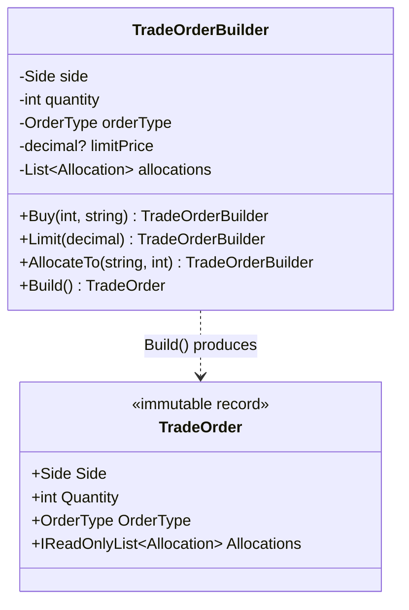
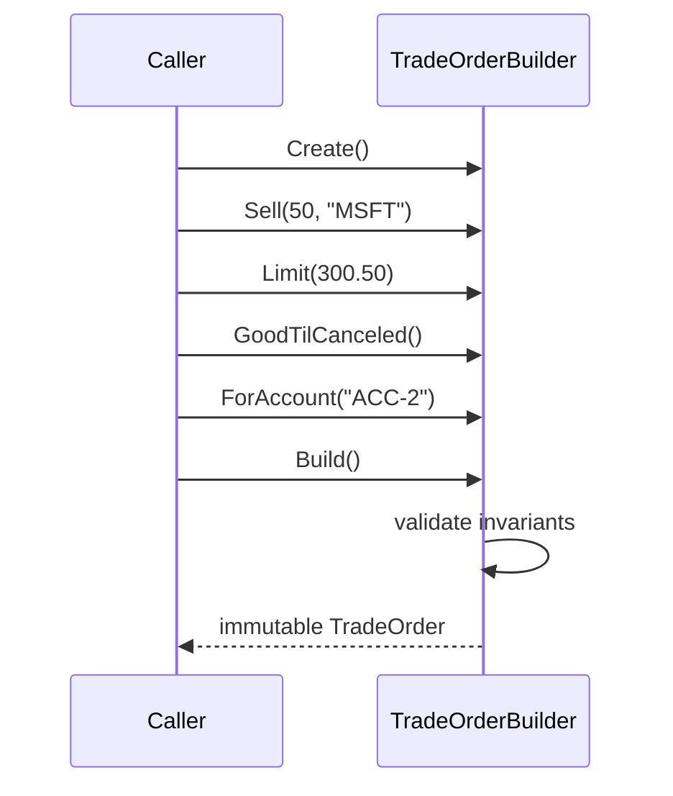

# Builder — Trade Order Construction

> **Week 1 · Day 2 · Creational**
> Run just this kata: `dotnet test --filter "FullyQualifiedName~Builder"`
> **This is a build-from-scratch kata:** you create every type yourself. Nothing is stubbed.

## The scenario

A trade order has a handful of required fields (side, quantity, symbol, account) and a long tail of
optional ones (order type, limit price, stop price, time-in-force, allocations, a free-text note).
A market order needs almost none of them; a stop-limit order split across sub-accounts needs most.
And some combinations are simply invalid — allocations that don't add up to the order quantity, a
zero quantity, a missing account.

## The challenge

Open [`Legacy/LegacyOrder.cs`](./Legacy/LegacyOrder.cs). Every order is built through one
constructor with **ten positional parameters**:

```csharp
// A plain market order still forces a wall of nulls:
var o = new LegacyOrder("AAPL", "Buy", 100, "Market", null, null, "Day", "ACC-1", null, null);

// limitPrice and stopPrice are adjacent decimal? params. Transpose them → still compiles:
var bug = new LegacyOrder("TSLA", "Buy", 10, "StopLimit", 250m, 255m, "Day", "ACC-1", null, null);
```

The smells:

| Smell | What it costs you |
|-------|-------------------|
| **Unreadable call sites** | Which `null` is the stop price? You have to count commas. |
| **Positional fragility** | Two adjacent `decimal?`/`string` params invite silent transposition bugs. |
| **No single validation gate** | Nothing guarantees the order is *coherent*; nonsense objects sail through. |
| **Telescoping** | Add one more optional field and every call site — and any overloads — must change. |

We want construction to **read like a sentence** and to be **validated exactly once**, at the end.

## The pattern: Builder

> **Intent:** Separate the construction of a complex object from its representation so that the same
> construction process can create different representations. — *Gang of Four*

- The **Builder** (`TradeOrderBuilder`) exposes small, named, fluent steps that *accumulate* state.
- Each step returns `this`, so calls chain fluently.
- **`Build()`** is the single gate: it validates the accumulated state and constructs the immutable
  **Product** (`TradeOrder`).

> **Modern C# note:** The Gang of Four version also has a **Director** that drives a `Builder`
> interface through a fixed recipe (useful when the *same* steps must build several representations).
> In everyday C# the fluent single-builder shown here is the common form; we mention the Director in
> the stretch goals.

### Participants

| Role | In this kata |
|------|--------------|
| Builder | `TradeOrderBuilder` (fluent steps + `Build`) |
| Product | `TradeOrder` (immutable record) |
| Director *(optional)* | see stretch goals |

### UML



The fluent chain in practice:



## Target API — what the (commented-out) tests expect

The **Product** (`TradeOrder`), its enums, and `Allocation` are provided; the one type you build is
`TradeOrderBuilder`, with this exact fluent surface. **Every method name and signature below is fixed
by the tests; the bodies are your design.**

| Member | Signature | Behaviour the tests pin down |
|--------|-----------|------------------------------|
| `Create` | `static TradeOrderBuilder Create()` | starts a fresh builder |
| `Buy` | `Buy(int quantity, string symbol)` → `this` | sets `Side.Buy`, quantity, symbol |
| `Sell` | `Sell(int quantity, string symbol)` → `this` | sets `Side.Sell`, quantity, symbol |
| `ForAccount` | `ForAccount(string account)` → `this` | records the account |
| `Limit` | `Limit(decimal price)` → `this` | `OrderType.Limit`, records the limit price |
| `StopLimit` | `StopLimit(decimal stopPrice, decimal limitPrice)` → `this` | `OrderType.StopLimit`, records both prices (called with **named** args) |
| `GoodTilCanceled` | `GoodTilCanceled()` → `this` | `TimeInForce.GoodTilCanceled` |
| `WithNote` | `WithNote(string note)` → `this` | attaches a free-text note |
| `AllocateTo` | `AllocateTo(string subAccount, int quantity)` → `this` | appends one `Allocation` |
| `Build` | `TradeOrder Build()` | validates, then returns an immutable snapshot |

Defaults when a step is never called: `OrderType.Market`, `LimitPrice`/`StopPrice` `null`,
`TimeInForce.Day`, empty `Allocations`. `Build()` throws `InvalidOperationException` when quantity
`<= 0`, symbol is empty, account is unset, or (if any allocations were added) they don't **sum to the
quantity**. It must defensive-copy the allocations so a later `.AllocateTo(…)` on the builder can't
mutate an order it already returned.

**Provided (do not recreate):** the `Side`, `OrderType`, `TimeInForce` enums, the `Allocation` record,
and the immutable `TradeOrder` record — all in [`OrderModels.cs`](./OrderModels.cs); plus the "before"
[`Legacy/LegacyOrder.cs`](./Legacy/LegacyOrder.cs).

## Your task (from scratch)

1. **Uncomment the tests.** In
   [`BuilderTests.cs`](../../../DesignPatternsBootcamp.Tests/Creational/BuilderTests.cs) delete the
   `/*` and `*/`. `dotnet test --filter "FullyQualifiedName~Builder"` now **won't compile** — every
   `TradeOrderBuilder` member the tests call is missing. That build-error list is your to-do list.
2. **Create the builder and its fluent steps.** Add a `.cs` file; define `TradeOrderBuilder` with the
   static `Create()` and every step in the table, each recording intent and returning `this`. Pick
   the defaults (`Market`, `Day`, no prices, empty allocations) so a bare
   `Buy(…).ForAccount(…).Build()` reads right. `Builds_a_simple_market_order_with_sensible_defaults`
   is your first target.
3. **Implement `Build()` as the single validation gate.** Throw `InvalidOperationException` on a
   non-positive quantity, empty symbol, missing account, or allocations that don't sum to the
   quantity. The allocation-sum rule spans several fields, so it *cannot* live in a setter — that is
   the point of deferring to `Build()`.
4. **Return an immutable snapshot.** Defensive-copy the allocations into a fresh read-only list so a
   caller who keeps chaining `.AllocateTo(…)` after `Build()` can't mutate an order you already handed
   back. `Built_orders_are_immutable_snapshots…` guards this.
5. **Green.** `dotnet test --filter "FullyQualifiedName~Builder"`.

### Stretch goals

- **Add an iceberg order** step, `.Iceberg(int displayQuantity)`, that must be `< Quantity`
  (validate in `Build`). Add it by writing **only** a new fluent method plus a test.
- **Introduce a Director.** Write a `RebalanceDirector` with a method
  `TradeOrder BuildReduceToHalf(string symbol, int currentQty, string account)` that drives the
  builder through a fixed recipe. This is the GoF "same steps, reusable recipe" idea.
- **Product Configuration Builder** *(the second Day 2 exercise)*: model a structured note
  (`Principal`, `Underlying`, `BarrierLevel?`, `CouponSchedule`, `MaturityMonths`) with its own
  builder and validation (e.g. a barrier note requires a `BarrierLevel`). Same pattern, new domain.

## When to use it

- **Use it** when an object has many optional fields, when several fields must be validated
  *together*, or when you want immutable products assembled step-by-step.
- **Real-world finance:** order/quote construction, report request builders, backtest configuration,
  fluent query/criteria builders for position and risk screens.
- **Avoid it** when the object has two or three fields (a constructor or `record` with named args is
  clearer). Don't build a Builder for a value object.

## Done when

- [ ] You built `TradeOrderBuilder` from scratch — every fluent step plus `Build()`.
- [ ] `Build()` validates all four rules and defensively copies allocations.
- [ ] `dotnet test --filter "FullyQualifiedName~Builder"` is fully green.
- [ ] You can explain why the allocation-sum check *cannot* live in a setter.
