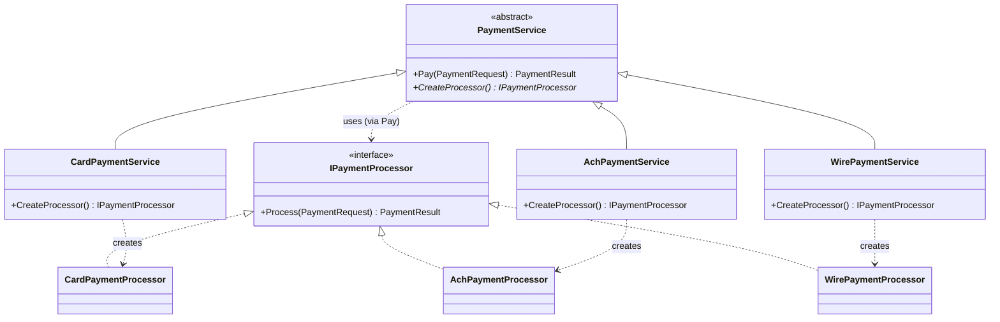

# Factory Method — Payment Rails

> **Week 1 · Day 1a · Creational**
> Run just this kata: `dotnet test --filter "FullyQualifiedName~FactoryMethod"`
> **This is a build-from-scratch kata:** you create every type yourself. Nothing is stubbed.

## The scenario

Our fintech app moves money over several **rails**: card, ACH, and wire. Each rail has its own
fee schedule and its own confirmation format, but the surrounding workflow (validate the request,
run it, hand back a result) is the same for all of them.

## The challenge

Open [`Legacy/LegacyPaymentGateway.cs`](./Legacy/LegacyPaymentGateway.cs). Everything lives in one
method behind a `switch`:

```csharp
switch (method)
{
    case PaymentMethod.Card: /* fee maths + confirmation */ ...
    case PaymentMethod.Ach:  ...
    case PaymentMethod.Wire: ...
}
```

It works — the legacy baseline test passes — but the design fights you:

| Smell | What it costs you |
|-------|-------------------|
| **Open/Closed violation** | Adding *real-time payments* means editing this method — and risking the rails already in production. |
| **Single Responsibility violation** | Validation, fee maths, and rail behaviour are tangled in one place. |
| **Poor testability** | You cannot test "card fee logic" in isolation; you must go through the whole gateway. |
| **Shotgun surgery** | Changing how wires work forces a change to code shared by every other rail. |

We want to **add a rail by adding a class, never by editing existing code.**

## The pattern: Factory Method

> **Intent:** Define an interface for creating an object, but let subclasses decide which class to
> instantiate. Factory Method lets a class defer instantiation to subclasses. — *Gang of Four*

The trick is to split "the work that is always the same" from "the object that varies":

- The **Creator** (`PaymentService`) owns the shared workflow (`Pay`) and declares an abstract
  **factory method** (`CreateProcessor`).
- Each **Concrete Creator** (`CardPaymentService`, …) overrides the factory method to return its
  own **Concrete Product**.
- The **Product** (`IPaymentProcessor`) is the interface the shared workflow depends on, so it
  never needs to know which rail it is running.

### Participants

| Role | In this kata |
|------|--------------|
| Product | `IPaymentProcessor` |
| Concrete Product | `CardPaymentProcessor`, `AchPaymentProcessor`, `WirePaymentProcessor` |
| Creator | `PaymentService` (abstract; owns `Pay`) |
| Concrete Creator | `CardPaymentService`, `AchPaymentService`, `WirePaymentService` |

### UML



Read the arrows as: `Pay` (in the base) *uses* an `IPaymentProcessor`; each subclass *creates* the
concrete one. The base never learns which rail it is running.

## Target API — what the (commented-out) tests expect

Every implementation file was deleted; you recreate all of these so the tests compile and pass.
**Names and constructor signatures are fixed by the tests; the bodies are your design.**

| Type | Shape | Behaviour the tests pin down |
|------|-------|------------------------------|
| `IPaymentProcessor` | interface: `PaymentResult Process(PaymentRequest request)` | the **Product** — one rail's fee + confirmation, nothing else |
| `CardPaymentProcessor` | `: IPaymentProcessor`, parameterless ctor | fee = `2.9% + $0.30` (→ `3.20` on `$100`); confirmation starts `"CARD-"` |
| `AchPaymentProcessor` | `: IPaymentProcessor`, parameterless ctor | flat `$0.25` fee; confirmation starts `"ACH-"` |
| `WirePaymentProcessor` | `: IPaymentProcessor`, parameterless ctor | flat `$15.00` fee; confirmation starts `"WIRE-"` |
| `PaymentService` | abstract: `PaymentResult Pay(PaymentRequest request)` + abstract `IPaymentProcessor CreateProcessor()` | the **Creator.** `Pay` validates once (amount `> 0`, else a rejected result) then delegates to the processor from `CreateProcessor()` |
| `CardPaymentService` | `: PaymentService`, parameterless ctor | overrides `CreateProcessor()` → a `CardPaymentProcessor` |
| `AchPaymentService` | `: PaymentService`, parameterless ctor | overrides `CreateProcessor()` → an `AchPaymentProcessor` |
| `WirePaymentService` | `: PaymentService`, parameterless ctor | overrides `CreateProcessor()` → a `WirePaymentProcessor` |

**Provided (do not recreate):** `PaymentMethod`, `PaymentRequest`, and `PaymentResult` (with its
`Ok`/`Rejected` factories) in [`PaymentModels.cs`](./PaymentModels.cs); the "before"
[`Legacy/LegacyPaymentGateway.cs`](./Legacy/LegacyPaymentGateway.cs). The exact fee numbers and
prefixes come straight from the legacy `switch` — read it.

## Your task (from scratch)

1. **Uncomment the tests.** In
   [`FactoryMethodTests.cs`](../../../DesignPatternsBootcamp.Tests/Creational/FactoryMethodTests.cs)
   delete the `/*` and `*/`. Now `dotnet test --filter "FullyQualifiedName~FactoryMethod"` **won't
   compile** — that is step one done. Each "type or namespace could not be found" error names a type
   from the table above: that build-error list is your to-do list.
2. **Create the Product.** Add a `.cs` file in this folder; define `IPaymentProcessor` with a
   `Process(PaymentRequest)` method, then the three concrete processors. Port each branch of the
   legacy `switch` into its processor — same fee maths, same `"CARD-"/"ACH-"/"WIRE-"` prefixes. The
   `..._service_creates_a_..._processor` tests go green as the types appear.
3. **Create the Creator.** Add the abstract `PaymentService` with the shared `Pay` workflow and the
   abstract `CreateProcessor()`. Write the amount-`> 0` validation **once** here, then hand off to the
   processor — that is what `Shared_validation_lives_in_the_base_creator_for_every_rail` checks.
4. **Create the Concrete Creators.** `CardPaymentService`, `AchPaymentService`, `WirePaymentService`
   each override `CreateProcessor()` to return their own processor. Drive the fee/confirmation tests
   from RED to GREEN.
5. **Green.** `dotnet test --filter "FullyQualifiedName~FactoryMethod"`. Notice you never wrote a
   `switch` — the subclass you chose *is* the decision.

### Stretch goals

- Add a fourth rail, `RealTimePayments` (flat `$0.50`), by adding **only new classes** plus tests.
  Confirm you never open `PaymentService.cs`'s `Pay` method.
- The app still needs to pick a `PaymentService` from a `PaymentMethod` value. Add a tiny
  registry (`Dictionary<PaymentMethod, PaymentService>`) so callers select a rail without a
  `switch`. How is that registry different from — and complementary to — Factory Method?

## Factory Method vs. Simple Factory

A *Simple Factory* is one method with a `switch` that returns products — it centralises the smell
rather than removing it. Factory Method removes the `switch` entirely by using **polymorphism**:
the subclass you already chose *is* the decision. Use a Simple Factory when a single decision point
is genuinely fine; reach for Factory Method when a base class needs to run a shared workflow over a
product whose type varies.

## When to use it

- **Use it** when a class can't anticipate the concrete type it must create, or when you want the
  choice of type to be an extension point (new subclass), not an edit.
- **Real-world finance:** payment/settlement rail selection, market-data feed handlers per venue,
  report exporters per regulator (MiFID, FINRA), order-router creation per asset class.
- **Avoid it** when there is only ever one product, or when a simple `Func<>`/DI registration is
  clearer than a class hierarchy. Don't manufacture subclasses just to look clever.

## Done when

- [ ] You created `IPaymentProcessor` + the three processors, and `PaymentService` + the three
      services, all from scratch.
- [ ] The amount validation is written exactly once, in `PaymentService.Pay`.
- [ ] `dotnet test --filter "FullyQualifiedName~FactoryMethod"` is fully green.
- [ ] Adding a fourth rail would be purely additive — no existing class edited.
