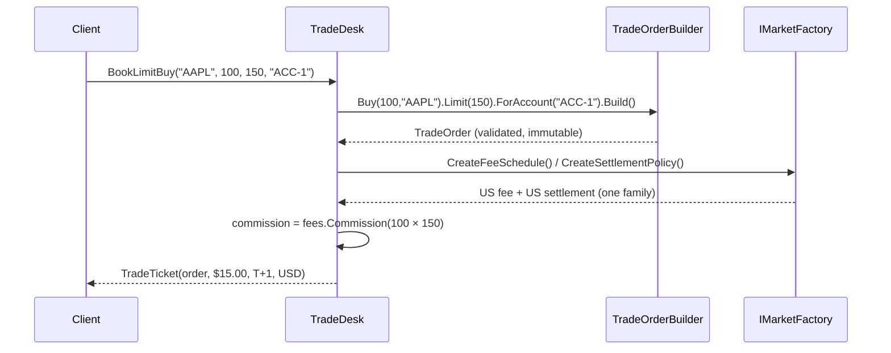

# Review & Integration — The Trade Desk Capstone

> **Week 1 · Day 5 · Creational**
> Run just this kata: `dotnet test --filter "FullyQualifiedName~Integration"`
> **Prerequisites:** finish **Day 1b (Abstract Factory)** and **Day 2 (Builder)** first — this
> capstone calls into both.

## Goal

The individual katas each fixed one pain in isolation. Real systems combine patterns. Here you wire
two of them into a single flow: a **trade desk** that books a limit order and prices it for its
market. One method, two patterns, cleanly composed.

## The exercise

Implement `TradeDesk.BookLimitBuy(...)` in [`TradeDesk.cs`](./TradeDesk.cs):

1. **Builder** — assemble a validated, immutable `TradeOrder`:
   `TradeOrderBuilder.Create().Buy(quantity, symbol).Limit(limitPrice).ForAccount(account).Build()`.
2. **Abstract Factory** — pull the fee schedule and settlement policy from the desk's `IMarketFactory`.
3. Charge commission on the **notional** (`quantity × limitPrice`), and attach the settlement terms.
4. Return a `TradeTicket`.

```bash
dotnet test --filter "FullyQualifiedName~Integration"
```

Notice what the composition buys you: the desk holds **one** `IMarketFactory`, so every ticket it
produces is priced *and* settled in the same market — the consistency guarantee from Day 1b now
protects an entire workflow, not just a single call.

### How the booking flows



## The Week 1 map — where each creational pattern fits an order pipeline

| Pattern | Day | Role in a real desk | Answers the question |
|---------|-----|---------------------|----------------------|
| **Factory Method** | 1a | Create the right *payment/settlement processor* per rail | "Which **one** object do I need?" |
| **Abstract Factory** | 1b | Supply a consistent *market family* (fees + settlement) | "Which **matched set** do I need?" |
| **Builder** | 2 | Assemble a complex, validated *order* step by step | "How do I **construct** it safely?" |
| **Prototype** | 3 | Clone a *model basket* template per client | "How do I **copy** it independently?" |
| **Singleton** | 4 | Share one *market-data connection / config* | "How do I guarantee **one** of it?" |

All five answer *"how should this object come into existence?"* — that is what makes them
**creational**. This capstone uses two of them; the stretch goals fold in the rest.

## Stretch goals — grow the capstone into the full pipeline

- **Factory Method to pick the market.** Add `IMarketFactory MarketFor(string region)` so callers
  pass `"US"`/`"EU"` and the desk selects the factory — without the desk hard-coding a market.
- **Prototype the order source.** Overload the desk to book from a `ModelBasket` (Day 3): clone the
  template, then build orders for each cloned line. The master template stays pristine.
- **Singleton / DI config.** Give the desk a shared `TradingConfiguration` (Day 4) for the default
  account and a max-notional guardrail — then rewrite it as an injected dependency and note why that
  is nicer to test.
- **Anti-pattern watch.** If you find yourself reaching for `MarketDataConnection.Instance` deep
  inside `TradeDesk`, stop: that hides a dependency. Inject it instead. Composing patterns well is as
  much about what you *don't* couple as what you do.

## Done when

- [ ] `TradeDesk.BookLimitBuy` composes Builder + Abstract Factory.
- [ ] `dotnet test --filter "FullyQualifiedName~Integration"` is green.
- [ ] You can explain, using this one method, why "creational patterns" are a family — and which
      question each of the five answers.

---

🎉 **That completes Week 1 — the five creational patterns.** Update your
[STATUS.md](../../../STATUS.md) as you turn each kata green, and tell the professor when you're ready
for Week 2 (Structural Patterns).
