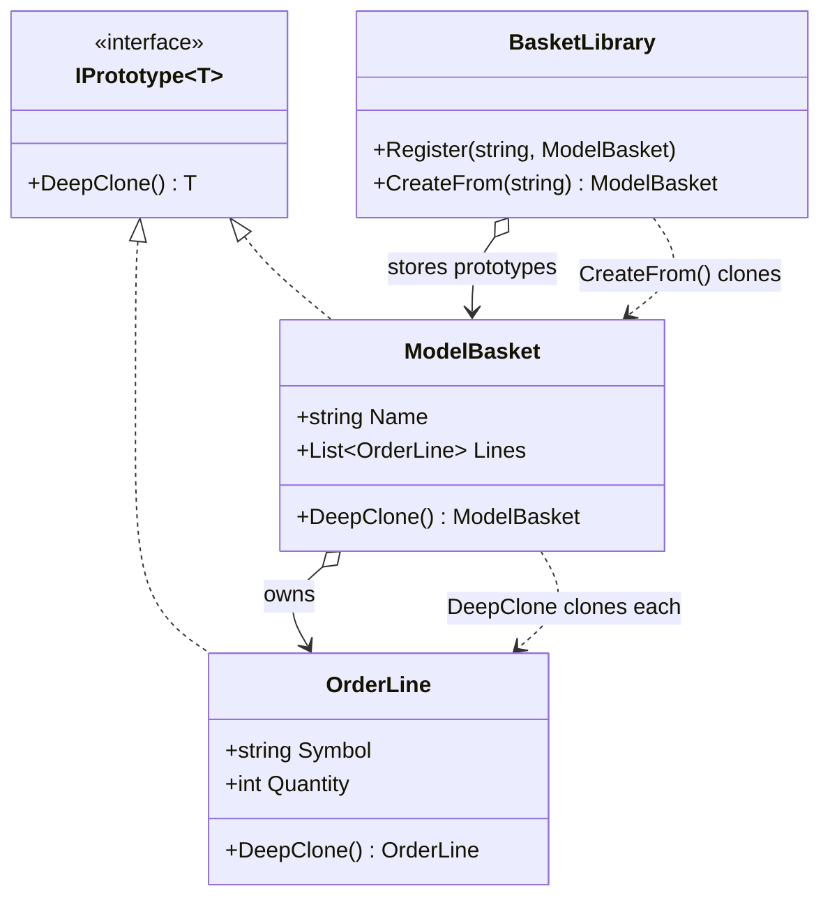

# Prototype — Cloning Model Baskets

> **Week 1 · Day 3 · Creational**
> Run just this kata: `dotnet test --filter "FullyQualifiedName~Prototype"`
> **This is a build-from-scratch kata:** you create every type yourself. Nothing is stubbed.

## The scenario

A trading desk keeps a library of **model baskets** — ready-made templates like a "Balanced Model"
(60% equities / 40% bonds). For each client the desk **clones** a template and tweaks the
quantities to the client's capital. The master template must never change when a client's copy is
edited.

## The challenge

Open [`Legacy/LegacyBasketCloner.cs`](./Legacy/LegacyBasketCloner.cs). It "copies" a basket by
copying the scalar fields and **reusing the same `Lines` list**:

```csharp
public LegacyBasket Copy(LegacyBasket basket) => new()
{
    Name = basket.Name,
    Lines = basket.Lines, // ← same list, same LegacyOrderLine objects
};
```

That is a **shallow copy**, and it is a landmine:

```csharp
var copy = cloner.Copy(template);
copy.Lines[0].Quantity = 999;     // tweak just the client's copy...
// template.Lines[0].Quantity is now 999 too — every client sharing this template is corrupted.
```

The legacy test `Legacy_shallow_copy_leaks_mutations_back_to_the_template` **passes** precisely
because it documents this bug.

| Smell | What it costs you |
|-------|-------------------|
| **Shared mutable state** | A "copy" that isn't a copy. Edits leak across clients and back to the master. |
| **Ambiguous copy semantics** | Nobody can tell from the call site how deep the copy goes. |
| **Rebuild-from-scratch alternative** | Re-running the (possibly expensive) assembly for every client is wasteful and error-prone. |

We want each object to **know how to copy itself, all the way down**.

## The pattern: Prototype

> **Intent:** Specify the kinds of objects to create using a prototypical instance, and create new
> objects by copying this prototype. — *Gang of Four*

- The **Prototype** contract (`IPrototype<T>`) declares `DeepClone()`.
- Each concrete type (`OrderLine`, `ModelBasket`) implements `DeepClone()` to return a fully
  independent copy — recursively cloning any mutable members it owns.
- A **prototype registry** (`BasketLibrary`) stores templates and hands out clones on demand, so
  callers get new objects without knowing how the originals were assembled.

The crux is **deep vs. shallow copy**: a deep clone duplicates the object *and* everything mutable
it references, so the copy shares nothing with the original.

### UML



## Target API — what the (commented-out) tests expect

Every implementation file was deleted; you recreate all of these so the tests compile and pass.
**Names and shapes are fixed by the tests; the bodies are your design.**

| Type | Shape | Behaviour the tests pin down |
|------|-------|------------------------------|
| `IPrototype<T>` | interface: `T DeepClone()` | the prototype contract — "clone me, all the way down" |
| `OrderLine` | mutable, object-initialisable: `Symbol` (string), `Quantity` (int); `OrderLine DeepClone()` | a fresh, independent line — editing the clone never touches the source |
| `ModelBasket` | mutable, object-initialisable: `Name`, `Strategy` (strings), `Lines` (`List<OrderLine>`); `ModelBasket DeepClone()` | deep clone: a **new list** of **deep-cloned** lines, so nothing is shared with the original |
| `BasketLibrary` | `Register(string key, ModelBasket prototype)`, `ModelBasket CreateFrom(string key)` | prototype registry — `CreateFrom` hands back an independent clone every call |

`OrderLine` and `ModelBasket` are created via object initialisers in the tests
(`new OrderLine { Symbol = …, Quantity = … }`, `new ModelBasket { Name = …, Strategy = …, Lines = [ … ] }`),
so their properties must be settable; `Lines` must support indexing and `.Add(…)`, and the tests
reassign `Name`/`Quantity` on clones — so both types stay mutable.

**Provided (do not recreate):** the "before"
[`Legacy/LegacyBasketCloner.cs`](./Legacy/LegacyBasketCloner.cs), which clones its **own**
`LegacyBasket`/`LegacyOrderLine` types (independent of the ones you build) to demonstrate the
shallow-copy bug. There is no given model file — you create the four types above yourself.

## Your task (from scratch)

1. **Uncomment the tests.** In
   [`PrototypeTests.cs`](../../../DesignPatternsBootcamp.Tests/Creational/PrototypeTests.cs) delete
   the `/*` and `*/`. `dotnet test --filter "FullyQualifiedName~Prototype"` **won't compile** — none
   of `OrderLine`, `ModelBasket`, or `BasketLibrary` exist yet. Those errors are your to-do list.
2. **Create the data types.** Add a `.cs` file; define `OrderLine` (`Symbol`, `Quantity`) and
   `ModelBasket` (`Name`, `Strategy`, a `List<OrderLine> Lines`) as mutable, object-initialisable
   classes so the tests' `new … { … }` initialisers compile.
3. **Add the prototype contract and deep clones.** Declare `IPrototype<T>` with `DeepClone()`.
   Implement `OrderLine.DeepClone()` to return an independent line, and `ModelBasket.DeepClone()` to
   build a **new list** whose elements are each deep-cloned — the basket delegates to its parts, so
   deep clone is naturally recursive. `Cloning_produces_distinct_instances_all_the_way_down` checks
   that *nothing* is shared.
4. **Build the registry.** `BasketLibrary` stores prototypes by key and, in `CreateFrom`, hands back
   a `DeepClone()` of the stored one — so every caller gets an independent basket.
   `Library_hands_out_independent_baskets…` proves it.
5. **Green.** `dotnet test --filter "FullyQualifiedName~Prototype"`.

### Stretch goals

- **Working-basket snapshot** *(the second Day 3 exercise)*: before a risky bulk edit, snapshot a
  live basket with `DeepClone()` so you can restore it if the edit goes wrong. (Notice this is a
  cousin of the **Memento** pattern you'll meet in Week 3 — Prototype copies the *whole* object;
  Memento captures just enough state to restore it.)
- **`ICloneable` vs. `IPrototype<T>`**: refactor to `ICloneable` and write a sentence on why its
  `object Clone()` — silent about shallow/deep — is considered a trap.
- **Copy constructors / `record` `with`**: C# records give you `with`-expressions for shallow copies
  for free. Explain why `with` still wouldn't have saved the legacy code here.

## When to use it

- **Use it** when creating an object is expensive or complicated, when you need many similar objects
  that differ only slightly, or when you want to snapshot/restore mutable state.
- **Real-world finance:** model portfolios and order baskets, scenario/what-if copies of a
  position book, cloning a complex report or backtest configuration, deep-copying risk inputs before
  a stress run.
- **Avoid it** when objects are immutable (sharing is already safe — no copy needed) or trivially
  cheap to construct. Beware half-deep clones: the subtle bug is copying *most* of the graph but
  accidentally sharing one mutable branch.

## Done when

- [ ] You created `OrderLine`, `ModelBasket`, `IPrototype<T>`, and `BasketLibrary` from scratch.
- [ ] Both `DeepClone()` methods duplicate everything mutable — no shared list, no shared line.
- [ ] `dotnet test --filter "FullyQualifiedName~Prototype"` is fully green.
- [ ] You can explain the difference between what the legacy shallow copy shared and what your deep
      clone duplicated.
