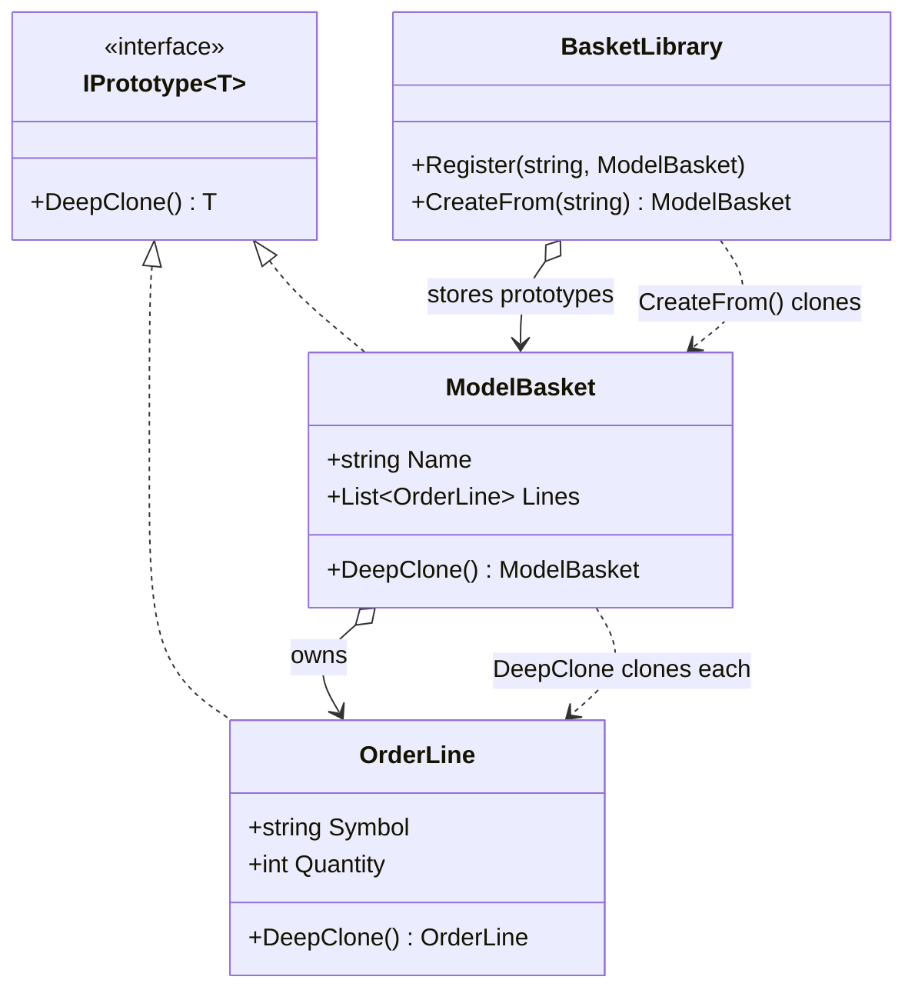

# Prototype — Cloning Model Baskets

> **Week 1 · Day 3 · Creational**
> Run just this kata: `dotnet test --filter "FullyQualifiedName~Prototype"`

## The scenario

A trading desk keeps a library of **model baskets** — ready-made templates like a "Balanced Model"
(60% equities / 40% bonds). For each client the desk **clones** a template and tweaks the
quantities to the client's capital. The master template must never change when a client's copy is
edited.

## The challenge

Open [`Legacy/LegacyBasketCloner.cs`](./Legacy/LegacyBasketCloner.cs). It "copies" a basket by
copying the scalar fields and **reusing the same `Lines` list**:

```csharp
public ModelBasket Copy(ModelBasket basket) => new()
{
    Name = basket.Name,
    Strategy = basket.Strategy,
    Lines = basket.Lines, // ← same list, same OrderLine objects
};
```

That is a **shallow copy**, and it is a landmine:

```csharp
var copy = cloner.Copy(template);
copy.Lines[0].Quantity = 999;     // tweak just the client's copy...
// template.Lines[0].Quantity is now 999 too — every client sharing this template is corrupted.
```

The legacy test `Legacy_shallow_copy_leaks_mutations_back_to_the_template` **passes** precisely
because it documents this bug.

| Smell | What it costs you |
|-------|-------------------|
| **Shared mutable state** | A "copy" that isn't a copy. Edits leak across clients and back to the master. |
| **Ambiguous copy semantics** | Nobody can tell from the call site how deep the copy goes. |
| **Rebuild-from-scratch alternative** | Re-running the (possibly expensive) assembly for every client is wasteful and error-prone. |

We want each object to **know how to copy itself, all the way down**.

## The pattern: Prototype

> **Intent:** Specify the kinds of objects to create using a prototypical instance, and create new
> objects by copying this prototype. — *Gang of Four*

- The **Prototype** contract (`IPrototype<T>`) declares `DeepClone()`.
- Each concrete type (`OrderLine`, `ModelBasket`) implements `DeepClone()` to return a fully
  independent copy — recursively cloning any mutable members it owns.
- A **prototype registry** (`BasketLibrary`) stores templates and hands out clones on demand, so
  callers get new objects without knowing how the originals were assembled.

The crux is **deep vs. shallow copy**: a deep clone duplicates the object *and* everything mutable
it references, so the copy shares nothing with the original.

### UML



## Your task

Implement the two `DeepClone` methods in [`Baskets.cs`](./Baskets.cs).

1. **`OrderLine.DeepClone()`** — return a new `OrderLine` with the same `Symbol` and `Quantity`.
2. **`ModelBasket.DeepClone()`** — return a new `ModelBasket` with a **new `Lines` list** whose
   elements are each **deep-cloned** (call `OrderLine.DeepClone()` for every line). Notice how the
   basket delegates to its parts — deep clone is naturally recursive.
3. Run the tests:
   ```bash
   dotnet test --filter "FullyQualifiedName~Prototype"
   ```
4. The provided `BasketLibrary` starts working for free the moment `DeepClone` is correct — that is
   the registry usage of Prototype.

### Stretch goals

- **Working-basket snapshot** *(the second Day 3 exercise)*: before a risky bulk edit, snapshot a
  live basket with `DeepClone()` so you can restore it if the edit goes wrong. (Notice this is a
  cousin of the **Memento** pattern you'll meet in Week 3 — Prototype copies the *whole* object;
  Memento captures just enough state to restore it.)
- **`ICloneable` vs. `IPrototype<T>`**: refactor to `ICloneable` and write a sentence on why its
  `object Clone()` — silent about shallow/deep — is considered a trap.
- **Copy constructors / `record` `with`**: C# records give you `with`-expressions for shallow copies
  for free. Explain why `with` still wouldn't have saved the legacy code here.

## When to use it

- **Use it** when creating an object is expensive or complicated, when you need many similar objects
  that differ only slightly, or when you want to snapshot/restore mutable state.
- **Real-world finance:** model portfolios and order baskets, scenario/what-if copies of a
  position book, cloning a complex report or backtest configuration, deep-copying risk inputs before
  a stress run.
- **Avoid it** when objects are immutable (sharing is already safe — no copy needed) or trivially
  cheap to construct. Beware half-deep clones: the subtle bug is copying *most* of the graph but
  accidentally sharing one mutable branch.

## Done when

- [ ] `OrderLine.DeepClone()` and `ModelBasket.DeepClone()` are implemented.
- [ ] `dotnet test --filter "FullyQualifiedName~Prototype"` is fully green.
- [ ] You can explain the difference between what the legacy shallow copy shared and what your deep
      clone duplicated.
