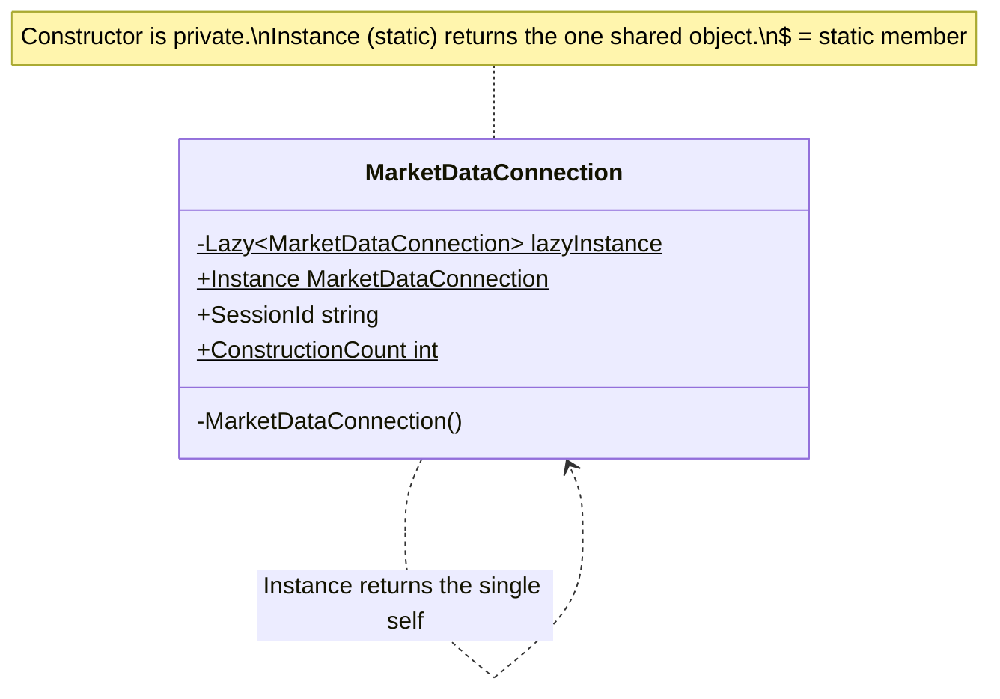

# Singleton — Shared Market-Data Connection

> **Week 1 · Day 4 · Creational**
> Run just this kata: `dotnet test --filter "FullyQualifiedName~Singleton"`
> **This is a build-from-scratch kata:** you create every type yourself. Nothing is stubbed.

## The scenario

Opening a market-data feed is expensive: a socket, an authentication handshake, a set of symbol
subscriptions. The whole application should share **one** connection — one source of truth for live
prices — not open a fresh one in every module.

## The challenge

Open [`Legacy/LegacyMarketDataClient.cs`](./Legacy/LegacyMarketDataClient.cs). Its constructor is
**public**, so anyone can `new` one:

```csharp
var a = new LegacyMarketDataClient(); // module 1 opens a connection
var b = new LegacyMarketDataClient(); // module 2 opens ANOTHER one
// a.SessionId != b.SessionId — two authentications, two subscription sets, two "truths".
```

| Smell | What it costs you |
|-------|-------------------|
| **Duplicated expensive work** | Every caller pays the full connection cost again. |
| **Divergent state** | Two clients can drift — prices, sequence numbers, and config no longer agree. |
| **No single owner** | Nothing in the type system says "there should only be one." |

We want the type itself to **guarantee a single instance** and hand everyone the same one.

## The pattern: Singleton

> **Intent:** Ensure a class has only one instance, and provide a global point of access to it. — *GoF*

Two mechanics do the work:

1. A **private constructor** — no one outside the class can call `new`. (Provided for you.)
2. A **static accessor** (`Instance`) that creates the one instance on first use and returns it
   forever after.

The interesting part is doing step 2 **lazily** (don't pay the cost until first use) and
**thread-safely** (a burst of concurrent first-callers must still construct exactly one).

### UML



### Idiomatic C#: `Lazy<T>`

`System.Lazy<T>` gives you lazy creation *and* thread-safety for free (its default mode is
`ExecutionAndPublication` — the factory runs at most once):

```csharp
private static readonly Lazy<MarketDataConnection> LazyInstance = new(() => new MarketDataConnection());
public static MarketDataConnection Instance => LazyInstance.Value;
```

Alternatives you should recognise:
- **Static field initializer** — `private static readonly MarketDataConnection _i = new();` The CLR
  guarantees a type's static initializer runs once, thread-safely. Simple, but eager-ish (runs when
  the type is first touched) and harder to make truly lazy.
- **Double-checked locking** — the manual version: check, `lock`, check again, create. Easy to get
  subtly wrong; prefer `Lazy<T>` unless you have a reason.

## Target API — what the (commented-out) tests expect

The implementation file was deleted; you recreate the one type below so the tests compile and pass.
**Its name and static surface are fixed by the tests; the mechanism is your design.**

| Member | Signature | Behaviour the tests pin down |
|--------|-----------|------------------------------|
| `MarketDataConnection` | class with a **private** constructor | can't be `new`ed from outside; each construction bumps `ConstructionCount` and does the "expensive" setup |
| `MarketDataConnection.Instance` | `static MarketDataConnection Instance { get; }` | returns the one shared instance — the **same object** every call, created **lazily** on first access, **thread-safe** |
| `MarketDataConnection.ConstructionCount` | `static int ConstructionCount { get; }` | how many times the constructor has run — must be `1` no matter how many callers, even under a 256-thread stampede |

Reach for `System.Lazy<T>` for the lazy + thread-safe accessor (see the idiomatic-C# snippet above).

**Provided (do not recreate):** the "before"
[`Legacy/LegacyMarketDataClient.cs`](./Legacy/LegacyMarketDataClient.cs), with its public constructor
and `InstancesCreated` counter — the per-caller waste you're removing.

## Your task (from scratch)

1. **Uncomment the tests.** In
   [`SingletonTests.cs`](../../../DesignPatternsBootcamp.Tests/Creational/SingletonTests.cs) delete
   the `/*` and `*/`. `dotnet test --filter "FullyQualifiedName~Singleton"` **won't compile** —
   `MarketDataConnection` does not exist yet. That error is step one done.
2. **Create the class with a private constructor.** Add a `.cs` file; define `MarketDataConnection`
   whose constructor is `private` (so no caller can `new` it) and does the "expensive" setup, bumping
   an internal count.
3. **Expose `ConstructionCount`.** A static, read-only count of how many times the constructor ran.
   `The_expensive_constructor_runs_only_once` asserts it stays `1`.
4. **Expose `Instance` lazily and thread-safely.** A static accessor that creates the one instance on
   first use and returns it forever after. Use `Lazy<T>` so a burst of concurrent first-callers still
   constructs exactly one — `Concurrent_first_access_still_constructs_exactly_one` fires 256 threads
   at `Instance` and asserts `ConstructionCount == 1`.
5. **Green.** `dotnet test --filter "FullyQualifiedName~Singleton"`.

## ⚠️ Singleton is the most abused pattern — read this

Singleton is a **global variable in a nicer coat**. Before you reach for it, know the costs:

- **Hidden dependencies.** `MarketDataConnection.Instance` buried inside a method hides that the
  method needs a connection — the signature lies about its dependencies.
- **Hard to test.** Global mutable state leaks between tests; you can't easily substitute a fake.
  (Notice our own tests can only ever observe the *one* process-wide instance.)
- **Concurrency traps.** Shared mutable singletons invite race conditions.

**The modern alternative: dependency injection with a singleton *lifetime*.** Keep "there is one
instance" but stop hard-coding global access. Register it once:

```csharp
services.AddSingleton<MarketDataConnection>();     // container guarantees one instance
// ...and receive it explicitly, so the dependency is visible and fakeable:
public sealed class PriceService(MarketDataConnection feed) { /* ... */ }
```

Same guarantee ("one instance"), but the dependency is explicit and testable. Use the classic
Singleton for genuinely process-global, stateless-ish concerns; prefer DI singletons for almost
everything else in application code.

### Stretch goals

- **Application Configuration** *(the second Day 4 exercise)*: build a `TradingConfiguration`
  singleton (e.g. `BaseCurrency`, `MaxOrderNotional`) as a read-only single source of truth.
- **Refactor to DI.** Register `MarketDataConnection` as an `AddSingleton` in a
  `ServiceCollection`, inject it into a small `PriceService`, and write a test that swaps in a fake
  — something the static Singleton makes painful. Feel the difference.

## When to use it

- **Use it** (sparingly) for a genuinely single, process-wide resource where global access is
  acceptable and the object is effectively stateless or internally synchronised.
- **Real-world finance:** a single shared reference-data cache, a connection/session pool manager, a
  process-wide metrics registry.
- **Avoid it** for anything you'll want to test, swap, or scope per-request/per-tenant. Reach for a
  DI container's singleton lifetime instead.

## Done when

- [ ] You created `MarketDataConnection` from scratch: private constructor, `ConstructionCount`, and
      a lazy, thread-safe `Instance`.
- [ ] `dotnet test --filter "FullyQualifiedName~Singleton"` is fully green.
- [ ] You can articulate, in one sentence, why a DI singleton is usually preferable to this one.
