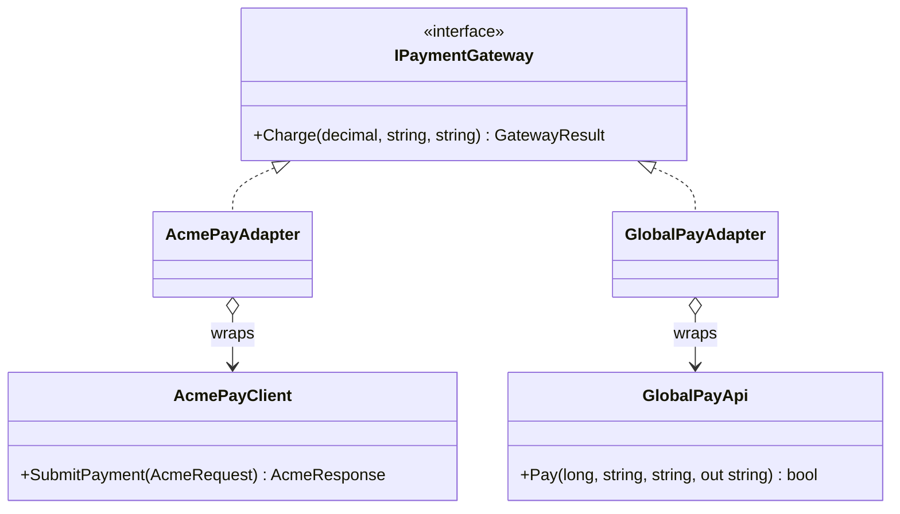

# Adapter — Third-Party Payment Gateways

> **Week 2 · Day 1a · Structural**
> Run just this kata: `dotnet test --filter "FullyQualifiedName~Adapter"`

## The scenario

We take payments through several providers. Each ships an SDK we **cannot change**, and every one
has a different shape: **AcmePay** uses request/response objects and whole-dollar amounts; **GlobalPay**
wants integer **cents**, an ISO currency code, and returns its confirmation through an `out`
parameter. Our application just wants to "charge this account this much."

## The challenge

Open [`Legacy/LegacyCheckout.cs`](./Legacy/LegacyCheckout.cs). The checkout talks to each SDK
directly, behind a `switch`:

```csharp
case "acme":   var r = _acme.SubmitPayment(new AcmeRequest { ... }); return r.Ok ? r.AcmeTxnId : "DECLINED";
case "global": long cents = (long)Math.Round(amount * 100m); ... _global.Pay(cents, ..., out var code); ...
```

| Smell | What it costs you |
|-------|-------------------|
| **Leaky vendor knowledge** | Business code knows each SDK's private shapes and the `$ → ¢` conversion. |
| **No common type** | You can't hold "a payment provider" in a variable or a list — there's no shared interface. |
| **Duplication** | Every place that charges money repeats the translation. |
| **Open/Closed violation** | A new provider means editing this switch. |

We want one uniform interface, with each vendor's quirks **quarantined** behind it.

## The pattern: Adapter

> **Intent:** Convert the interface of a class into another interface clients expect. Adapter lets
> classes work together that couldn't otherwise because of incompatible interfaces. — *Gang of Four*

- The **Target** (`IPaymentGateway`) is the interface our app wants.
- The **Adaptee** (`AcmePayClient`, `GlobalPayApi`) is the incompatible third-party class.
- The **Adapter** (`AcmePayAdapter`, `GlobalPayAdapter`) implements the Target by **wrapping** an
  Adaptee and translating each call in and each result out.

### Participants

| Role | In this kata |
|------|--------------|
| Target | `IPaymentGateway` |
| Adaptee | `AcmePayClient`, `GlobalPayApi` (in `ThirdParty/`, "unchangeable") |
| Adapter | `AcmePayAdapter`, `GlobalPayAdapter` |
| Client | anything holding an `IPaymentGateway` |

### UML



The adapter **has-a** adaptee (object adapter, via composition) and **is-a** target (implements the
interface). That composition is what lets it translate.

## Your task

Implement the two adapters in [`Adapters.cs`](./Adapters.cs).

1. **`AcmePayAdapter.Charge`** — build an `AcmeRequest`, call `SubmitPayment`, and map the
   `AcmeResponse` to a `GatewayResult` (`Approved = Ok`, `Reference = AcmeTxnId`).
2. **`GlobalPayAdapter.Charge`** — convert dollars to **integer cents**, call `Pay(..., out var code)`,
   and map the result (`Reference = code`). The `Global_adapter_converts_dollars_to_integer_cents`
   test checks that `123.45 → 12345`.
3. Run the tests:
   ```bash
   dotnet test --filter "FullyQualifiedName~Adapter"
   ```

Notice the pay-off in `Both_providers_can_be_treated_uniformly…`: once wrapped, both live in a
`List<IPaymentGateway>` and the client stops caring which vendor is which.

### Stretch goals

- **Add a third provider** with yet another odd API (e.g. amounts as `string`, status as an int
  code) by writing **only** a new adapter — the client and the other adapters don't move.
- **Class vs. object adapter.** We used an *object* adapter (composition). C# can't do the classic
  *class* adapter (multiple inheritance), but explain when you'd prefer composition anyway.
- **Two-way adapter / decline path.** Make the SDKs sometimes decline and map that to
  `Approved = false`; add tests.

## When to use it

- **Use it** to integrate code you don't control, to unify several incompatible APIs behind one
  interface, or to keep a third-party type from leaking through your codebase.
- **Real-world finance:** payment/PSP gateways, market-data vendor feeds, broker/FIX connectors,
  KYC/AML provider APIs, legacy core-banking systems.
- **Avoid it** when you *can* change the source interface (just fix it), or when the "translation" is
  really new behaviour (that's a Decorator or a Facade, not an Adapter).

## Done when

- [ ] Both adapters are implemented and translate arguments/results correctly.
- [ ] `dotnet test --filter "FullyQualifiedName~Adapter"` is fully green.
- [ ] You can explain why the client can now hold providers in a `List<IPaymentGateway>`.
