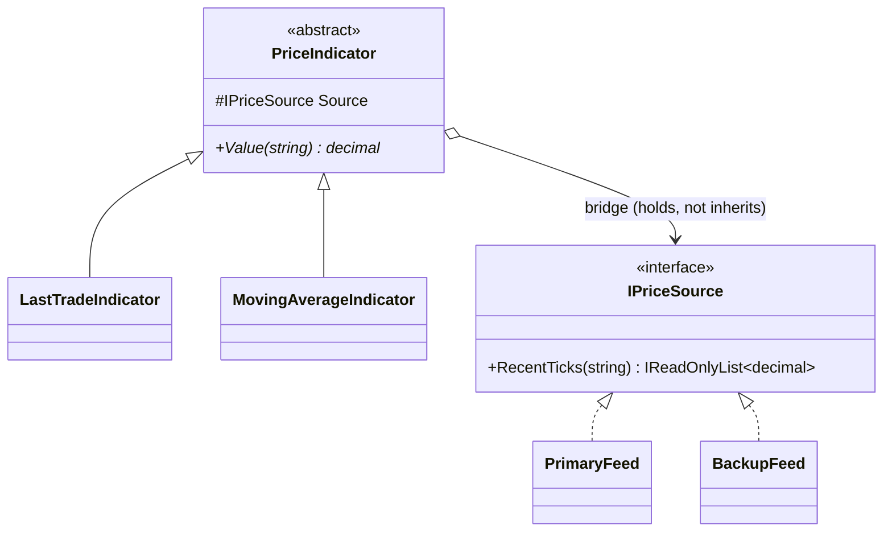

# Bridge — Market-Data Indicators × Sources

> **Week 2 · Day 1b · Structural**
> Run just this kata: `dotnet test --filter "FullyQualifiedName~Bridge"`
> **This is a build-from-scratch kata:** you create every type yourself. Nothing is stubbed.

## The scenario

We compute **indicators** from market data — last trade, moving average, and more to come. The data
can come from different **feeds** — a primary vendor, a backup vendor, more later. These are two
*independent* things: any indicator should work over any feed.

## The challenge

Open [`Legacy/LegacyIndicators.cs`](./Legacy/LegacyIndicators.cs). Someone baked the feed **into**
each indicator by subclassing, so every combination is its own class:

```
PrimaryLastTrade   PrimaryMovingAverage
BackupLastTrade    BackupMovingAverage
```

That's `2 indicators × 2 feeds = 4` classes, with the feed-access code copy-pasted between the two
classes that share a feed.

| Smell | What it costs you |
|-------|-------------------|
| **Combinatorial explosion** | Add a `Vwap` indicator → 6 classes. Add a `Tertiary` feed → 9. It multiplies. |
| **Duplication** | `PrimaryTicks` is copied into every "Primary…" class; a feed fix means editing several. |
| **Two reasons to change one class** | An indicator class changes when the maths changes *and* when the feed changes. |

The root cause: **one inheritance hierarchy is being made to vary along two axes at once.**

## The pattern: Bridge

> **Intent:** Decouple an abstraction from its implementation so that the two can vary
> independently. — *Gang of Four*

Split the two axes into two hierarchies and connect them by **composition**, not inheritance:

- The **Abstraction** (`PriceIndicator`) is the "what do we derive" axis. It **holds** an
  implementor instead of inheriting one.
- The **Implementor** (`IPriceSource`) is the "where do ticks come from" axis.
- **Refined Abstractions** (`LastTradeIndicator`, `MovingAverageIndicator`) add behaviour on top of
  the implementor's primitive (`RecentTicks`).
- **Concrete Implementors** (`PrimaryFeed`, `BackupFeed`) supply that primitive.

Now you have `indicators + feeds` building blocks that combine at runtime — not `indicators × feeds`
classes.

### UML



The vertical line down the middle is the "bridge": the left hierarchy (indicators) and the right
hierarchy (feeds) grow on their own.

> **Bridge vs. Adapter (Day 1a):** Adapter makes an *existing, unchangeable* class fit an interface
> after the fact. Bridge is a *deliberate up-front* design that keeps two hierarchies apart so both
> can evolve. Adapter reacts; Bridge plans.

## Target API — what the (commented-out) tests expect

You build **both** hierarchies — the implementor axis (feeds) and the abstraction axis (indicators).
**Names and constructor signatures are fixed by the tests; everything inside is your design.**

| Type | Shape | Behaviour the tests pin down |
|------|-------|------------------------------|
| `IPriceSource` | interface: `IReadOnlyList<decimal> RecentTicks(string symbol)` | the implementor primitive — "where ticks come from" |
| `PrimaryFeed` | `PrimaryFeed()` — implements `IPriceSource` | canned data: `"AAPL" → [100, 101, 102]` |
| `BackupFeed` | `BackupFeed()` — implements `IPriceSource` | canned data: `"AAPL" → [100, 104]` |
| `PriceIndicator` | abstract; **holds** an `IPriceSource`; `abstract decimal Value(string symbol)` | the abstraction that bridges to a source (composition, not inheritance) |
| `LastTradeIndicator` | `LastTradeIndicator(IPriceSource source)` : `PriceIndicator` | `Value` = the **last** tick of `RecentTicks(symbol)` |
| `MovingAverageIndicator` | `MovingAverageIndicator(IPriceSource source)` : `PriceIndicator` | `Value` = the **average** of `RecentTicks(symbol)` |

The exact totals the tests assert fall straight out of that canned data: primary `[100, 101, 102]` →
last `102`, average `101`; backup `[100, 104]` → last `104`, average `102`. Reproduce those two feeds
faithfully or the numbers won't line up.

**Provided (do not edit):** the [`Legacy/`](./Legacy/) baseline (`PrimaryLastTrade`,
`BackupMovingAverage`, …) — the four hand-baked combination classes you are replacing. Everything in
the table above you build.

## Your task (from scratch)

1. **Uncomment the tests.** In [`BridgeTests.cs`](../../../DesignPatternsBootcamp.Tests/Structural/BridgeTests.cs)
   delete the `/*` and `*/`. Now `dotnet test --filter "FullyQualifiedName~Bridge"` **won't
   compile** — that's step one done. Each "type or namespace could not be found" is a type on your
   checklist. (The `Legacy_primary_last_trade…` test already passes against the provided baseline.)
2. **Build the implementor axis.** Add a new `.cs` file; define `IPriceSource` with the single
   `RecentTicks` primitive, then `PrimaryFeed` and `BackupFeed` returning the canned ticks above.
3. **Build the abstraction axis.** Define the abstract `PriceIndicator` that is *handed* an
   `IPriceSource` and holds it (the "bridge"), with an abstract `Value`.
4. **Add the refined indicators.** `LastTradeIndicator` takes the last tick; `MovingAverageIndicator`
   averages them. Each reads through its `Source`, never knowing which feed it got.
5. **Green.** `dotnet test --filter "FullyQualifiedName~Bridge"`.

The `Any_indicator_combines_with_any_feed` test builds all four behaviours from just your two
indicators and the two feeds — no combination classes anywhere.

### Stretch goals

- **Add a `VwapIndicator`** (or a `median`), and a **`TertiaryFeed`**. Notice you add *one* class per
  axis, and every existing combination keeps working — the explosion is gone.
- **Where's the duplication now?** Point at the single place feed data lives per feed, versus the
  legacy's copies.
- **Bridge vs. Strategy.** Both inject a collaborator. Argue which lens fits here and why the answer
  is partly about intent (structure two hierarchies vs. swap one algorithm).

## When to use it

- **Use it** when a type varies along two (or more) independent dimensions and you feel a subclass
  explosion coming, or when abstraction and implementation should be swappable/deployable separately.
- **Real-world finance:** market-data views × vendor feeds, reports × output formats, pricing models
  × numerical engines, notifications × delivery channels.
- **Avoid it** when there's genuinely only one axis of change (plain inheritance is simpler), or when
  the two sides are so entwined that separating them just adds indirection.

## Done when

- [ ] You created `IPriceSource` + the two feeds, and `PriceIndicator` + the two refined indicators.
- [ ] Each refined indicator reads through its `Source` and never names a concrete feed.
- [ ] `dotnet test --filter "FullyQualifiedName~Bridge"` is fully green.
- [ ] You can state how many classes 3 indicators × 4 feeds needs with Bridge (7) vs. without (12).
