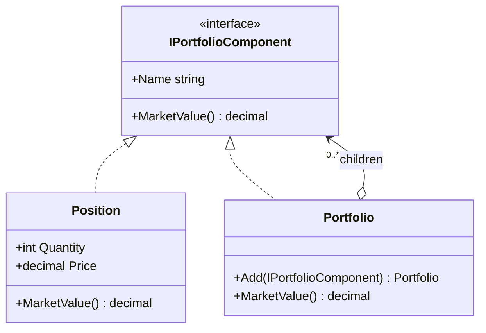

# Composite — Portfolio Hierarchy

> **Week 2 · Day 2a · Structural**
> Run just this kata: `dotnet test --filter "FullyQualifiedName~Composite"`
> **This is a build-from-scratch kata:** you create every type yourself. Nothing is stubbed.

## The scenario

A book of business is a **tree**: a top-level portfolio holds sub-portfolios (by desk, strategy, or
asset class), which hold more sub-portfolios or individual **positions**. We constantly need to roll
a number *up* the tree — market value, exposure, P&L — treating "one position" and "a whole
sub-book" the same way.

## The challenge

Open [`Legacy/LegacyValuation.cs`](./Legacy/LegacyValuation.cs). Leaves (`LegacyHolding`) and
branches (`LegacyPortfolio`) are **different types in different lists**, so every roll-up hand-rolls
the recursion:

```csharp
foreach (var holding in portfolio.Holdings)      total += holding.Quantity * holding.Price;
foreach (var sub    in portfolio.SubPortfolios)  total += TotalValue(sub);
```

| Smell | What it costs you |
|-------|-------------------|
| **Client knows the shape** | Callers must understand the two-list structure to do anything. |
| **Duplicated traversal** | That two-loop recursion gets copy-pasted into valuation, counting, reporting… |
| **Rigid to new node types** | Add a cash balance or a derivative leg and *every* traversal must change. |

We want to treat a leaf and a branch as **the same kind of thing** and let the tree value itself.

## The pattern: Composite

> **Intent:** Compose objects into tree structures to represent part-whole hierarchies. Composite
> lets clients treat individual objects and compositions of objects uniformly. — *Gang of Four*

- The **Component** (`IPortfolioComponent`) is the common interface for both leaves and branches.
- The **Leaf** (`Position`) implements it directly.
- The **Composite** (`Portfolio`) implements it by **delegating to its children** and combining the
  results — and since a child may itself be a composite, the recursion is automatic.

### UML



That self-referential arrow (`Portfolio` holds many `IPortfolioComponent`, which a `Portfolio`
*is*) is the whole pattern: branches contain components, and a branch is itself a component.

## Target API — what the (commented-out) tests expect

You must create these types so the tests compile and pass. **Names and constructor signatures are
fixed by the tests; everything inside is your design.**

| Type | Shape | Behaviour the tests pin down |
|------|-------|------------------------------|
| `IPortfolioComponent` | interface: `string Name { get; }`, `decimal MarketValue()` | the common type for leaf **and** branch |
| `Position` | `Position(string symbol, int quantity, decimal price)` — implements `IPortfolioComponent` | the leaf; `MarketValue()` = `quantity × price` (e.g. `10 × 150 = 1500`) |
| `Portfolio` | `Portfolio(string name)` — implements `IPortfolioComponent`; `Portfolio Add(IPortfolioComponent child)` | the composite; `Add` returns `this` so calls chain; `MarketValue()` = the **sum** of its children's `MarketValue()` |

`Add` returning the `Portfolio` is what lets the tests write `new Portfolio("…").Add(…).Add(…)`.
Because a child may itself be a `Portfolio`, one `MarketValue()` recurses the whole tree with no
special case.

**Provided (do not edit):** the [`Legacy/`](./Legacy/) baseline — `LegacyHolding`, `LegacyPortfolio`,
`LegacyValuation` (the two-list, hand-rolled recursion you are replacing). Everything in the table
above you build.

## Your task (from scratch)

1. **Uncomment the tests.** In [`CompositeTests.cs`](../../../DesignPatternsBootcamp.Tests/Structural/CompositeTests.cs)
   delete the `/*` and `*/`. Now `dotnet test --filter "FullyQualifiedName~Composite"` **won't
   compile** — that's step one done. Each "type or namespace could not be found" is a type on your
   checklist. (The `Legacy_valuation…` test already passes against the provided baseline.)
2. **Create the component.** Add a new `.cs` file; define `IPortfolioComponent` with `Name` and
   `MarketValue()` — the single type a leaf and a branch will share.
3. **Create the leaf.** `Position` holds symbol/quantity/price and values itself. Get
   `Position_value_is_quantity_times_price` green.
4. **Create the composite.** `Portfolio` keeps a list of children, `Add` appends one and returns
   `this`, and `MarketValue()` sums the children — letting the recursion happen for free.
5. **Green.** `dotnet test --filter "FullyQualifiedName~Composite"`.

`A_leaf_and_a_branch_are_interchangeable` puts a `Position` and a `Portfolio` in the same parent —
proof the client no longer cares which is which.

### Stretch goals

- **Add a second roll-up**, e.g. `int PositionCount()` on the interface. Notice it's the same
  shape — leaf returns 1, composite sums children — and no traversal code lives in the client.
- **Add a new leaf type** `CashBalance : IPortfolioComponent`. It drops into any portfolio and every
  existing roll-up keeps working — contrast with the legacy, where you'd edit every traversal.
- **Safety vs. transparency.** We kept `Add` only on `Portfolio` (the "safe" variant). Read about the
  "transparent" variant (Add on the Component) and note the trade-off (uniformity vs. leaf misuse).

## When to use it

- **Use it** for part-whole hierarchies you traverse uniformly: trees where "one" and "many" should
  look identical to callers.
- **Real-world finance:** portfolio/account hierarchies, org and cost-centre trees, nested fee
  schedules, bill-of-materials style instrument baskets, hierarchical limits.
- **Avoid it** when the structure isn't really a tree, or when leaves and composites have so little
  in common that a shared interface would be mostly empty (forcing meaningless methods onto leaves).

## Done when

- [ ] You created `IPortfolioComponent`, `Position` (leaf), and `Portfolio` (composite) from scratch.
- [ ] `Add` chains, and `MarketValue()` sums children with no branch-vs-leaf special case.
- [ ] `dotnet test --filter "FullyQualifiedName~Composite"` is fully green.
- [ ] You can explain why `Portfolio.MarketValue()` needs no special case for nested portfolios.
