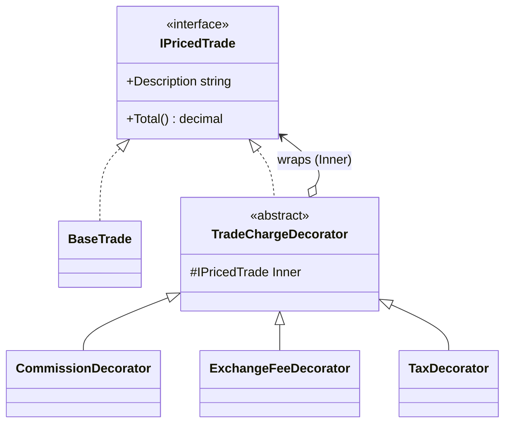

# Decorator — Fee & Tax Pricing

> **Week 2 · Day 2b · Structural**
> Run just this kata: `dotnet test --filter "FullyQualifiedName~Decorator"`
> **This is a build-from-scratch kata:** you create every type yourself. Nothing is stubbed.

## The scenario

Pricing a trade means layering charges on top of a base notional: commission, an exchange fee, tax.
Which charges apply — and in what order — varies per account and venue. We want to compose those
charges freely at runtime, not hard-code every combination.

## The challenge

Open [`Legacy/LegacyTradePricer.cs`](./Legacy/LegacyTradePricer.cs). Every charge is a boolean flag
on one method, applied in a fixed, baked-in order:

```csharp
pricer.Price(10_000m, commission: true, commissionRate: 0.001m,
                      exchangeFee: true, exchangeAmount: 5m,
                      tax: true, taxRate: 0.10m);
```

| Smell | What it costs you |
|-------|-------------------|
| **Flag-argument wall** | A row of booleans no caller can read. |
| **Fixed order** | The order of charges is hard-coded here, not chosen by the caller. |
| **Closed to extension** | A new charge (stamp duty, clearing fee) changes this method's signature and every call site. |

Your job is to **refactor this into the Decorator pattern — building the whole thing yourself.**

## The pattern: Decorator

> **Intent:** Attach additional responsibilities to an object dynamically. Decorators provide a
> flexible alternative to subclassing for extending functionality. — *Gang of Four*

- A **Component** interface both the base object and the wrappers implement.
- A **Concrete Component** — the bare trade.
- **Decorators** each *wrap* a component (an "inner"), delegate to it, and add one charge on top. A
  decorator is itself a component, so decorators stack: any charge can wrap any priced trade,
  including another decorator.

### UML (the shape you're aiming for)



The `TradeChargeDecorator` abstract base is *one* way to avoid repeating the "hold an inner + delegate
to it" plumbing in every decorator — but whether you use it is your call. The tests don't care.

## Target API — what the (commented-out) tests expect

You must create these types so the tests compile and pass. **Names and constructor signatures are
fixed by the tests; everything inside is your design.**

| Type | Shape | Behaviour the tests pin down |
|------|-------|------------------------------|
| `IPricedTrade` | interface: `decimal Total()`, `string Description { get; }` | the common component type |
| `BaseTrade` | `BaseTrade(string symbol, decimal notional)` | `Total()` is the notional; `Description` is the symbol |
| `CommissionDecorator` | `CommissionDecorator(IPricedTrade inner, decimal rate)` | adds a **percentage** of what it wraps |
| `ExchangeFeeDecorator` | `ExchangeFeeDecorator(IPricedTrade inner, decimal fee)` | adds a **flat** amount |
| `TaxDecorator` | `TaxDecorator(IPricedTrade inner, decimal rate)` | adds a **percentage** on top of everything beneath it |

`Description` should read as the layers applied, e.g. `"AAPL + commission + exchange fee + tax"`. The
exact numbers are in the tests — derive each formula from them.

## Your task (from scratch)

1. **Uncomment the tests.** In [`DecoratorTests.cs`](../../../DesignPatternsBootcamp.Tests/Structural/DecoratorTests.cs)
   delete the `/*` and `*/`. Now `dotnet test --filter "FullyQualifiedName~Decorator"` **won't
   compile** — that's step one done. The build errors are your checklist.
2. **Create the component.** Add a new `.cs` file in this folder; define `IPricedTrade` and
   `BaseTrade`. Get `Base_trade_total_is_just_the_notional` green.
3. **Create the decorators.** Add `CommissionDecorator`, `ExchangeFeeDecorator`, `TaxDecorator`
   (consider the abstract base to share the wrap-and-delegate plumbing). Each holds an inner
   `IPricedTrade`, delegates to it, and adds its charge.
4. **Make the maths and the description right.** Use the test numbers to pin each formula. Watch the
   `Order_matters…` test — mixing a flat fee with a percentage tax makes composition order
   significant.
5. **Green.** `dotnet test --filter "FullyQualifiedName~Decorator"`.

### Stretch goals

- **Add a charge** (`StampDutyDecorator`) with no change to any existing class or the base trade.
- **`CappedFee`** — a decorator that wraps another and caps its `Total` at a maximum. (Strategy-meets-
  Decorator.)
- **Decorator vs. Proxy vs. Facade:** all wrap something. Which *adds behaviour*, which *controls
  access*, which *simplifies*? Write a sentence on each.

## When to use it

- **Use it** to add responsibilities to individual objects dynamically and transparently, without a
  subclass per combination.
- **Real-world finance:** layered pricing/fees/taxes, wrapping streams or handlers (logging, retry,
  caching), enriching messages/requests in a pipeline.
- **Avoid it** when the layering is fixed and small (a couple of fields on the object is simpler), or
  when order-dependence between decorators becomes a hidden trap.

## Done when

- [ ] You created `IPricedTrade`, `BaseTrade`, and the three decorators from scratch.
- [ ] `dotnet test --filter "FullyQualifiedName~Decorator"` is fully green.
- [ ] You can explain why `Order_matters…` produces two different totals.
