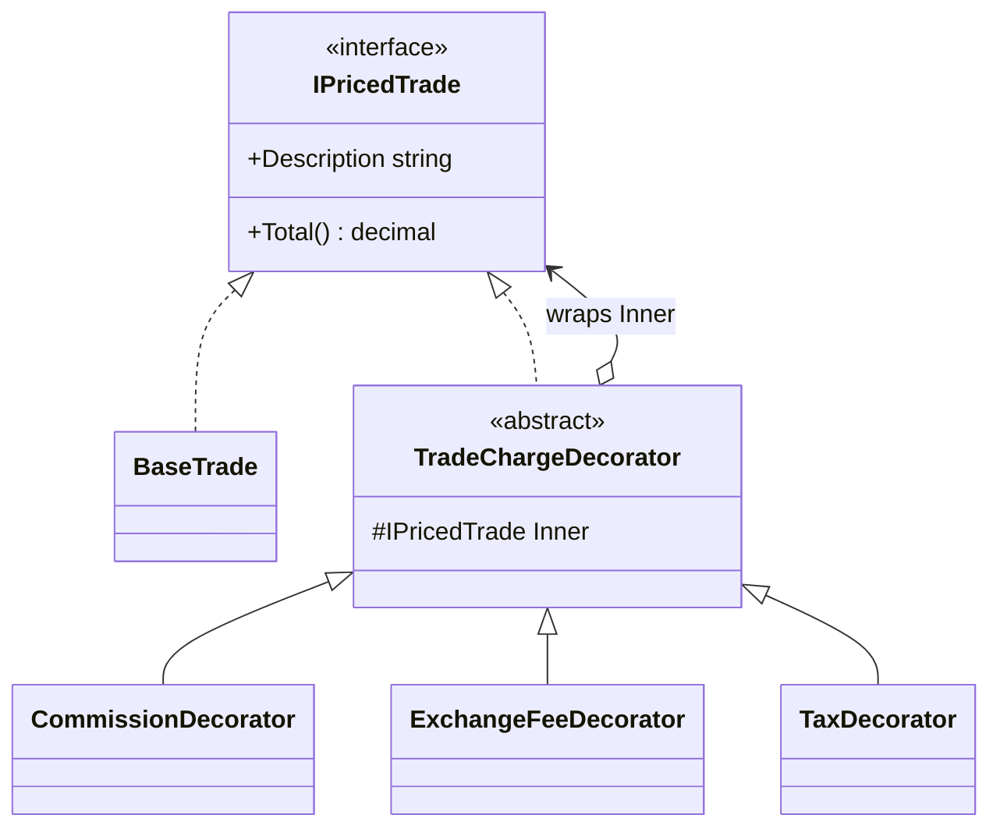

# Decorator — Fee & Tax Pricing

> **Week 2 · Day 2b · Structural**
> Run just this kata: `dotnet test --filter "FullyQualifiedName~Decorator"`

## The scenario

The all-in cost of a trade is the notional plus a **stack of charges**: commission, exchange fees,
taxes, and more. Which charges apply — and in **what order** — varies by venue, account, and
instrument. Whether the exchange fee is itself taxable literally changes the number.

## The challenge

Open [`Legacy/LegacyTradePricer.cs`](./Legacy/LegacyTradePricer.cs). One method takes a boolean (and
a value) for every charge:

```csharp
pricer.Price(10_000m, commission: true, commissionRate: 0.001m,
                       exchangeFee: true, exchangeAmount: 5m,
                       tax: true,         taxRate: 0.10m);
```

| Smell | What it costs you |
|-------|-------------------|
| **Flag-argument soup** | A row of booleans no reader can decode at the call site. |
| **Hard-coded order** | The sequence of charges is fixed inside the method; callers can't choose it. |
| **Not open for extension** | A new charge changes this method's signature and body — every caller breaks. |
| **Combination explosion (the OO alternative)** | Subclassing instead (`TradeWithCommissionAndTax`, …) multiplies classes. |

We want each charge to be a small, composable thing we can **stack in any order and combination**.

## The pattern: Decorator

> **Intent:** Attach additional responsibilities to an object dynamically. Decorators provide a
> flexible alternative to subclassing for extending functionality. — *Gang of Four*

- The **Component** (`IPricedTrade`) is the common interface.
- The **Concrete Component** (`BaseTrade`) is the thing being decorated.
- The **base Decorator** (`TradeChargeDecorator`) *is* a component and *wraps* a component.
- **Concrete Decorators** (`CommissionDecorator`, `ExchangeFeeDecorator`, `TaxDecorator`) each add
  one charge on top of whatever they wrap — including another decorator.

### UML



A decorator is both an `IPricedTrade` (so it can stand in anywhere) and a holder of one (so it can
delegate then augment). `Tax(Fee(Commission(Base)))` is a four-object onion; calling `Total()` peels
inward and adds back outward.

> **Decorator vs. Adapter/Composite:** all three "wrap" an object. Adapter changes the *interface*;
> Decorator keeps the same interface and adds *behaviour*; Composite uses the same wrapping shape to
> build *trees*. Same skeleton, different intent.

## Your task

Implement `Total()` and `Description` for the three decorators in
[`PricedTrade.cs`](./PricedTrade.cs). Each one calls `Inner` and adds its bit:

1. **`CommissionDecorator`** — `Inner.Total()` plus `Inner.Total() × rate`; description
   `"<inner> + commission"`.
2. **`ExchangeFeeDecorator`** — `Inner.Total()` plus the flat fee; `"<inner> + exchange fee"`.
3. **`TaxDecorator`** — `Inner.Total() × (1 + rate)`; `"<inner> + tax"`.

```bash
dotnet test --filter "FullyQualifiedName~Decorator"
```

`Order_matters_when_charges_are_not_all_the_same_kind` proves the pay-off: because you compose the
onion yourself, taxing-then-fee and fee-then-tax give different totals — a decision the legacy method
made for you.

### Stretch goals

- **Add a `RegulatoryFeeDecorator`** (e.g. a per-share SEC-style fee) with **only** a new class — no
  existing code changes. That's "open for extension, closed for modification" in one move.
- **A decorator that changes behaviour, not just numbers.** Add an `AuditDecorator` that records each
  `Total()` call — decorators can add cross-cutting behaviour, not only value.
- **`Description` as evidence.** Explain how the onion's `Description` gives you a free audit trail of
  exactly which charges applied and in what order.

## When to use it

- **Use it** to add responsibilities to individual objects dynamically and transparently, without a
  subclass per combination, and when order/opt-in of those responsibilities varies.
- **Real-world finance:** layered fees/taxes, notification pipelines, streams (buffering/encryption),
  cross-cutting concerns like logging, caching, retry, and auth around a service.
- **Avoid it** when you only ever need one fixed combination (just write it), or when deep decorator
  stacks make debugging a "who added this?" nightmare — keep the onion shallow and named.

## Done when

- [ ] All three decorators implement `Total()` and `Description`.
- [ ] `dotnet test --filter "FullyQualifiedName~Decorator"` is fully green.
- [ ] You can explain why `Tax(Fee(x))` and `Fee(Tax(x))` differ but `Tax(Commission(x))` and
      `Commission(Tax(x))` don't.
