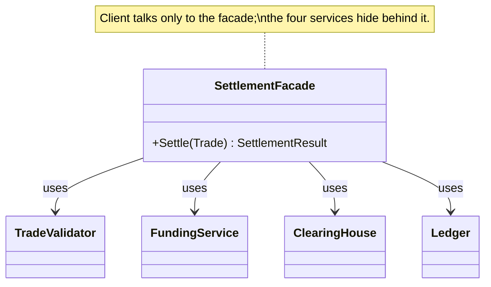
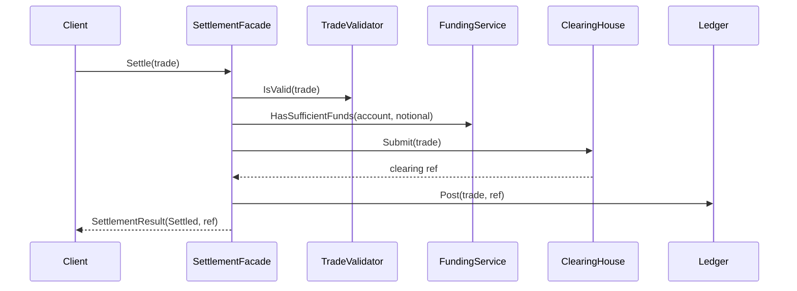

# Facade — Trade Settlement

> **Week 2 · Day 3a · Structural**
> Run just this kata: `dotnet test --filter "FullyQualifiedName~Facade"`
> **This is a build-from-scratch kata:** the subsystem is provided; you build the facade yourself.

## The scenario

Settling a trade touches four services: a **validator**, a **funding** check, a **clearing house**,
and the **ledger**. Each is simple on its own. The pain is that anyone who wants to settle a trade
must know all four, call them in the right order, and handle each failure path.

## The challenge

Open [`Legacy/LegacyDeskClient.cs`](./Legacy/LegacyDeskClient.cs). The desk drives the whole
subsystem itself:

```csharp
if (!validator.IsValid(trade, out var reason)) return $"REJECTED: {reason}";
if (!funding.HasSufficientFunds(trade.Account, trade.Notional)) return "REJECTED: Insufficient funds.";
var clr = clearing.Submit(trade);
ledger.Post(trade, clr);
```

| Smell | What it costs you |
|-------|-------------------|
| **Client coupled to the whole subsystem** | Callers depend on four types and their call order. |
| **Duplicated choreography** | Every place that settles repeats this exact sequence. |
| **Fragile to change** | Insert a compliance step or swap the clearing house → edit every caller. |

We want callers to say **"settle this trade"** and nothing more.

## The pattern: Facade

> **Intent:** Provide a unified interface to a set of interfaces in a subsystem. Facade defines a
> higher-level interface that makes the subsystem easier to use. — *Gang of Four*

- The **Facade** (`SettlementFacade`) exposes one method, `Settle`, and owns the choreography.
- The **Subsystem** (`TradeValidator`, `FundingService`, `ClearingHouse`, `Ledger`) stays exactly as
  it is — the facade doesn't hide or replace it, it just gives callers an easy front door.

Note a facade **doesn't forbid** direct subsystem access; it provides a convenient default path. It
adds no new behaviour of its own — it *coordinates*. (Contrast Decorator, which adds behaviour.)

### UML





## Target API — what the (commented-out) tests expect

You must create this type so the tests compile and pass. **The name, constructor, and method
signature are fixed by the tests; the choreography inside is your design.**

| Type | Shape | Behaviour the tests pin down |
|------|-------|------------------------------|
| `SettlementFacade` | `SettlementFacade(TradeValidator validator, FundingService funding, ClearingHouse clearing, Ledger ledger)`; `SettlementResult Settle(Trade trade)` | takes the four subsystems in, then `Settle` runs the whole dance and returns one result |

**Provided (do not recreate):** `Subsystems.cs` gives you the `Trade` record, the `SettlementResult`
record (`bool Settled`, `string? ClearingReference`, `string Message`), and the four subsystems
`TradeValidator`, `FundingService`, `ClearingHouse`, `Ledger` — all complete. `Legacy/` holds the
"before" code. The facade is the **only** type missing.

## Your task (from scratch)

1. **Uncomment the tests.** In [`FacadeTests.cs`](../../../DesignPatternsBootcamp.Tests/Structural/FacadeTests.cs)
   delete the `/*` and `*/`. Now `dotnet test --filter "FullyQualifiedName~Facade"` **won't compile** —
   the only missing type is `SettlementFacade`, so that single build error is your checklist.
2. **Create the facade.** Add a new `.cs` file in this folder; define `SettlementFacade` with the
   four-subsystem constructor and a `Settle(Trade)` method returning `SettlementResult`.
3. **Choreograph the subsystem.** Inside `Settle`:
   - Validate — on failure return a **failed** `SettlementResult` carrying the reason; **do not** call
     clearing or the ledger.
   - Check funding (`trade.Notional`) — on failure return failed (`"Insufficient funds."`); again no
     clearing, no ledger.
   - Otherwise submit to clearing, post the returned reference to the ledger, and return a **successful**
     result carrying that reference.
4. **Green.** `dotnet test --filter "FullyQualifiedName~Facade"`.

The short-circuit tests check `clearing.SubmissionCount == 0` and an empty ledger on rejection — so
your ordering and early-returns actually matter.

### Stretch goals

- **Add a compliance check** (a new subsystem call) *inside the facade only* — no caller changes.
  That's the payoff: the subsystem grew, the front door didn't.
- **Keep the subsystem usable directly.** Write a test that calls `ClearingHouse.Submit` on its own,
  proving the facade is a convenience, not a wall.
- **Facade vs. Mediator (Week 3).** Both reduce coupling between parts. Sketch how a Facade is
  one-directional (client → subsystem) while a Mediator coordinates peers talking *to each other*.

## When to use it

- **Use it** to give a simple, stable entry point to a complicated or sprawling subsystem, to
  decouple clients from its internals, or to layer your system (each layer a facade over the next).
- **Real-world finance:** settlement/clearing pipelines, onboarding/KYC flows, order-management
  entry points, "one call" wrappers over a mess of internal microservices.
- **Avoid it** when the subsystem is already simple (a facade just adds a hop), or when you let the
  facade grow into a god-object that hoards logic instead of delegating it.

## Done when

- [ ] You created `SettlementFacade` from scratch, choreographing the four subsystems with correct
  short-circuiting.
- [ ] `dotnet test --filter "FullyQualifiedName~Facade"` is fully green.
- [ ] You can explain why a rejected trade must leave `SubmissionCount` at 0.
