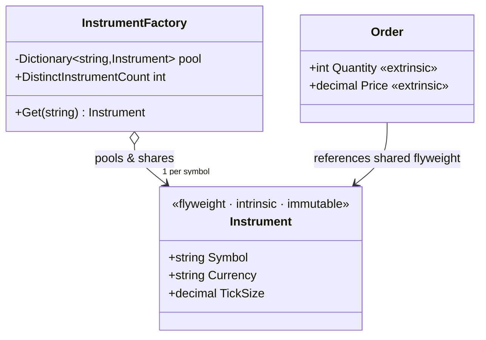

# Flyweight — Instrument Reference Data

> **Week 2 · Day 3b · Structural**
> Run just this kata: `dotnet test --filter "FullyQualifiedName~Flyweight"`

## The scenario

An order-management system holds **millions** of orders. Each order references its instrument's
**static reference data** — currency, tick size, lot size, exchange. For a given symbol that data is
identical across every order and never changes.

## The challenge

Open [`Legacy/LegacyOrder.cs`](./Legacy/LegacyOrder.cs). Every order stores its **own copy** of the
reference data:

```csharp
(Symbol, Currency, TickSize, LotSize, Exchange) = symbol switch { "AAPL" => ("AAPL","USD",0.01m,100,"NASDAQ"), ... };
```

Book a million AAPL orders and you have a million identical copies of `USD / 0.01 / 100 / NASDAQ`.
The `ReferenceDataCopies` counter ticks once per order to make the waste visible.

| Smell | What it costs you |
|-------|-------------------|
| **Memory blow-up** | Immutable data that's the same for millions of objects is duplicated per object. |
| **Cache-unfriendly** | More bytes, more allocations, more GC pressure. |
| **No identity** | You can't ask "is this the AAPL instrument?" — there are a million of them. |

We want the shared, unchanging part to exist **once** and be **shared** by every order.

## The pattern: Flyweight

> **Intent:** Use sharing to support large numbers of fine-grained objects efficiently. — *Gang of Four*

The trick is to split an object's state:

- **Intrinsic** state — shared, immutable, context-free: the `Instrument` reference data. Stored
  **once** in a flyweight.
- **Extrinsic** state — unique per use, supplied by the context: an order's `Quantity` and `Price`.

A **Flyweight Factory** (`InstrumentFactory`) hands out shared flyweights, creating each distinct one
only once (interning). Millions of orders then hold a *reference* to a handful of shared instruments.

### UML



## Your task

Implement `Get` in [`InstrumentFactory.cs`](./InstrumentFactory.cs) so it **interns** instruments:

1. If the symbol is already in `_pool`, return that same instance.
2. Otherwise build one from `Catalog[symbol]`, store it in `_pool`, and return it.

```bash
dotnet test --filter "FullyQualifiedName~Flyweight"
```

These tests use `Assert.Same` (reference identity), not `Assert.Equal` — because the whole point is
that everyone gets the **same object**, not merely an equal one. `Many_orders_share_a_single_instrument_object`
builds three orders and proves they point at one flyweight.

### Stretch goals

- **Thread-safety.** Swap `_pool` for a `ConcurrentDictionary` and use `GetOrAdd` so concurrent
  callers still create each flyweight once. (Compare with the Singleton kata's thread-safety.)
- **Measure it.** Estimate the memory saved: a million orders × (bytes of duplicated reference data)
  versus a handful of shared `Instrument` objects.
- **Why immutable matters.** Explain what breaks if `Instrument` were mutable and two orders shared
  it — this is the same "shared mutable state" trap you saw in the Prototype kata, from the other side.

## When to use it

- **Use it** when you have a huge number of objects whose state is mostly shared and immutable, and
  memory (or allocation churn) is the bottleneck.
- **Real-world finance:** instrument/security master data, currency and calendar objects, symbol and
  venue metadata, glyphs in a rendering engine (the classic example).
- **Avoid it** when objects are few, when the "shared" state actually varies, or when the intrinsic
  state is mutable — the sharing would then leak changes between contexts.

## Done when

- [ ] `Get` returns one shared, interned `Instrument` per symbol.
- [ ] `dotnet test --filter "FullyQualifiedName~Flyweight"` is fully green.
- [ ] You can name which fields here are intrinsic (shared) and which are extrinsic (per-order).
