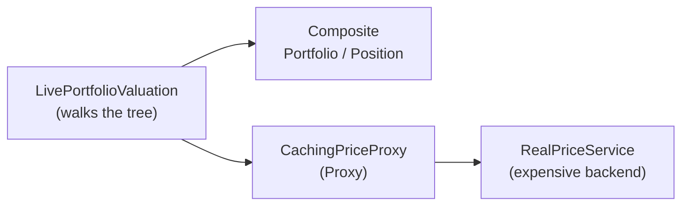

# Review & Integration — The Live Valuation Capstone

> **Week 2 · Day 5 · Structural**
> Run just this kata: `dotnet test --filter "FullyQualifiedName~StructuralIntegration"`
> **Prerequisite:** finish **Day 4 (Proxy)** first — this capstone relies on the caching proxy.

## Goal

Structural patterns shine when they **compose**. Here you value an entire book at live prices —
efficiently — by stacking two of them:

- **Composite** gives you the portfolio *tree* to walk.
- **Proxy** (caching `IPriceService`) makes sure each distinct symbol is fetched from the expensive
  backend **at most once**, no matter how many sub-portfolios hold it.

That is the "structural optimization" theme of the week in one method.

## The exercise

Implement `LivePortfolioValuation.MarketValue(IPortfolioComponent)` in
[`LivePortfolioValuation.cs`](./LivePortfolioValuation.cs) by walking the Composite tree:

- `Position p` → `p.Quantity * _prices.GetPrice(p.Name)`
- `Portfolio pf` → sum of `MarketValue(child)` over `pf.Children`

```bash
dotnet test --filter "FullyQualifiedName~StructuralIntegration"
```

The key test, `Each_distinct_symbol_is_priced_only_once_across_the_whole_book`, puts `AAPL` in two
different sub-portfolios and asserts the backend was hit **twice total** (AAPL + MSFT). That only
happens if the caching Proxy is doing its job underneath your recursion.

### How the stack fits together



> **A teaching note:** Composite's own `MarketValue()` prices a position at its *book* value — that's
> the operation baked into the hierarchy. Live repricing is a *new* operation that needs an external
> service, so here we pattern-match on the node type. When you have many such operations, adding them
> by pattern-matching gets unwieldy — that's the itch **Visitor** (Week 4) scratches.

## The Week 2 map — what each structural pattern does

| Pattern | Day | Structural job | One-liner |
|---------|-----|----------------|-----------|
| **Adapter** | 1a | Make an incompatible class fit an interface | "Reshape a thing to fit." |
| **Bridge** | 1b | Split two axes so they vary independently | "Two hierarchies, one seam." |
| **Composite** | 2a | Treat leaves and trees uniformly | "One and many look the same." |
| **Decorator** | 2b | Add responsibilities by wrapping | "Stack behaviour, don't subclass." |
| **Facade** | 3a | One simple front door to a subsystem | "Hide the machinery." |
| **Flyweight** | 3b | Share immutable state across many objects | "Store it once." |
| **Proxy** | 4 | Control access behind the same interface | "A stand-in that guards/caches/defers." |

They all answer *"how do I compose objects into larger structures?"* — some by **wrapping** (Adapter,
Decorator, Facade, Proxy), some by **arranging** (Bridge, Composite), some by **sharing** (Flyweight).

## Stretch goals — grow the capstone into the full stack

- **Adapter/Bridge feed.** Replace `RealPriceService` with an adapter over a Bridge
  `LastTradeIndicator(PrimaryFeed())`, so the price ultimately comes from a swappable feed. Now the
  stack is Bridge → Adapter → Proxy → valuation.
- **Decorator fees.** Wrap each position's live value with the Day 2b `CommissionDecorator` /
  `TaxDecorator` to produce an all-in valuation.
- **Flyweight instruments.** Attach shared `Instrument` reference data (Day 3b) to positions so the
  book carries one instrument object per symbol.
- **Facade it.** Put a `ValuationService` facade over the whole stack so callers say
  `service.ValueBook(book)` and nothing else.

## Done when

- [ ] `MarketValue` walks the Composite tree and prices via the injected `IPriceService`.
- [ ] `dotnet test --filter "FullyQualifiedName~StructuralIntegration"` is green.
- [ ] You can explain why AAPL-in-two-places still costs only one backend call.

---

🎉 **That completes Week 2 — the seven structural patterns.** Update your
[STATUS.md](../../../STATUS.md) as each kata goes green, and tell the professor when you're ready for
Week 3 (Behavioral Patterns, Part 1).
