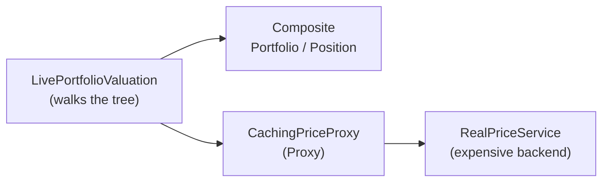

# Review & Integration — The Live Valuation Capstone

> **Week 2 · Day 5 · Structural**
> Run just this kata: `dotnet test --filter "FullyQualifiedName~StructuralIntegration"`
> **This is a build-from-scratch kata:** the capstone's whole source was deleted — you build the
> composing `LivePortfolioValuation` yourself. Nothing here is stubbed.
> **Prerequisite:** finish **Day 4 (Proxy)** first — this capstone relies on the caching proxy, so it
> won't compile until Proxy's types exist. (You use Composite's tree directly, so its `MarketValue`
> kata need not be done.)

## Goal

Structural patterns shine when they **compose**. Here you value an entire book at live prices —
efficiently — by stacking two of them:

- **Composite** gives you the portfolio *tree* to walk.
- **Proxy** (caching `IPriceService`) makes sure each distinct symbol is fetched from the expensive
  backend **at most once**, no matter how many sub-portfolios hold it.

That is the "structural optimization" theme of the week in one method.

## Target API — what the (commented-out) tests expect

This is a capstone: you create the one composing type below, and it *leans on* types you already built
in the prerequisite katas. **The name and signatures are fixed by the tests; the recursion inside is
your design.**

| Type (you create) | Shape | Behaviour the tests pin down |
|-------------------|-------|------------------------------|
| `LivePortfolioValuation` | `LivePortfolioValuation(IPriceService prices)`; `decimal MarketValue(IPortfolioComponent component)` | walks the Composite tree, repricing every position live through the injected `IPriceService`: `Position p` → `p.Quantity * prices.GetPrice(p.Name)`; `Portfolio pf` → sum of `MarketValue(child)` over `pf.Children` |

**Provided:** only this README — the capstone class is yours to write. The **dependency types come
from the prerequisite katas**: `IPriceService` / `CachingPriceProxy` / `RealPriceService` (Proxy,
Day 4) and `IPortfolioComponent` / `Portfolio` / `Position` (Composite, Day 2a — its tree is used
directly). If Proxy isn't done, this won't compile.

## Your task (from scratch)

1. **Uncomment the tests.** In [`StructuralIntegrationTests.cs`](../../../DesignPatternsBootcamp.Tests/Structural/StructuralIntegrationTests.cs)
   delete the `/*` and `*/`. Now `dotnet test --filter "FullyQualifiedName~StructuralIntegration"`
   **won't compile** — that's step one done. Missing-type errors point at this capstone's
   `LivePortfolioValuation` *and* any prerequisite (Proxy/Composite) type you haven't built yet.
2. **Create `LivePortfolioValuation`.** Add a new `.cs` file: a constructor that stores the injected
   `IPriceService`, and a `MarketValue(IPortfolioComponent)` that recurses over the Composite tree —
   `Position` → `Quantity × prices.GetPrice(Name)`, `Portfolio` → sum over `Children`.
3. **Green.** `dotnet test --filter "FullyQualifiedName~StructuralIntegration"`.

The key test, `Each_distinct_symbol_is_priced_only_once_across_the_whole_book`, puts `AAPL` in two
different sub-portfolios and asserts the backend was hit **twice total** (AAPL + MSFT). That only
happens if the caching Proxy is doing its job underneath your recursion.

### How the stack fits together

> **A teaching note:** Composite's own `MarketValue()` prices a position at its *book* value — that's
> the operation baked into the hierarchy. Live repricing is a *new* operation that needs an external
> service, so here we pattern-match on the node type. When you have many such operations, adding them
> by pattern-matching gets unwieldy — that's the itch **Visitor** (Week 4) scratches.

## The Week 2 map — what each structural pattern does

| Pattern | Day | Structural job | One-liner |
|---------|-----|----------------|-----------|
| **Adapter** | 1a | Make an incompatible class fit an interface | "Reshape a thing to fit." |
| **Bridge** | 1b | Split two axes so they vary independently | "Two hierarchies, one seam." |
| **Composite** | 2a | Treat leaves and trees uniformly | "One and many look the same." |
| **Decorator** | 2b | Add responsibilities by wrapping | "Stack behaviour, don't subclass." |
| **Facade** | 3a | One simple front door to a subsystem | "Hide the machinery." |
| **Flyweight** | 3b | Share immutable state across many objects | "Store it once." |
| **Proxy** | 4 | Control access behind the same interface | "A stand-in that guards/caches/defers." |

They all answer *"how do I compose objects into larger structures?"* — some by **wrapping** (Adapter,
Decorator, Facade, Proxy), some by **arranging** (Bridge, Composite), some by **sharing** (Flyweight).

## Stretch goals — grow the capstone into the full stack

- **Adapter/Bridge feed.** Replace `RealPriceService` with an adapter over a Bridge
  `LastTradeIndicator(PrimaryFeed())`, so the price ultimately comes from a swappable feed. Now the
  stack is Bridge → Adapter → Proxy → valuation.
- **Decorator fees.** Wrap each position's live value with the Day 2b `CommissionDecorator` /
  `TaxDecorator` to produce an all-in valuation.
- **Flyweight instruments.** Attach shared `Instrument` reference data (Day 3b) to positions so the
  book carries one instrument object per symbol.
- **Facade it.** Put a `ValuationService` facade over the whole stack so callers say
  `service.ValueBook(book)` and nothing else.

## Done when

- [ ] You built `LivePortfolioValuation` from scratch; `MarketValue` walks the Composite tree and
      prices via the injected `IPriceService` (Proxy kata done first).
- [ ] `dotnet test --filter "FullyQualifiedName~StructuralIntegration"` is green.
- [ ] You can explain why AAPL-in-two-places still costs only one backend call.

---

🎉 **That completes Week 2 — the seven structural patterns.** Update your
[STATUS.md](../../../STATUS.md) as each kata goes green, and tell the professor when you're ready for
Week 3 (Behavioral Patterns, Part 1).
