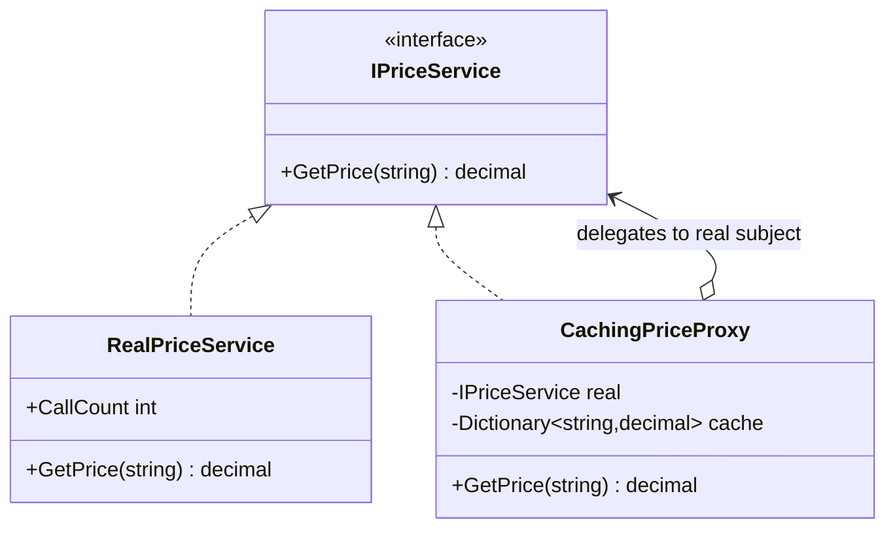

# Proxy — Caching Market-Data Service

> **Week 2 · Day 4 · Structural**
> Run just this kata: `dotnet test --filter "FullyQualifiedName~Proxy"`
> **This is a build-from-scratch kata:** the subject interface and the real service are provided; you build the caching proxy yourself.

## The scenario

Fetching a price from our vendor is expensive — a network round-trip per lookup. But prices are
requested constantly, often for the same symbol many times in a row. We want to stop paying for the
same lookup twice, **without** changing the callers or the vendor client.

## The challenge

Open [`Legacy/LegacyPriceClient.cs`](./Legacy/LegacyPriceClient.cs). It calls the real service
directly:

```csharp
symbols.Select(service.GetPrice).ToArray(); // one backend hit per element, duplicates and all
```

Ask for `AAPL` three times → three round-trips (`RealPriceService.CallCount == 3`).

| Smell | What it costs you |
|-------|-------------------|
| **Repeated expensive work** | Identical lookups each pay full price. |
| **Nowhere to intervene** | Adding caching means editing every caller, or bloating the real service with concerns that aren't its job. |
| **Mixed responsibilities (the alternative)** | Baking a cache into `RealPriceService` mixes "fetch" with "remember". |

We want to insert caching **transparently**, behind the same interface.

## The pattern: Proxy

> **Intent:** Provide a surrogate or placeholder for another object to control access to it. — *Gang of Four*

- The **Subject** (`IPriceService`) is the shared interface.
- The **Real Subject** (`RealPriceService`) does the actual, expensive work.
- The **Proxy** (`CachingPriceProxy`) implements the same interface, **holds** the real subject, and
  controls access to it — here by caching. The client holds an `IPriceService` and never knows.

Common flavours of Proxy:

| Flavour | Controls access by… | Example |
|---------|---------------------|---------|
| **Caching / smart** | remembering results | *this kata* |
| **Virtual** | deferring creation until first use | a lazy-loaded statement/report |
| **Protection** | checking permissions first | trader-role guard on an admin service |
| **Remote** | standing in for an object elsewhere | an RPC/client stub |

### UML



> **Proxy vs. Decorator vs. Adapter:** all wrap an object behind an interface. Adapter *changes* the
> interface; Decorator *adds behaviour* meant to stack; Proxy *keeps the interface identical* and
> *controls access* (often invisibly, and usually a single wrapper, not a stack).

## Target API — what the (commented-out) tests expect

You must create this type so the tests compile and pass. **The name, constructor, and interface are
fixed by the tests; the caching inside is your design.**

| Type | Shape | Behaviour the tests pin down |
|------|-------|------------------------------|
| `CachingPriceProxy` | `CachingPriceProxy(IPriceService real)`; implements `IPriceService` → `decimal GetPrice(string symbol)` | same interface as the real service; **cache hit** returns the stored price without touching `real`; **miss** fetches once, stores, returns |

**Provided (do not recreate):** `PriceService.cs` gives you the `IPriceService` subject interface and
the `RealPriceService` real subject (with its `CallCount`). `Legacy/LegacyPriceClient.cs` is the
"before" code that calls the service directly. The proxy is the **only** type missing.

## Your task (from scratch)

1. **Uncomment the tests.** In [`ProxyTests.cs`](../../../DesignPatternsBootcamp.Tests/Structural/ProxyTests.cs)
   delete the `/*` and `*/`. Now `dotnet test --filter "FullyQualifiedName~Proxy"` **won't compile** —
   the only missing type is `CachingPriceProxy`, so that single build error is your checklist.
2. **Create the proxy.** Add a new `.cs` file in this folder; define `CachingPriceProxy` that
   **implements `IPriceService`**, holds the injected real subject, and keeps a per-symbol cache.
3. **Cache in `GetPrice`.** On a cache **hit**, return the cached price and do **not** call the real
   service. On a **miss**, call the real service once, store the result, and return it.
4. **Green.** `dotnet test --filter "FullyQualifiedName~Proxy"`.

The tests assert on `RealPriceService.CallCount`, so they verify you actually *avoided* the backend,
not just returned the right number. `Proxy_is_a_drop_in_replacement…` even hands the proxy to the
unchanged legacy client — transparency in action.

### Stretch goals

- **Lazy-loading (virtual) proxy** *(the second Day 4 exercise)*: build a `LazyStatementProxy` that
  doesn't construct/load an expensive account statement until the first method call on it.
- **Protection proxy:** wrap the service so only a caller with a "market-data" entitlement may call
  `GetPrice`; throw otherwise. Same interface, access controlled.
- **Cache invalidation.** Prices go stale. Add a TTL so entries expire — and appreciate why "there
  are only two hard problems in computer science."

## When to use it

- **Use it** to control access to an object transparently: cache, lazy-load, guard, meter, or stand
  in for something remote — all behind the real object's own interface.
- **Real-world finance:** caching market-data/reference-data services, lazy-loaded reports and
  statements, permissioned access to sensitive services, client stubs for remote pricing/risk APIs.
- **Avoid it** when you don't need to control access (just use the object), or when a Decorator
  (stackable added behaviour) or Facade (simplified subsystem) is the better fit for your intent.

## Done when

- [ ] You created `CachingPriceProxy` from scratch, and `GetPrice` caches: hits skip the backend,
  misses fetch once.
- [ ] `dotnet test --filter "FullyQualifiedName~Proxy"` is fully green.
- [ ] You can explain why the proxy sharing `IPriceService` is what makes it invisible to callers.
